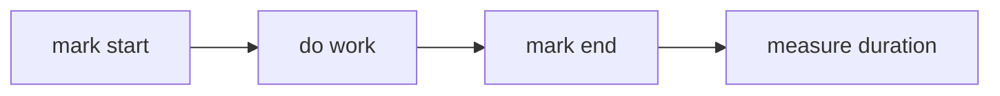

# Performance API

## Detailed explanation
Performance API gives high-resolution timing and measurement tools in browser. It helps measure page loads, user timing marks, resource timing, long tasks, and custom app performance.

Frontend engineers use it to debug slow interactions, compare optimizations, and feed real-user monitoring.

## 1. One-line mental model
Performance API measures browser and app timing.

## 2. Problem it solves
Performance work needs numbers, not guesses.

## 3. Core idea
- `performance.now()` gives high-resolution time.
- `performance.mark()` records named point.
- `performance.measure()` records duration.
- Performance entries expose navigation/resource data.
- Observers can stream metrics.

## 4. Visual / analogy
Performance API = stopwatch plus timeline labels.



## 5. Minimal example

```js
const start = performance.now();
doWork();
console.log(performance.now() - start);
```

## 6. Real-world example

```js
performance.mark("search-start");
renderResults();
performance.mark("search-end");
performance.measure("search-render", "search-start", "search-end");
```

## 7. Common interview questions
- What is Performance API?
- `Date.now` vs `performance.now`?
- What are marks/measures?
- How measure slow interaction?
- What is PerformanceObserver?

## 8. Active recall test
1. Which method high-res time?
2. How create named start?
3. How measure duration?
4. Why not guess?
5. Name RUM use case.

## 9. Mistakes / traps
- Using one local measurement as final proof.
- Mixing wall-clock and high-res timing.
- Measuring dev build only.
- Ignoring user-device variance.

## 10. Compare with related concepts
- **Performance API vs DevTools:** programmatic measurement vs inspection UI.
- **`Date.now` vs `performance.now`:** wall time vs monotonic high-res.
- **Lab vs RUM:** controlled local test vs real user data.

## 11. Summary from memory
Explain how to measure search result render duration.

## 12. Spaced revision prompts
- 1 day: Define Performance API.
- 3 days: Use `performance.now`.
- 7 days: Use marks/measures.
- 14 days: Explain RUM.

