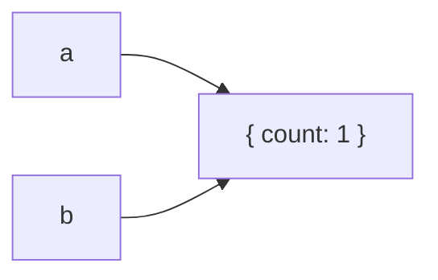

# Primitive vs Reference Values

## Detailed explanation
JavaScript values are commonly discussed as primitives and reference values. Primitives include strings, numbers, booleans, `null`, `undefined`, `symbol`, and `bigint`. Objects, arrays, functions, maps, sets, and dates are reference values.

The practical interview point is assignment and comparison behavior. Primitives behave like independent values. Reference variables point to heap objects, so assigning or passing them copies the reference, not the underlying object.

## 1. One-line mental model
Primitives are copied as values; objects are shared through references.

## 2. Problem it solves
Frontend developers need to predict mutation, equality, React state updates, and memoization behavior.

## 3. Core idea
- Primitives compare by value.
- Objects compare by reference.
- Assigning an object copies the reference.
- Mutating through one reference affects the same object.
- Immutable updates create new references.

## 4. Visual / analogy
A primitive is like a photocopy of a note. A reference is like two people holding the same shared document link.



## 5. Minimal example

```js
const a = { count: 1 };
const b = a;

b.count = 2;
console.log(a.count); // 2
```

## 6. Real-world example

```js
const nextUser = {
  ...user,
  name: "Asha",
};
```

React state updates create a new object reference instead of mutating the old object.

## 7. Common interview questions
- Primitive vs reference values?
- Why does `{}` === `{}` return false?
- What happens when you assign an object to another variable?
- How does this affect React state?
- Why does shallow copy share nested objects?
- How do arrays behave?
- How does reference equality affect memoization?

## 8. Active recall test
1. Name all primitive types.
2. Why does object assignment share mutation?
3. Why are two identical object literals not equal?
4. How do you create a new object reference?
5. Why does React care?

## 9. Mistakes / traps
- Saying objects are copied by value.
- Forgetting arrays are objects.
- Mutating nested state after a shallow copy.
- Comparing objects with `===` expecting deep equality.
- Passing mutable references into memoized components.

## 10. Compare with related concepts
- **Primitive vs reference:** direct value behavior vs shared object identity.
- **Reference equality vs deep equality:** same object vs same structure.
- **Shallow copy vs deep copy:** top-level copy vs nested copy.

## 11. Summary from memory
Explain why mutating `b.user.name` also changes `a.user.name` after a shallow copy.

## 12. Spaced revision prompts
- After 1 day: List primitive types.
- After 3 days: Explain object reference assignment.
- After 7 days: Compare shallow and deep equality.
- After 14 days: Connect references to React immutability.

