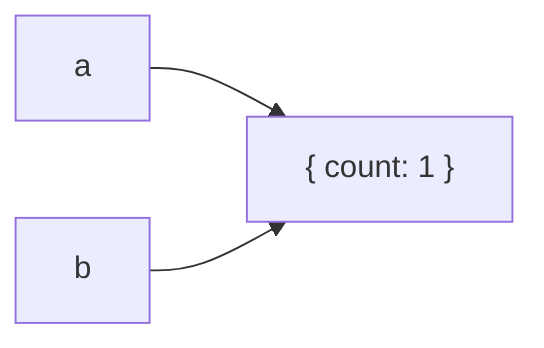

# Primitive vs Reference Values

## Detailed explanation
JavaScript values are commonly discussed as primitives and reference values. Primitives include strings, numbers, booleans, `null`, `undefined`, `symbol`, and `bigint`. Objects, arrays, functions, maps, sets, and dates are reference values.

The practical interview point is assignment and comparison behavior. Primitives behave like independent values. Reference variables point to heap objects, so assigning or passing them copies the reference, not the underlying object.

## 1. One-line mental model
Primitives are copied as values; objects are shared through references.

## 2. Problem it solves
Frontend developers need to predict mutation, equality, React state updates, and memoization behavior.

## 3. Core idea
- Primitives compare by value.
- Objects compare by reference.
- Assigning an object copies the reference.
- Mutating through one reference affects the same object.
- Immutable updates create new references.

## 4. Visual / analogy
A primitive is like a photocopy of a note. A reference is like two people holding the same shared document link.



## 5. Minimal example

```js
const a = { count: 1 };
const b = a;

b.count = 2;
console.log(a.count); // 2
```

## 6. Real-world example

```js
const nextUser = {
  ...user,
  name: "Asha",
};
```

React state updates create a new object reference instead of mutating the old object.

## 7. Common interview questions
#### Primitive vs reference values?
- **The Engine Mechanism (Why it behaves this way):** Primitives are stored directly within the Call Stack stack frame representing the current execution context (for local scope variables) or inline inside objects. Primitives are immutable: you cannot change the underlying value (e.g., you cannot mutate the string `"hello"` into `"hell"`, you can only reassign the variable to a new string value). Reference values (objects, arrays, functions) are stored in the **Memory Heap**, which is an unstructured memory pool for dynamic allocations. The variable on the stack only stores a fixed-size **memory address pointer** pointing to the location of the object in the heap.
- **The Unforgettable Mental Model:** A primitive is like **cash in your pocket** (you hold it directly). A reference value is like a **home address written on a piece of paper** (you don't hold the house in your pocket, only the instructions on how to find the house in the city heap).
- **The Trap:** Believing primitive wrapper objects (like `new String("hello")`) are primitive values. Utilizing `new` creates a full-fledged reference object in the heap.
- **Senior Interview Playbook (Verbal Script):** "When asked this in an interview, say: Primitives are stored by value directly on the call stack and are immutable, whereas reference values are stored on the memory heap. When you assign or pass a reference value, you are only passing a copy of the memory pointer, not the object itself. Primitives compare by their actual value, while objects compare by their memory address identity."

#### Why does `{}` === `{}` return false?
- **The Engine Mechanism (Why it behaves this way):** In JavaScript, the strict equality operator `===` evaluates reference types by comparing their memory addresses. Every time the engine encounters an object literal `{}` during the execution phase, it dynamically allocates a fresh, unique block of memory in the Heap to store that new object. Therefore, `{}` creates Object A at Address 0x101, and the second `{}` creates Object B at Address 0x102. Comparing them with `===` checks if `0x101 === 0x102`, which is false because their memory addresses differ, regardless of the fact that they are structurally identical.
- **The Unforgettable Mental Model:** **Two identical, newly built houses**. They are built using the exact same blueprints and look identical, but they exist on different plots of land (different addresses) in the city. You cannot be in both at the same time.
- **The Trap:** Thinking that `JSON.stringify(obj1) === JSON.stringify(obj2)` is a reliable way to compare all objects. Key order differences (e.g., `{a:1, b:2}` vs `{b:2, a:1}`) will cause this to return `false` even if the objects are structurally equivalent.
- **Senior Interview Playbook (Verbal Script):** "When asked this in an interview, say: `{}` === `{}` evaluates to false because the strict equality operator compares objects by their reference identity in memory, not their structural contents. Each object literal `{}` triggers a separate heap allocation, creating two distinct objects with different memory addresses. Since their pointers differ, the equality check returns false."

#### What happens when you assign an object to another variable?
- **The Engine Mechanism (Why it behaves this way):** When you execute `const b = a` where `a` holds an object, the engine copies the value stored in the stack frame for variable `a`. Since that value is not the object itself but a **64-bit memory address pointer** (e.g., `0x7ff4`), `b` is assigned the exact same pointer `0x7ff4`. No new memory is allocated in the Heap. Both stack variables now contain identical pointers pointing to the exact same heap object. Any modification performed through `b` (e.g. `b.name = 'x'`) directly alters the heap object, which is immediately visible when accessing `a.name`.
- **The Unforgettable Mental Model:** **Two keys to the same front door**. Handing a key (assigning the variable) to your friend does not build a duplicate house; it just gives them access to your house. If they paint the walls blue, the walls are blue when you walk in too.
- **The Trap:** Reassigning the second variable to a new object (e.g. `b = { val: 2 }`) and expecting the first variable `a` to also update. Reassigning `b` changes the pointer stored on the stack for `b`, separating it from `a` completely.
- **Senior Interview Playbook (Verbal Script):** "When asked this in an interview, say: Assigning an object to another variable copies the memory pointer, not the actual object data. Both variables now point to the exact same memory address in the heap. Therefore, modifying properties through one variable will mutate the shared object, affecting both references."

#### How does this affect React state?
- **The Engine Mechanism (Why it behaves this way):** React relies on **shallow comparison** of state and props (using `Object.is`) to determine if a component needs to re-render. When you mutate an object or array in place (e.g. `state.user.name = "Asha"`), the memory pointer of the top-level state object remains identical. When React compares the old state to the new state, it sees that `Object.is(oldState, newState)` is `true` (their pointers match). React assumes the state has not changed and bypasses the reconciliation and render phases entirely, leading to a silent UI update failure.
- **The Unforgettable Mental Model:** The **Hotel Registration Desk**. The receptionist (React) checks if a new person has checked in. If you just dye your hair but keep the same passport (same pointer), the receptionist thinks you are the same guest and does nothing. You must check in as a completely new guest with a new passport (new reference).
- **The Trap:** Direct mutations followed by a forced update, which degrades React's rendering optimizations and causes unpredictable UI bugs.
- **Senior Interview Playbook (Verbal Script):** "When asked this in an interview, say: React checks reference equality to determine if state has changed. If you mutate an object or array in place, its memory address pointer remains identical, causing React's shallow comparison to assume nothing changed and skip the re-render. To trigger a state update, we must follow immutable patterns by spreading the object into a brand new reference, which allocates a new address in the heap."

#### Why does shallow copy share nested objects?
- **The Engine Mechanism (Why it behaves this way):** A shallow copy (e.g., using `Object.assign({}, original)` or `{...original}`) creates a new object in the Heap and iterates over the top-level keys of `original`. If a key's value is a primitive, it copies the actual primitive value. However, if a key's value is a reference (another object or array), the shallow copy copies the **memory pointer** stored under that key. The new object's key is now assigned the same heap address. Consequently, both the original and the shallow-copied object have keys pointing to the exact same nested object in memory.
- **The Unforgettable Mental Model:** The **Dual-Key File Cabinet**. A shallow copy duplicates the file cabinet itself, but the keys inside the cabinet still open the exact same shared locked drawers (nested objects) in the workshop.
- **The Trap:** Spreading a complex configuration object (like a nested Redux state) and modifying a deep nested property, thinking the spread operator made it completely safe.
- **Senior Interview Playbook (Verbal Script):** "When asked this in an interview, say: A shallow copy only duplicates the top-level properties of an object. If the original object contains nested objects, their memory pointers are copied rather than their data structure. As a result, both the copied and original objects still point to the same shared nested objects in the heap, and mutating a nested property will affect both."

#### How do arrays behave?
- **The Engine Mechanism (Why it behaves this way):** In JavaScript, arrays are subclassed objects (`typeof [] === 'object'`). They are reference values allocated in the Memory Heap. Assigning an array copy with `=` copies the pointer. Comparing arrays with `===` checks if they point to the same heap address. Furthermore, array mutation methods (like `push`, `pop`, `shift`, `unshift`, `splice`, `sort`, `reverse`) perform in-place mutations on the heap object, preserving the memory pointer.
- **The Unforgettable Mental Model:** A **Shared Shopping List**. Copying the reference of the array is like writing the list's URL on an index card. If someone scratches out an item on the list, everyone who has the URL sees the updated list.
- **The Trap:** Using array methods expecting them to return a new array copy, or performing `arr1 === arr2` to check if they have the same numbers in the same order.
- **Senior Interview Playbook (Verbal Script):** "When asked this in an interview, say: Arrays are reference values in JavaScript, meaning they behave identically to standard objects. They are allocated in the heap, and assigning an array variable copies its memory pointer. Methods like `push` or `splice` mutate the array in place, keeping the reference pointer identical. To update arrays safely in frameworks like React, we must copy them using the spread operator or non-mutating methods like `filter` or `map`."

#### How does reference equality affect memoization?
- **The Engine Mechanism (Why it behaves this way):** Memoization mechanisms (like React's `React.memo`, `useMemo`, or utility functions like Lodash's `memoize`) check the arguments of function calls using shallow equality checks (`Object.is` or `===`). If a function parameter is a reference type and you pass a newly created object or array on every execution (even if it has the exact same fields), the memory pointer changes. The memoization cache fails to recognize it as the same input, invalidating the cache and triggering expensive recalculations or re-renders.
- **The Unforgettable Mental Model:** The **Membership Card**. If you lose your card and print a new one every time you visit (new reference), the club guard doesn't recognize you instantly and forces you to fill out the paperwork (expensive calculation) all over again, even though your name is the same.
- **The Trap:** Passing inline objects like `style={{ color: 'red' }}` or inline arrays/functions as props to memoized child components, completely defeating `React.memo`.
- **Senior Interview Playbook (Verbal Script):** "When asked this in an interview, say: Memoization hinges on reference equality to determine if inputs have changed. If a reference-type argument changes its memory address on every execution—even if its internal data remains identical—the memoization check will fail, invalidating the cache and forcing redundant calculations. We must stabilize references using hooks like `useMemo` or `useCallback` to ensure memoization works as designed."

## 8. Active recall test
1. **Name all primitive types.**
   - **Explanation:** There are 7 primitive types in JavaScript: `String`, `Number`, `Boolean`, `null`, `undefined`, `Symbol`, and `BigInt`.
2. **Why does object assignment share mutation?**
   - **Explanation:** Because object assignment copies only the 64-bit memory address pointer from the stack, not the actual object in the heap. Both variables store the same address and reference the same object instance.
3. **Why are two identical object literals not equal?**
   - **Explanation:** Because each object literal `{}` dynamically allocates a brand new memory block in the heap. The strict equality operator compares the distinct memory addresses, which evaluates to `false`.
4. **How do you create a new object reference?**
   - **Explanation:** By using the spread operator `{...obj}`, `Object.assign({}, obj)`, `structuredClone(obj)`, or parsing a stringified representation `JSON.parse(JSON.stringify(obj))`.
5. **Why does React care?**
   - **Explanation:** React uses shallow comparison of pointers to optimize rendering performance. If state is mutated directly, the pointer remains unchanged, causing React to assume no change occurred and skip critical UI updates.

## 9. Mistakes / traps
- Saying objects are copied by value.
- Forgetting arrays are objects.
- Mutating nested state after a shallow copy.
- Comparing objects with `===` expecting deep equality.
- Passing mutable references into memoized components.

## 10. Compare with related concepts
- **Primitive vs reference:** direct value behavior vs shared object identity.
- **Reference equality vs deep equality:** same object vs same structure.
- **Shallow copy vs deep copy:** top-level copy vs nested copy.

## 11. Summary from memory
Explain why mutating `b.user.name` also changes `a.user.name` after a shallow copy.

## 12. Spaced revision prompts
- After 1 day: List primitive types.
- After 3 days: Explain object reference assignment.
- After 7 days: Compare shallow and deep equality.
- After 14 days: Connect references to React immutability.

