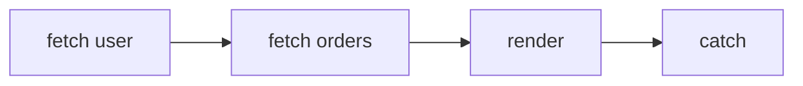

# Promise Chaining

## Detailed explanation
Promise chaining connects asynchronous steps by returning values or promises from `.then`, `.catch`, and `.finally` callbacks. Each call returns a new promise, so the next step waits for the previous callback result.

Interviewers use chaining to test error propagation, return behavior, flattening of returned promises, and the difference between parallel and sequential async work.

## 1. One-line mental model
A promise chain passes each async result or error to the next link.

## 2. Problem it solves
Async workflows need readable sequencing and centralized error handling.

## 3. Core idea
- `.then` returns a new promise.
- Returning a plain value fulfills the next promise with that value.
- Returning a promise makes the next step wait for it.
- Throwing rejects the next promise.
- `.catch` handles previous rejections and can recover.

## 4. Visual / analogy
A promise chain is an assembly line where each station passes work to the next.



## 5. Minimal example

```js
fetchUser()
  .then((user) => fetchOrders(user.id))
  .then((orders) => renderOrders(orders))
  .catch((error) => showError(error));
```

## 6. Real-world example
A checkout flow may load a cart, validate inventory, create an order, and then redirect. Each step depends on the previous result.

## 7. Common interview questions
#### What does `.then` return?
- **The Engine Mechanism (Why it behaves this way):** Calling `.then()` synchronously constructs and returns a **brand-new Promise object** (let's call it Promise B) in the Heap. The engine links Promise B to the original Promise A. The internal `[[PromiseState]]` of Promise B starts as `"pending"`. It remains pending until the callback supplied to `.then()` is executed asynchronously (via the Microtask Queue). Once the callback executes, its return value determines whether Promise B becomes `"fulfilled"` or `"rejected"`.
- **The Unforgettable Mental Model:** The **Baton Pass Relay Race**. Calling `.then()` is like adding a new runner (Promise B) to the track. They do not start running immediately; they hold their hand out (pending), waiting for the previous runner (Promise A) to pass them the baton (settle) before they can run their leg of the race.
- **The Trap:** Believing `.then()` returns the *result* of the callback, or the original Promise itself. It always returns a newly allocated Promise reference.
- **Senior Interview Playbook (Verbal Script):** "When asked this in an interview, say: Calling `.then()` always synchronously creates and returns a brand-new Promise instance. This returned Promise starts in a pending state, and its eventual settlement is determined by the return value or thrown error of the callback function executed asynchronously within the microtask queue."

#### What happens if you return a promise from `.then`?
- **The Engine Mechanism (Why it behaves this way):** When a callback inside `.then()` returns a Promise (let's call it Promise C), the JS engine registers a special resolver wrapper. It dynamically hooks up Promise C's reactions to Promise B (the promise returned by `.then()`). In effect, the engine pauses the settlement of Promise B. Promise B remains pending and "adopts" the exact state and resolution value of Promise C once Promise C settles.
- **The Unforgettable Mental Model:** The **Subcontractor**. The general contractor (Promise B) gets a job, but decides to hire a subcontractor (Promise C) to do the heavy lifting. The client (the next link in the chain) must wait until the subcontractor finishes, and the final quality of the work (success/failure) is determined entirely by the subcontractor's output.
- **The Trap:** Returning a nested Promise chain without returning it from the outer `.then()`. If you omit the `return` keyword, the outer `.then()` immediately resolves Promise B with `undefined`, and the nested chain runs asynchronously in isolation, detached from the outer chain.
- **Senior Interview Playbook (Verbal Script):** "When asked this in an interview, say: If you return a Promise from a `.then()` callback, the chain's execution is deferred. The promise returned by `.then()` adopts the state and value of the returned promise. The engine hooks up the internal resolve and reject triggers so that the subsequent `.then()` link in the chain waits until this nested promise settles."

#### How do errors move through a chain?
- **The Engine Mechanism (Why it behaves this way):** When a Promise rejects, the engine skips any downstream success callbacks (`[[PromiseFulfillReactions]]`) and traverses down the chain looking for the first Promise that has an error handler registered in its `[[PromiseRejectReactions]]` (like a `.catch()` or the second argument of a `.then()`). The rejection "bubbles" down the chain, passing the rejection reason from promise to promise until it is handled. If no handler is found in the entire chain, the engine triggers an `"unhandledrejection"` event.
- **The Unforgettable Mental Model:** The **Emergency Chute**. If water is flowing down a pipe and hits a blockage (error), it bypasses all the regular faucets (thens) and falls straight down the emergency vertical drain (catch) at the bottom.
- **The Trap:** Thinking a `.then(onFulfill, onReject)` can catch an error thrown in its *own* `onFulfill` callback. It cannot; the error will bypass its sibling `onReject` and bubble to the *next* catch handler downstream.
- **Senior Interview Playbook (Verbal Script):** "When asked this in an interview, say: Errors propagate down a Promise chain via a process similar to exception bubbling. When a promise is rejected, the engine skips all subsequent fulfillment handlers in the chain, passing the rejection reason down until it encounters a rejection handler—typically a `.catch()` block. If no handler is registered, it triggers an unhandled promise rejection error."

#### How does `.catch` recover?
- **The Engine Mechanism (Why it behaves this way):** Under the hood, `.catch(onReject)` is strictly syntactical sugar for `.then(undefined, onReject)`. It returns a new Promise. When an error bubbles into `.catch()`, the `onReject` callback is executed. If `onReject` executes successfully and returns a normal value (primitive or object), or returns a resolving promise, the promise returned by `.catch()` resolves to `"fulfilled"`. The chain is considered "recovered," and execution resumes with the next `.then()` fulfillment handler downstream.
- **The Unforgettable Mental Model:** The **Backup Generator**. The main power grid fails (error). The system automatically cuts to the backup generator (catch). The generator starts up successfully and restores light to the house, allowing your appliances (next thens) to keep running normally.
- **The Trap:** Forgetting that if a `.catch()` handler itself throws an error, the promise returned by `.catch()` will reject, and the error will resume bubbling down the chain.
- **Senior Interview Playbook (Verbal Script):** "When asked this in an interview, say: `.catch` acts as an error recovery mechanism. Because it is syntactic sugar for `.then(undefined, onReject)`, it returns a new Promise. If the handler executes successfully and returns a value without throwing, the promise returned by `.catch()` resolves to a fulfilled state. This allows the Promise chain to recover and continue executing subsequent `.then()` blocks."

#### When should you use `Promise.all` instead?
- **The Engine Mechanism (Why it behaves this way):** Promise chaining is sequential: each step executes *after* the previous one settles, which blocks execution. `Promise.all(iterable)` accepts an array of promises and schedules them concurrently. The browser or Node.js background thread processes all asynchronous tasks (like multi-threaded network sockets) in parallel. The engine returns a single wrapper Promise that resolves only when all input promises have fulfilled, or rejects immediately if any single promise rejects.
- **The Unforgettable Mental Model:** 
  - Chaining is like a **Relay Race** (one runner at a time).
  - `Promise.all` is like a **Group Marathon**. Everyone starts running at the exact same starter pistol shot, and we record the total group time when the last runner crosses the finish line.
- **The Trap:** Using `Promise.all` when operations depend on each other (e.g. you need the user ID from Request A to perform Request B).
- **Senior Interview Playbook (Verbal Script):** "When asked this in an interview, say: We should use `Promise.all` when we have multiple independent asynchronous operations that can run concurrently, rather than chaining them sequentially. Chaining them sequentially creates an unnecessary waterfall delay, whereas `Promise.all` triggers them in parallel, significantly reducing the overall execution time to the duration of the slowest promise."

## 8. Active recall test
1. **What happens when `.then` returns a value?**
   - **Explanation:** The new Promise returned by `.then()` resolves to `"fulfilled"`, and its resolved value is set to that returned value.
2. **What happens when it throws?**
   - **Explanation:** The new Promise returned by `.then()` immediately transitions to `"rejected"`, and its rejection reason is set to the thrown error.
3. **What if it returns another promise?**
   - **Explanation:** The new Promise returned by `.then()` remains pending and adopts the exact final state (fulfilled/rejected) and value of the returned promise once it settles.
4. **Can `.catch` continue the chain?**
   - **Explanation:** Yes. If the catch handler returns a normal value or resolving promise, it fulfills the next promise in the chain, allowing execution to resume with subsequent `.then()` blocks.
5. **How do you run work in parallel?**
   - **Explanation:** By using concurrency APIs like `Promise.all()` or `Promise.allSettled()` instead of chaining the operations sequentially.

## 9. Mistakes / traps
- Forgetting to return a promise from `.then`.
- Nesting chains unnecessarily.
- Swallowing errors in `.catch`.
- Running sequential work when parallel work is safe.

## 10. Compare with related concepts
- **Promise chain vs async/await:** same promise mechanics, different syntax.
- **Sequential vs parallel:** chain waits step by step; `Promise.all` starts work together.
- **`.catch` vs second `.then` argument:** centralized catch is usually clearer.

## 11. Summary from memory
Explain how values and errors travel through a promise chain.

## 12. Spaced revision prompts
- After 1 day: Define promise chaining.
- After 3 days: Predict chain output.
- After 7 days: Compare chain and `async/await`.
- After 14 days: Refactor nested promises into a chain.
