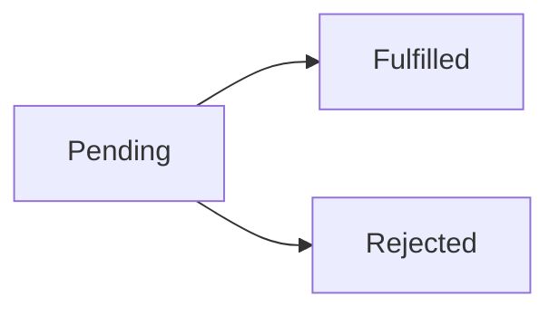

# Promise States

## Detailed explanation
A Promise represents future completion or failure of async work. It has three states: pending, fulfilled, and rejected. Once settled, it cannot change state again.

Frontend interviews use Promise states to test async reasoning, error propagation, request handling, and why `then`, `catch`, and `finally` callbacks run later on microtasks.

## 1. One-line mental model
Promise starts pending, then settles once as fulfilled or rejected.

## 2. Problem it solves
Async work needs one object that represents future result and supports success/failure handlers.

## 3. Core idea
- Pending = not settled yet.
- Fulfilled = resolved successfully.
- Rejected = failed.
- Settled promise cannot change again.
- Handlers run asynchronously through microtask queue.

## 4. Visual / analogy
Promise is order receipt: waiting, delivered, or failed delivery.



## 5. Minimal example

```js
const promise = new Promise((resolve) => {
  resolve("done");
});
```

## 6. Real-world example

```js
fetch("/api/user")
  .then((res) => res.json())
  .catch((error) => showError(error))
  .finally(() => hideSpinner());
```

## 7. Common interview questions
- What are Promise states?
- Can settled Promise change state?
- What is pending?
- What is fulfilled?
- What is rejected?
- When do `then` callbacks run?

## 8. Active recall test
1. Name three states.
2. What means settled?
3. Can rejected become fulfilled?
4. Which queue runs handlers?
5. What does `finally` mean?

## 9. Mistakes / traps
- Thinking Promise can settle multiple times.
- Thinking `then` runs synchronously.
- Forgetting thrown errors reject next Promise.
- Confusing resolved with fulfilled in nested Promise cases.

## 10. Compare with related concepts
- **Promise vs callback:** object with chainable state vs function passed to async API.
- **Fulfilled vs resolved:** often same in simple cases; resolved may adopt another Promise.
- **Rejected vs thrown:** thrown error inside handler becomes rejection.

## 11. Summary from memory
Explain what happens from pending fetch to fulfilled JSON or rejected network error.

## 12. Spaced revision prompts
- 1 day: Name Promise states.
- 3 days: Explain settled.
- 7 days: Trace `then/catch/finally`.
- 14 days: Explain microtask timing.

