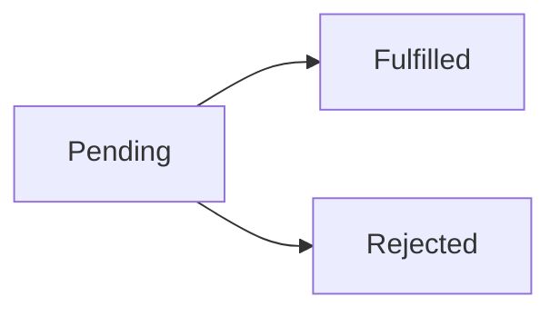

# Promise States

## Detailed explanation
A Promise represents future completion or failure of async work. It has three states: pending, fulfilled, and rejected. Once settled, it cannot change state again.

Frontend interviews use Promise states to test async reasoning, error propagation, request handling, and why `then`, `catch`, and `finally` callbacks run later on microtasks.

## 1. One-line mental model
Promise starts pending, then settles once as fulfilled or rejected.

## 2. Problem it solves
Async work needs one object that represents future result and supports success/failure handlers.

## 3. Core idea
- Pending = not settled yet.
- Fulfilled = resolved successfully.
- Rejected = failed.
- Settled promise cannot change again.
- Handlers run asynchronously through microtask queue.

## 4. Visual / analogy
Promise is order receipt: waiting, delivered, or failed delivery.



## 5. Minimal example

```js
const promise = new Promise((resolve) => {
  resolve("done");
});
```

## 6. Real-world example

```js
fetch("/api/user")
  .then((res) => res.json())
  .catch((error) => showError(error))
  .finally(() => hideSpinner());
```

## 7. Common interview questions
#### What are Promise states?
- **The Engine Mechanism (Why it behaves this way):** In the JS engine, a Promise is a C++ or native object containing internal slots:
  - `[[PromiseState]]`: Which can be `"pending"`, `"fulfilled"`, or `"rejected"`.
  - `[[PromiseResult]]`: Stores the value returned from resolving or the error thrown from rejecting.
  - `[[PromiseFulfillReactions]]` and `[[PromiseRejectReactions]]`: Internal queues holding the `.then()`, `.catch()`, or `.finally()` callbacks attached to this promise.
- **The Unforgettable Mental Model:** The **Automated Amazon Locker**. When you order an item, the locker is **Pending** (empty, waiting for delivery). When the courier successfully drops off the package, it becomes **Fulfilled** (holds your package). If the package is lost or broken, the locker becomes **Rejected** (holds an error slip). Once the door shuts with a status, it stays that way.
- **The Trap:** Believing `[[PromiseState]]` and `[[PromiseResult]]` are accessible directly via JS code. They are private internal engine slots and can only be observed indirectly via Promise methods.
- **Senior Interview Playbook (Verbal Script):** "When asked this in an interview, say: A Promise has three distinct internal states: pending, fulfilled, and rejected. Pending represents ongoing async work; fulfilled indicates that the operation completed successfully with a value; rejected indicates the operation failed with a reason. These states are managed through the engine's internal slots `[[PromiseState]]` and `[[PromiseResult]]` and can only be set once."

#### Can settled Promise change state?
- **The Engine Mechanism (Why it behaves this way):** No. The ECMAScript specification mandates that the transitions from `"pending"` to `"fulfilled"` or `"pending"` to `"rejected"` are strictly **one-way and irreversible**. When you call `resolve(val)` or `reject(err)` inside the executor function, the engine checks the `[[PromiseState]]` slot. If it is already `"fulfilled"` or `"rejected"`, the invocation is silently ignored, and no state change or reaction scheduling occurs.
- **The Unforgettable Mental Model:** The **Concrete Cast**. When you pour concrete into a mold (pending), you can shape it once. Once it dries (settles) into a solid block (fulfilled or rejected), no amount of poking or pouring more liquid will reshape that concrete block.
- **The Trap:** Thinking that calling `resolve()` after throwing an error or calling `reject()` will override the state. Whichever function executes first locks the Promise state forever.
- **Senior Interview Playbook (Verbal Script):** "When asked this in an interview, say: No, once a Promise is settled—meaning it has transitioned to either a fulfilled or rejected state—its state and resolved value become immutable. Any subsequent attempts to call `resolve` or `reject` within the executor function are completely ignored by the engine's internal state checks."

#### What is pending?
- **The Engine Mechanism (Why it behaves this way):** When a Promise is constructed using `new Promise(executor)`, the JS engine immediately executes the `executor` function synchronously. During this synchronous execution, the engine sets the Promise's `[[PromiseState]]` internal slot to `"pending"`, and the `[[PromiseResult]]` slot is set to `undefined`. The Promise stays in this pending state, waiting for the execution context of the asynchronous host operation (like a network fetch or disk read) to invoke the provided `resolve` or `reject` functions.
- **The Unforgettable Mental Model:** The **Ticket Number**. You are standing in line at a bakery. The cashier hands you a numbered ticket (pending promise). You do not have the bread yet, nor have they run out. You are simply waiting in the system.
- **The Trap:** Believing the executor runs asynchronously. The executor code executes *synchronously* immediately inside the `new Promise` constructor. Only the resolutions and callbacks run asynchronously.
- **Senior Interview Playbook (Verbal Script):** "When asked this in an interview, say: The pending state is the initial state of a Promise. It signifies that the asynchronous operation has been initiated but has not yet completed or failed. While pending, the Promise's internal `[[PromiseResult]]` slot is undefined, and any attached callbacks are stored in reaction queues waiting for settlement."

#### What is fulfilled?
- **The Engine Mechanism (Why it behaves this way):** A Promise transitions to the fulfilled state when the `resolve` function passed to its executor is successfully invoked with a non-promise value (or when a returned promise settles). The engine updates the internal slot `[[PromiseState]]` from `"pending"` to `"fulfilled"` and stores the resolved value inside `[[PromiseResult]]`. The engine then immediately drains the callbacks registered in `[[PromiseFulfillReactions]]` and enqueues them onto the **Microtask Queue** to execute asynchronously.
- **The Unforgettable Mental Model:** The **Delivery Confirmed Notification**. The mailman drops the box on your porch. The tracking system updates to 'Delivered' (fulfilled) and lists your exact delivery details (result).
- **The Trap:** Returning a rejected Promise inside a `resolve()` call. Resolving a promise with a rejected promise will actually reject the outer promise, since `resolve` wraps and adopts the state of the inner promise.
- **Senior Interview Playbook (Verbal Script):** "When asked this in an interview, say: A Promise transitions to the fulfilled state when its asynchronous task completes successfully and `resolve` is called. The engine updates the Promise's internal state slot to fulfilled, stores the resulting value in its result slot, and schedules any attached success callbacks in the microtask queue."

#### What is rejected?
- **The Engine Mechanism (Why it behaves this way):** A Promise transitions to the rejected state when `reject` is invoked inside its executor, or when a synchronous runtime error is thrown within the executor scope. The engine updates the internal slot `[[PromiseState]]` to `"rejected"` and stores the error object or reason inside `[[PromiseResult]]`. It then schedules all callbacks in `[[PromiseRejectReactions]]` to be pushed onto the **Microtask Queue** for async execution.
- **The Unforgettable Mental Model:** The **Check Engine Light**. A sensor fails on your car dashboard. The dashboard light immediately turns red (rejected) and displays the diagnostic error code (reason).
- **The Trap:** Rejecting with a raw string instead of a full `Error` object. Raw strings do not generate a stack trace, making debugging extremely difficult when tracing rejected promises in large applications.
- **Senior Interview Playbook (Verbal Script):** "When asked this in an interview, say: A Promise transitions to the rejected state when the async operation fails, when `reject` is called, or when a synchronous error is thrown inside the executor block. The engine updates the internal state slot to rejected, stores the failure reason, and routes execution to the reject reactions in the microtask queue."

#### When do `then` callbacks run?
- **The Engine Mechanism (Why it behaves this way):** When `.then()` is called, it registers callbacks in the Promise's internal reactions slots. If the Promise is pending, they wait. Once the Promise transitions to fulfilled or rejected, or if `.then()` is called on an *already* settled Promise, the engine schedules these callbacks in the **Microtask Queue** (using the `EnqueueJob` mechanism). The JavaScript runtime event loop processes the Microtask Queue immediately after the current synchronous script execution block completes and *before* yielding back to the task queue or layout/paint render phases.
- **The Unforgettable Mental Model:** The **VIP Fast Pass Line**. Microtasks are VIPs. After the main queue of customers finishes the current transaction, the staff registers everyone in the VIP line before letting any standard queue callers (macro/task queue, like `setTimeout`) step up.
- **The Trap:** Believing `then` callbacks execute synchronously if the Promise is created using `Promise.resolve()`. They are *always* deferred to the microtask queue, ensuring execution consistency.
- **Senior Interview Playbook (Verbal Script):** "When asked this in an interview, say: Callbacks registered with `.then()` are guaranteed to execute asynchronously, even if the Promise is already resolved. The JS engine schedules these callbacks onto the microtask queue, which is executed immediately after the current call stack clears and before the event loop processes any macro tasks, rendering cycles, or UI paints."

## 8. Active recall test
1. **Name three states.**
   - **Explanation:** The three internal states are `pending`, `fulfilled`, and `rejected`.
2. **What means settled?**
   - **Explanation:** A Promise is settled when it is no longer pending, meaning it has permanently transitioned to either `fulfilled` or `rejected`.
3. **Can rejected become fulfilled?**
   - **Explanation:** No. A settled Promise's state is immutable. It cannot transition from `rejected` to `fulfilled` or vice-versa.
4. **Which queue runs handlers?**
   - **Explanation:** The **Microtask Queue** runs Promise reaction handlers.
5. **What does `finally` mean?**
   - **Explanation:** `finally` registers a callback that executes once the Promise is settled (either fulfilled or rejected). It does not receive the resolved value or rejection reason and returns a Promise that usually preserves the original settlement state.

## 9. Mistakes / traps
- Thinking Promise can settle multiple times.
- Thinking `then` runs synchronously.
- Forgetting thrown errors reject next Promise.
- Confusing resolved with fulfilled in nested Promise cases.

## 10. Compare with related concepts
- **Promise vs callback:** object with chainable state vs function passed to async API.
- **Fulfilled vs resolved:** often same in simple cases; resolved may adopt another Promise.
- **Rejected vs thrown:** thrown error inside handler becomes rejection.

## 11. Summary from memory
Explain what happens from pending fetch to fulfilled JSON or rejected network error.

## 12. Spaced revision prompts
- 1 day: Name Promise states.
- 3 days: Explain settled.
- 7 days: Trace `then/catch/finally`.
- 14 days: Explain microtask timing.

