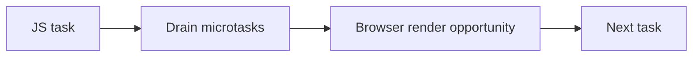

# JavaScript and Rendering Pipeline Interaction

## Detailed explanation
JavaScript runs on the browser's main thread alongside style calculation, layout, paint, compositing, and user input handling. If JavaScript runs for too long, the browser cannot render the next frame or respond quickly to input. This is why heavy synchronous work can freeze the UI.

The event loop gives the browser opportunities to render between tasks, but microtasks must drain before the browser can move on. Too many promise callbacks can delay rendering even though they are "async."

## 1. One-line mental model
JavaScript can block rendering because it shares the main thread with browser rendering work.

## 2. Problem it solves
Frontend developers need to understand why code that is logically correct can still make the UI feel slow or frozen.

## 3. Core idea
- Browser rendering and JavaScript often share the main thread.
- Long JavaScript tasks delay input and painting.
- Microtasks run before the browser gets the next rendering opportunity.
- Layout reads/writes can force extra rendering work.
- Use scheduling, chunking, workers, and `requestAnimationFrame` for smoother UI.

## 4. Visual / analogy
The main thread is one checkout counter. If one customer has a huge cart, everyone else waits, including rendering and input.



## 5. Minimal example

```js
const start = performance.now();
while (performance.now() - start < 2000) {}

// UI is blocked during the loop.
```

## 6. Real-world example

```js
requestAnimationFrame(() => {
  element.style.transform = `translateX(${x}px)`;
});
```

`requestAnimationFrame` schedules visual updates near the browser's paint cycle.

## 7. Common interview questions

#### Why does heavy JavaScript freeze the UI?
- **The Engine Mechanism (Why it behaves this way):** The browser uses a single **Main Thread** to execute the Event Loop, run JavaScript tasks, calculate CSS styles, compute layouts (reflow), paint pixel layers (repaint), and process user inputs (clicks, keypresses). When the Call Stack is occupied by a heavy, synchronous JavaScript task, the Event Loop's tick is paused. The rendering engine cannot step in to run its layout or paint pipelines, nor can the input thread dispatch events to the main thread. Consequently, all visual updates are halted, and the browser UI becomes completely frozen until the stack is entirely cleared.
- **The Unforgettable Mental Model:** A busy chef in a tiny one-person kitchen. If the chef is stuck spending 30 minutes chopping a single massive squash (running heavy JS), they cannot plate the food (paint) or take new orders from waitstaff (process user input). The entire restaurant grinds to a halt until the chopping is finished.
- **The Trap:** Thinking that asynchronous callbacks like `Promise` or `setTimeout` resolve main thread blocking automatically. If the callback itself executes a massive synchronous block, it will freeze the main thread the second it is pushed onto the stack.
- **Senior Interview Playbook (Verbal Script):** When asked this in an interview, say: "Heavy JavaScript freezes the UI because the browser's main thread operates on a single-threaded Event Loop that coordinates both JS execution and UI rendering. When a blocking synchronous function occupies the call stack, it halts the Event Loop, preventing the browser from scheduling style recalculation, layout, paint operations, or processing queued user interaction events."

#### How do microtasks affect rendering?
- **The Engine Mechanism (Why it behaves this way):** The Event Loop executes tasks (macrotasks) one by one. However, after *every* single task—and before returning control to the rendering pipeline—the engine must completely drain the **Microtask Queue**. If a microtask schedules another microtask, the engine continues executing them recursively until the queue is completely empty. If you generate a continuous stream of promise resolutions or microtasks, the Event Loop remains trapped in the microtask checkpoint phase indefinitely. As a result, the Event Loop can never transition to the rendering phase, and the browser cannot paint.
- **The Unforgettable Mental Model:** A parent telling a child they can watch TV (render) after they clean up their room (current task). However, the child must also pick up *every single scrap of paper* that falls on the floor while they clean (microtasks). If the child keeps shredding papers and dropping them (recursive microtasks), they will clean forever and never get to watch TV.
- **The Trap:** Thinking that promise chains are "gentle" to the UI because they are asynchronous. A microtask recursion (e.g., recursive `queueMicrotask` or unresolved promise loops) will block rendering just as effectively as a synchronous `while (true)` loop.
- **Senior Interview Playbook (Verbal Script):** When asked this in an interview, say: "Microtasks have a highly aggressive scheduling priority. After any macrotask finishes, the engine executes all queued microtasks, including any newly queued during this phase, before allowing the rendering pipeline to run. Consequently, flooding the microtask queue with recursive promise resolutions or queueMicrotask calls will starve the rendering engine, causing the UI to freeze."

#### When does the browser get a chance to paint?
- **The Engine Mechanism (Why it behaves this way):** In modern browsers, rendering is typically synchronized with the device display's refresh rate (e.g., 60Hz, 120Hz). A paint opportunity arises roughly every 16.6ms (at 60fps) or 8.3ms (at 120fps). At the start of a tick where a paint is due, and *only* if the Call Stack is completely clear and the Microtask Queue has been drained, the Event Loop yields to the browser's rendering pipeline. This pipeline executes: active media queries, `requestAnimationFrame` callbacks, style recalculations (Recalculate Style), layout calculation (Layout), paint layer creation (Paint), and sends composite layers to the GPU compositor thread.
- **The Unforgettable Mental Model:** A train leaving the station on a strict hourly schedule. The train (paint opportunity) is ready to depart every hour. However, if the track is blocked by a cargo train (JS stack or microtask drain), the passenger train cannot leave the station. Once the track is clear, the train immediately departs.
- **The Trap:** Assuming that every Event Loop tick triggers a paint. The loop can spin hundreds of times per second running small microtasks and macrotasks without rendering anything if the browser deems that no visual styles have changed or if the screen refresh frame deadline has not been met.
- **Senior Interview Playbook (Verbal Script):** When asked this in an interview, say: "The browser paints during rendering opportunities, which are aligned with the display's refresh rate—typically every 16.6 milliseconds at 60Hz. The Event Loop yields to the rendering pipeline only when the current stack is empty and all pending microtasks are drained, triggering animation frame callbacks, style recalculation, layout, and layer painting."

#### What is a long task?
- **The Engine Mechanism (Why it behaves this way):** By Chrome/W3C performance standard definition, a **Long Task** is any contiguous block of main-thread execution (JavaScript compilation, parsing, or execution) that takes longer than **50 milliseconds**. The 50ms threshold is derived from the budget required to maintain a responsive interface: to respond to a user input within the human-perceived 100ms budget, the browser must have the main thread free to handle the input event within 50ms, leaving the remaining 50ms for layout, paint, and event listener execution. Long tasks degrade user-centric performance metrics like Interaction to Next Paint (INP) and Total Blocking Time (TBT).
- **The Unforgettable Mental Model:** A roadblock on a street. If the roadblock is removed in under 50ms, drivers barely notice a pause. If it takes longer than 50ms, traffic backs up (events pile up), and drivers start getting frustrated because the delay is now highly noticeable.
- **The Trap:** Believing that a task is only a single function. A long task is the *total* contiguous execution time of a stack frame. If `functionA` calls `functionB` which calls `functionC`, and the total combined execution time exceeds 50ms, it is registered as one unified Long Task.
- **Senior Interview Playbook (Verbal Script):** When asked this in an interview, say: "A Long Task is defined by W3C performance standards as any continuous main-thread execution exceeding 50 milliseconds. This threshold ensures the browser can respond to user inputs within the human perception limit of 100 milliseconds. Accumulating Long Tasks directly degrades Core Web Vitals, specifically TBT and INP, leading to a sluggish user experience."

#### Why use `requestAnimationFrame`?
- **The Engine Mechanism (Why it behaves this way):** `requestAnimationFrame` (rAF) is a browser API that schedules a callback to run at the precise start of the browser's next rendering pipeline step, immediately before style recalculation and layout. Unlike `setTimeout(cb, 16)`, which is subject to event loop timer drift and execution delay (meaning it might execute in the middle or end of a paint frame, causing frame drops or double-paints), rAF guarantees that your DOM mutations align perfectly with the display refresh cycle, minimizing layout recalculation overhead and screen tearing.
- **The Unforgettable Mental Model:** The rAF API is like stepping onto an escalator at the exact moment a step arrives. `setTimeout` is like jumping blindly onto the escalator track; you might land perfectly on a step, or you might trip and fall between steps (causing stuttery animation frames).
- **The Trap:** Thinking that rAF runs asynchronously on a separate thread. The rAF callback runs entirely on the main thread, meaning a heavy DOM or JS operation inside a rAF callback will still freeze the rendering pipeline and drop frames.
- **Senior Interview Playbook (Verbal Script):** When asked this in an interview, say: "We use `requestAnimationFrame` to align DOM modifications directly with the browser's rendering pipeline cycles. Unlike `setTimeout` or `setInterval` which trigger asynchronously without regard to screen refresh rates, rAF callbacks execute precisely before style recalculation and layout, ensuring animations run at a smooth, stutter-free frame rate."

#### How can layout thrashing happen?
- **The Engine Mechanism (Why it behaves this way):** Layout Thrashing occurs when JavaScript repeatedly **reads** a layout property (e.g., `element.offsetHeight`, `element.getBoundingClientRect()`) and then immediately **writes** a style property (e.g., `element.style.height = 'x'`) inside a loop. The browser is optimized to batch style updates and recalculate layout lazily before the next paint. However, if JS reads a layout property after a style change, the browser is forced to halt JS execution, flush the pending style changes, and immediately recalculate the layout synchronously to return the correct, updated geometry. Doing this iteratively in a loop causes the browser to recalculate the layout repeatedly (Forced Synchronous Layout), leading to massive CPU overhead.
- **The Unforgettable Mental Model:** Imagine writing a book, but after writing every single word (writing style), you stop, print the entire book, and count the total pages (forced layout read) before writing the next word. It is incredibly slow compared to writing the entire chapter first and printing it just once.
- **The Trap:** Thinking that reading layout is always expensive. Reading layout is cheap *unless* you have made a preceding style mutation that has not yet been processed by the browser. Only then does it trigger a Forced Synchronous Layout.
- **Senior Interview Playbook (Verbal Script):** When asked this in an interview, say: "Layout thrashing is caused by alternating DOM writes and reads in rapid succession. When you write a style and immediately read a geometric property like `offsetWidth`, you force the browser to execute a Forced Synchronous Layout to calculate the updated dimensions. Repeating this sequence in a loop creates a bottleneck that decimates frame rates."

#### When should you use a Web Worker?
- **The Engine Mechanism (Why it behaves this way):** A Web Worker runs on an entirely separate operating system thread, isolated from the browser's main thread. It has its own call stack and execution context. Because it does not share the main thread, executing CPU-intensive work (like encrypting data, parsing massive JSON strings, or running complex algorithms) inside a worker does not affect the main thread's Event Loop or block the rendering pipeline. Workers communicate with the main thread asynchronously via message passing (`postMessage`), ensuring the UI remains perfectly fluid and responsive.
- **The Unforgettable Mental Model:** Think of the main thread as the store manager. Instead of having the manager go to the backroom to count 10,000 inventory items (blocking customer checkout), the manager hires a stock clerk (Web Worker) to count in the backroom. Once the clerk is done, they report the final number back to the manager.
- **The Trap:** Attempting to manipulate the DOM directly inside a Web Worker. Workers do not have access to the `window`, `document`, or DOM elements. They are strictly designed for computational, non-DOM workloads.
- **Senior Interview Playbook (Verbal Script):** When asked this in an interview, say: "Web Workers should be utilized for any non-DOM, CPU-intensive computations such as large data parsing, image processing, or complex algorithms. By delegating these operations to an isolated background thread, we keep the browser's main thread unblocked, ensuring seamless user interaction and maintaining optimal Core Web Vitals."

## 8. Active recall test

1. **What thread usually runs JavaScript in the browser?**
   - **Answer:** The Browser Main Thread, which is shared between JavaScript execution, layout calculation, styling, painting, and event dispatching.

2. **Why can a `while` loop freeze the page?**
   - **Answer:** Because a synchronous `while` loop completely occupies the call stack, halting the Event Loop and preventing the main thread from ever yielding control to the layout, paint, or input event dispatching pipelines.

3. **Why can many promises delay rendering?**
   - **Answer:** Because promise callbacks are executed as microtasks. The Event Loop must completely drain the Microtask Queue, including any microtasks added recursively, before it can yield control to the rendering pipeline, creating a rendering starvation bottleneck.

4. **What does `requestAnimationFrame` align with?**
   - **Answer:** It aligns perfectly with the start of the browser's rendering pipeline step, running callbacks immediately before style recalculation and layout in sync with the display's refresh rate.

5. **How can workers help?**
   - **Answer:** They run on completely separate OS threads, allowing CPU-heavy operations to execute without occupying the main thread, keeping the main thread's event loop unblocked and responsive to user input.

## 9. Mistakes / traps
- Thinking async promises automatically avoid main-thread blocking.
- Doing large JSON processing synchronously on the main thread.
- Reading and writing layout repeatedly.
- Using `setTimeout` for animation instead of `requestAnimationFrame`.
- Ignoring input responsiveness metrics like INP.

## 10. Compare with related concepts
- **Task vs microtask:** tasks are event loop units; microtasks drain before rendering.
- **JavaScript execution vs browser paint:** code runs first; paint happens when the browser gets a chance.
- **Web Worker vs main thread:** worker moves CPU work off the UI thread.

## 11. Summary from memory
Explain why a long JavaScript function can delay both button clicks and visual updates.

## 12. Spaced revision prompts
- After 1 day: Explain how JavaScript blocks rendering.
- After 3 days: Compare task, microtask, and paint opportunity.
- After 7 days: Explain `requestAnimationFrame`.
- After 14 days: Describe how to fix a long-task performance issue.

