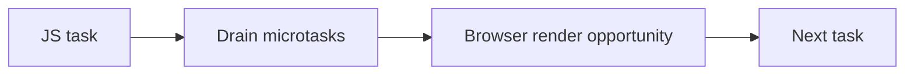

# JavaScript and Rendering Pipeline Interaction

## Detailed explanation
JavaScript runs on the browser's main thread alongside style calculation, layout, paint, compositing, and user input handling. If JavaScript runs for too long, the browser cannot render the next frame or respond quickly to input. This is why heavy synchronous work can freeze the UI.

The event loop gives the browser opportunities to render between tasks, but microtasks must drain before the browser can move on. Too many promise callbacks can delay rendering even though they are "async."

## 1. One-line mental model
JavaScript can block rendering because it shares the main thread with browser rendering work.

## 2. Problem it solves
Frontend developers need to understand why code that is logically correct can still make the UI feel slow or frozen.

## 3. Core idea
- Browser rendering and JavaScript often share the main thread.
- Long JavaScript tasks delay input and painting.
- Microtasks run before the browser gets the next rendering opportunity.
- Layout reads/writes can force extra rendering work.
- Use scheduling, chunking, workers, and `requestAnimationFrame` for smoother UI.

## 4. Visual / analogy
The main thread is one checkout counter. If one customer has a huge cart, everyone else waits, including rendering and input.



## 5. Minimal example

```js
const start = performance.now();
while (performance.now() - start < 2000) {}

// UI is blocked during the loop.
```

## 6. Real-world example

```js
requestAnimationFrame(() => {
  element.style.transform = `translateX(${x}px)`;
});
```

`requestAnimationFrame` schedules visual updates near the browser's paint cycle.

## 7. Common interview questions
- Why does heavy JavaScript freeze the UI?
- How do microtasks affect rendering?
- When does the browser get a chance to paint?
- What is a long task?
- Why use `requestAnimationFrame`?
- How can layout thrashing happen?
- When should you use a Web Worker?

## 8. Active recall test
1. What thread usually runs JavaScript in the browser?
2. Why can a `while` loop freeze the page?
3. Why can many promises delay rendering?
4. What does `requestAnimationFrame` align with?
5. How can workers help?

## 9. Mistakes / traps
- Thinking async promises automatically avoid main-thread blocking.
- Doing large JSON processing synchronously on the main thread.
- Reading and writing layout repeatedly.
- Using `setTimeout` for animation instead of `requestAnimationFrame`.
- Ignoring input responsiveness metrics like INP.

## 10. Compare with related concepts
- **Task vs microtask:** tasks are event loop units; microtasks drain before rendering.
- **JavaScript execution vs browser paint:** code runs first; paint happens when the browser gets a chance.
- **Web Worker vs main thread:** worker moves CPU work off the UI thread.

## 11. Summary from memory
Explain why a long JavaScript function can delay both button clicks and visual updates.

## 12. Spaced revision prompts
- After 1 day: Explain how JavaScript blocks rendering.
- After 3 days: Compare task, microtask, and paint opportunity.
- After 7 days: Explain `requestAnimationFrame`.
- After 14 days: Describe how to fix a long-task performance issue.

