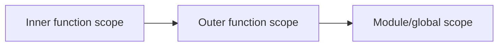

# Scope Chain

## Detailed explanation
The scope chain is the ordered lookup path JavaScript follows when resolving a variable name. It starts in the current lexical environment and moves outward through parent environments until it finds a binding or reaches the global scope.

This matters in interviews because it explains nested functions, closures, shadowing, module scope, and why a function can access variables declared outside it.

## 1. One-line mental model
The scope chain is JavaScript's path for finding variable names.

## 2. Problem it solves
Nested code needs a deterministic way to find local and outer variables.

## 3. Core idea
- Lookup starts in the current scope.
- If not found, JavaScript checks outer scopes.
- Inner declarations can shadow outer names.
- The chain is based on where code is written, not where it is called.
- Closures preserve access to outer scope bindings.

## 4. Visual / analogy
The scope chain is like asking your desk first, then your room, then the building reception.



## 5. Minimal example

```js
const currency = "INR";

function format(amount) {
  const prefix = "Rs";
  return `${prefix} ${amount} ${currency}`;
}
```

`format` finds `prefix` locally and `currency` in the outer scope.

## 6. Real-world example
Factory functions use the scope chain to keep private state without exposing it globally.

## 7. Common interview questions

#### What is the scope chain?
- **The Engine Mechanism (Why it behaves this way):** Structurally, every Execution Context contains a **Lexical Environment** which comprises an **Environment Record** (storing local identifiers) and an **Outer Lexical Environment Reference** (a pointer to the parent Lexical Environment). The Scope Chain is not a physical array, but rather a linked list of these Lexical Environment records. When the parser encounters an identifier like `x`, the engine's Resolver searches the active Execution Context's Environment Record. If it is not found, the Resolver dereferences the Outer pointer to jump to the parent Lexical Environment and repeats the search. This traversal continues link-by-link up the chain until the identifier is found or the Outer pointer is `null` (which occurs at the Global Environment record).
- **The Unforgettable Mental Model:** Think of Russian nesting dolls. The innermost doll represents your local scope. If you need a key (variable), you first look inside your doll. If it's not there, you open the next outer doll, and the next, until you reach the largest, outermost doll (global scope). You can look *outwards* to see what is in parent dolls, but an outer doll can never peer *inwards* into the inner dolls.
- **The Trap:** Believing that caller contexts alter this lookup. The Scope Chain pointers are established statically at compile time based entirely on geographic containment in the source code (Lexical Scoping). Where a function is called (its position in the call stack) has absolutely zero influence on its Scope Chain.
- **Senior Interview Playbook (Verbal Script):** When asked this in an interview, say: "The Scope Chain is the physical linked list of Lexical Environments utilized by the JS engine to resolve identifiers. When a variable is accessed, the engine queries the current Environment Record. If missing, it traverses upward via the outer Lexical Environment pointer, continuing this sequential traversal up to the Global Environment. If still unresolved, a ReferenceError is thrown in strict mode."

#### What is variable shadowing?
- **The Engine Mechanism (Why it behaves this way):** Shadowing occurs when an identifier is declared in an inner scope with the exact same name as an identifier in an outer scope. During name resolution, the engine searches the Lexical Environments sequentially starting at the innermost level. The moment the engine finds a matching identifier in the local Environment Record, the search stops immediately, and the value is returned. The outer variable remains completely intact in its respective outer Environment Record, but it becomes unreachable from the inner scope because the resolver's traversal is aborted at the first match.
- **The Unforgettable Mental Model:** A solar eclipse. The moon (inner local variable) passes directly in front of the massive sun (outer variable) from your perspective on Earth. The sun is still there in the sky (the outer scope), but it is completely blacked out (shadowed) by the closer moon.
- **The Trap:** Thinking shadowing with `var` inside a block behaves the same as `let`. If you do `var x` inside an `if` block, it hoists to the function or global scope, overwriting any parent `var x` in that function rather than shadowing it, since `var` does not respect block boundaries.
- **Senior Interview Playbook (Verbal Script):** When asked this in an interview, say: "Variable shadowing occurs when an identifier in an inner scope shares a name with a variable in an outer parent scope. Since name resolution traverses from the inside out and terminates at the first match, the inner declaration effectively blocks accessibility to the outer variable within that inner execution context, although the outer variable remains unaffected."

#### Is scope decided by call location or definition location?
- **The Engine Mechanism (Why it behaves this way):** Scope is determined entirely by **definition location** (Lexical Scoping), not by call location (Dynamic Scoping). When the compiler parses source code and creates functions, it attaches an internal, hidden property called `[[Environment]]` to the function object. This slot is permanently hardcoded with a reference to the Lexical Environment that was active *where the function was physically defined*. When the function is subsequently invoked at runtime, its FEC is pushed, and its outer Lexical Environment link is pointed directly to the address stored in that compile-time `[[Environment]]` slot.
- **The Unforgettable Mental Model:** Lexical scoping is like your DNA. It is determined at the moment of birth (definition) and never changes, no matter where you travel or who calls you on the phone (invocation) later in life.
- **The Trap:** Confusing variable scope resolution with the `this` keyword. Variable lookup is always static and lexical (definition-based), whereas `this` is dynamic and call-site dependent (call-location based, unless bound or using an arrow function).
- **Senior Interview Playbook (Verbal Script):** When asked this in an interview, say: "JavaScript strictly uses Lexical Scoping, meaning scope boundaries are decided entirely at compile time based on where functions are defined in the source code. Upon instantiation, every function receives a permanent `[[Environment]]` slot pointing to its parent scope, ensuring its lookup chain remains identical regardless of where or how it is eventually invoked."

#### How does scope chain relate to closures?
- **The Engine Mechanism (Why it behaves this way):** A closure is the combination of a function and the Lexical Environment within which that function was declared. Since the inner function holds a reference to the outer Lexical Environment via its internal `[[Environment]]` slot, the entire scope chain of the parent remains active. The garbage collector traces this reachability path: `Global -> Inner Function Object -> [[Environment]] -> Outer Lexical Environment`. Because the inner function preserves this pointer, it can traverse the scope chain of its parent context at any point in the future, even if that parent context has been popped from the call stack.
- **The Unforgettable Mental Model:** A closure is like carrying a backpack. The backpack contains the room where you were born (parent scope). Even if you walk out of that room and travel to a new city (the parent function finishes execution), you can open your backpack at any time and pull out items (variables) that were inside that original room.
- **The Trap:** Thinking that closures create a copy of the parent variables. They reference the actual live Environment Record itself. If the parent scope mutates a variable after the inner function is defined, invoking the inner function will resolve the newly mutated value.
- **Senior Interview Playbook (Verbal Script):** When asked this in an interview, say: "Closures are a direct consequence of Lexical Scoping and the Scope Chain. Because an inner function preserves a reference to its birth environment via its internal `[[Environment]]` slot, it keeps the parent scope chain alive in the heap. This allows the function to access parent variables dynamically long after the parent execution context has been destroyed."

#### How do modules affect scope?
- **The Engine Mechanism (Why it behaves this way):** ES Modules introduce a distinct type of environment record called a **Module Environment Record**. When a file is executed as a module, it does not share the global classic Variable Environment. Instead, it gets its own top-level Lexical Environment. Any variables declared at the top-level of the module are completely encapsulated within that file-level scope. They do not become properties of the `window` object, and they cannot be resolved by other scripts unless explicitly exported and imported.
- **The Unforgettable Mental Model:** A classic script is like a public park where anyone can dump their toys. A module is a locked private yard. If you want someone else to play with a toy, you must explicitly carry it out and hand it to them (export), and they must explicitly accept it (import).
- **The Trap:** Attempting to access module-declared variables via `window.myVar` in a script or in the browser console. It will return `undefined` because modules completely disconnect their top-level scope from the global window object.
- **Senior Interview Playbook (Verbal Script):** When asked this in an interview, say: "ES Modules isolate scope by instantiating a Module Environment Record for each file. This encapsulates top-level variables within the module, preventing them from leaking into the global `window` scope. Sharing variables across file boundaries is strictly controlled via explicit `export` and `import` semantics, which are verified statically during compile-time parsing."

## 8. Active recall test

1. **Where does lookup start?**
   - **Answer:** Lookup starts in the Environment Record of the currently active Execution Context (the innermost scope).

2. **What happens when an inner variable has the same name?**
   - **Answer:** It shadows the outer variable. The engine resolves the identifier at the local level and halts the lookup immediately, making the outer variable unreachable within that inner scope.

3. **Is JavaScript lexical or dynamic scoped?**
   - **Answer:** Lexical scoped. Variable accessibility is determined entirely at compile-time by where the variables and functions are physically defined in the source code.

4. **How do closures use the scope chain?**
   - **Answer:** Closures leverage the scope chain by holding a persistent pointer to their birth Lexical Environment via their internal `[[Environment]]` slot, allowing them to look up parent variables at runtime even after the parent function has finished executing.

5. **What happens when a name is never found?**
   - **Answer:** The lookup traverses all the way to the Global Environment record (where the outer link is `null`). If the name is still not found, the engine throws a `ReferenceError`. In non-strict mode, assigning to it would create a global property.

## 9. Mistakes / traps
- Thinking callers decide scope.
- Confusing object property lookup with variable lookup.
- Forgetting `let` and `const` are block-scoped.
- Accidentally shadowing important variables.

## 10. Compare with related concepts
- **Scope chain vs prototype chain:** variable lookup vs object property lookup.
- **Scope vs closure:** scope is availability; closure is a function retaining outer scope.
- **Lexical vs dynamic scope:** JavaScript uses lexical scope.

## 11. Summary from memory
Explain how JavaScript resolves a variable inside a nested function.

## 12. Spaced revision prompts
- After 1 day: Define scope chain.
- After 3 days: Explain shadowing.
- After 7 days: Compare scope chain and prototype chain.
- After 14 days: Trace a nested closure lookup.
