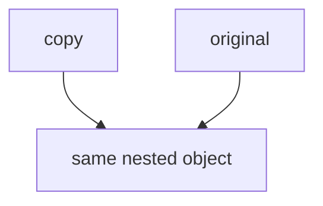

# Shallow Copy vs Deep Copy

## Detailed explanation
A shallow copy copies only the top-level structure while nested objects remain shared by reference. A deep copy recursively copies nested data so changes to nested values do not affect the original.

Frontend interviews ask this because React state updates, reducers, memoization, undo history, and API transformations depend on understanding reference sharing.

## 1. One-line mental model
Shallow copy copies the container; deep copy copies the nested contents too.

## 2. Problem it solves
Developers need to control when data updates share references and when they are independent.

## 3. Core idea
- Spread and `Object.assign` are shallow.
- Array spread and `slice` are shallow.
- Nested objects remain shared in shallow copies.
- Deep copy can be expensive and lossy if done blindly.
- Prefer targeted immutable updates in React.

## 4. Visual / analogy
Shallow copy duplicates a folder shortcut; deep copy duplicates the files inside.



## 5. Minimal example

```js
const user = { name: "Asha", address: { city: "Pune" } };
const copy = { ...user };

copy.address.city = "Mumbai";
console.log(user.address.city); // Mumbai
```

## 6. Real-world example
Updating nested React state with only a top-level spread can mutate old state through a shared nested reference.

## 7. Common interview questions
#### What is shallow copy?
- **The Engine Mechanism (Why it behaves this way):** A shallow copy creates a new object container in the Heap. The engine iterates over the enumerable keys of the source object and copies their values over. If a property is a primitive value, its actual value is written directly into the new object. If a property is a reference type (like an object, array, or function), the engine copies the **memory address pointer** to the nested heap object. Consequently, both the original and copied objects now house keys that point to the exact same nested location in the Memory Heap.
- **The Unforgettable Mental Model:** The **Photocopied Address Book**. You photocopy your friend's address book. The book itself is a new physical item (shallow copy), but all the addresses written inside point to the same physical houses (nested objects) in the real world.
- **The Trap:** Thinking that spreading an array of objects `[...arr]` makes the objects inside immune to mutation. Any modification of a property inside one of the array elements will mutatively bleed back to the original array.
- **Senior Interview Playbook (Verbal Script):** "When asked this in an interview, say: A shallow copy duplicates only the top-level properties of an object or array. Primitives are copied by value, but references to objects, arrays, and nested structures are copied by their memory pointer. Consequently, the copied container still shares identical nested references in the heap with the original object, making deep mutations globally shared."

#### What is deep copy?
- **The Engine Mechanism (Why it behaves this way):** A deep copy recursively traverses the entire object tree on the Memory Heap, allocating a completely brand-new object or array container for every single nested reference it encounters. It copies primitive values and rebuilds all structural links, guaranteeing that no reference pointer from the new structure matches any reference pointer in the original structure.
- **The Unforgettable Mental Model:** The **Parallel Universe Builder**. A deep copy doesn't just copy the layout map; it instantiates a completely independent parallel universe. Every single house and item is rebuilt from scratch in a new location, ensuring that a change in Universe A has absolutely zero physical impact on Universe B.
- **The Trap:** Attempting to write a simple custom deep-cloning function using naive recursion. This will crash the call stack with a "Maximum call stack size exceeded" error if the source object contains circular references (Object A referencing Object B, which references Object A).
- **Senior Interview Playbook (Verbal Script):** "When asked this in an interview, say: A deep copy is a complete, recursive duplication of an entire object graph. It allocates new memory in the heap for every single nested object and array, ensuring that no reference pointers are shared. This isolates the copied object completely from the original, making deep mutations completely safe."

#### Is spread deep?
- **The Engine Mechanism (Why it behaves this way):** No. The spread operator (`...`) is syntactic sugar for copying properties from one object or array to another. When the engine executes `{ ...original }`, it performs a shallow iteration over the enumerable properties of `original`, copying the exact stack-stored value (which is a primitive value or a heap memory pointer). It does not trigger any recursive deep copy mechanism.
- **The Unforgettable Mental Model:** Spreading is like **unboxing a package and placing the contents into a new box**. You have a new box (new reference), but the items inside (nested objects) are the exact same physical items you pulled out of the old box.
- **The Trap:** Spreading a complex nested state in a React component and thinking that reassigning a nested property like `stateCopy.user.address.city = 'Delhi'` is an immutable update.
- **Senior Interview Playbook (Verbal Script):** "When asked this in an interview, say: No, the spread operator is strictly a shallow copy mechanism. It only iterates through the top-level properties of the target. If any nested property contains an object or an array, only its memory pointer is copied. Thus, nested references remain shared between the original and spread objects."

#### When is `structuredClone` useful?
- **The Engine Mechanism (Why it behaves this way):** `structuredClone` is a modern browser and Node.js global API that implements the **HTML Structured Clone Algorithm**. Unlike JSON cloning, the structured clone algorithm is executed inside the engine with native support for circular references and a rich variety of built-in JavaScript types (such as `Date`, `RegExp`, `Map`, `Set`, `ArrayBuffer`, and `Blob`). It recursively allocates heap memory and recreates these complex structures natively, preserving internal prototype hierarchies.
- **The Unforgettable Mental Model:** The **Native 3D Scanner and Printer**. It scans any object—even those with cycles or weird built-in gear (like Dates and Maps)—and prints an exact, fully functional duplicate in a fresh block of heap memory.
- **The Trap:** Passing functions, DOM nodes, or getters/setters to `structuredClone`. These items cannot be cloned by the structured clone algorithm and will throw a `DataCloneError`.
- **Senior Interview Playbook (Verbal Script):** "When asked this in an interview, say: `structuredClone` is a native global API that provides deep copying capabilities. It is highly useful because it natively supports complex JS types like Dates, Maps, Sets, and RegExps, and correctly handles circular references without throwing call stack errors. However, we should avoid passing functions, symbols, or DOM elements to it, as they cannot be cloned."

#### Why can JSON cloning be unsafe?
- **The Engine Mechanism (Why it behaves this way):** The serialization trick `JSON.parse(JSON.stringify(obj))` converts an object to a JSON string and parses it back. This is highly unsafe because the JSON specification does not support many native JavaScript constructs. During the `stringify` phase:
  - `Date` objects are converted to ISO string primitives (losing their prototype methods).
  - `RegExp`, `Map`, `Set`, and `ArrayBuffer` objects are serialized into empty objects `{}`.
  - `undefined`, functions, and `Symbol` properties are completely omitted/ignored.
  - `NaN`, `Infinity`, and `-Infinity` are serialized as `null`.
  - Circular references instantly throw a `TypeError`.
- **The Unforgettable Mental Model:** The **Airport Security Shredder**. You put your luggage through a machine that only accepts clothes. It shreds your camera (Date), throws away your passport (Map/Set), and vaporizes your money (undefined/functions), returning a simplified box containing only the basic garments.
- **The Trap:** Relying on JSON cloning to duplicate utility objects or state trees that contain date instances, custom classes, or undefined properties.
- **Senior Interview Playbook (Verbal Script):** "When asked this in an interview, say: JSON cloning is highly unsafe because it is a hacky serialization mechanism. The JSON spec only supports basic objects, arrays, and primitives. Passing a JS object to JSON stringify will mutate Dates into strings, erase undefined values, symbols, and functions, serialize Maps and Sets into empty objects, and immediately throw an error if a circular reference is encountered."

## 8. Active recall test
1. **What remains shared in a shallow copy?**
   - **Explanation:** All reference-type values (nested objects, nested arrays, functions) remain shared via copied memory pointers in a shallow copy.
2. **Is array spread deep?**
   - **Explanation:** No. Array spread `[...arr]` is strictly shallow. If the array elements are objects, only their reference pointers are copied into the new array.
3. **What can JSON cloning lose?**
   - **Explanation:** It loses functions, `undefined` properties, `Symbol` properties, the type identity of `Date` instances (converted to strings), `Map` and `Set` contents, and throws errors on circular references.
4. **Why is deep copy expensive?**
   - **Explanation:** Because it requires recursive traversal of the entire object tree, triggering brand new memory allocations in the Heap for every nested level, which consumes significant CPU cycles and memory.
5. **What should React reducers usually do?**
   - **Explanation:** React reducers should perform **targeted shallow copies** (shallow spreading only the specific nested path of the object that actually changed) rather than deep cloning the entire state tree. This preserves reference equality for unchanged state branches, optimizing performance by preventing unnecessary child re-renders.

## 9. Mistakes / traps
- Thinking spread deeply clones.
- Mutating nested state after shallow copy.
- Using JSON clone on Dates, Maps, undefined, functions, or circular data.
- Deep cloning everything instead of updating the changed path.

## 10. Compare with related concepts
- **Shallow copy vs deep copy:** top-level only vs recursive.
- **Copy vs mutation:** new reference vs changing existing data.
- **`structuredClone` vs JSON clone:** broader browser-native clone vs lossy serialization trick.

## 11. Summary from memory
Explain why `{ ...obj }` does not protect nested objects.

## 12. Spaced revision prompts
- After 1 day: Define shallow copy.
- After 3 days: Show nested mutation bug.
- After 7 days: Compare JSON clone and `structuredClone`.
- After 14 days: Write targeted nested state update.
