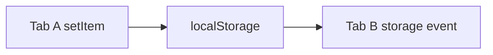

# Storage Event

## Detailed explanation
`storage` event fires in other tabs/windows from same origin when localStorage changes. It does not fire in same tab that made change. It is useful for logout sync, preference sync, and simple cross-tab communication.

For richer cross-tab messaging, use BroadcastChannel.

## 1. One-line mental model
`storage` event notifies other tabs about localStorage changes.

## 2. Problem it solves
Multiple tabs need to know when shared browser storage changes.

## 3. Core idea
- Fires on other same-origin documents.
- Triggered by localStorage changes.
- Includes key, oldValue, newValue.
- Same tab does not receive its own event.
- Useful for logout sync.

## 4. Visual / analogy
One tab writes notice; other tabs hear bell.



## 5. Minimal example

```js
window.addEventListener("storage", (event) => {
  console.log(event.key, event.newValue);
});
```

## 6. Real-world example

```js
window.addEventListener("storage", (event) => {
  if (event.key === "logout") redirectToLogin();
});
```

## 7. Common interview questions

#### What is the storage event?
- **The Engine Mechanism (Why it behaves this way):** The `storage` event represents a notification dispatched by the browser's storage synchronization engine when a change is committed to `localStorage` (or `sessionStorage` in limited iframe scopes). Under the hood, when a tab modifies a storage key via `localStorage.setItem()`, `removeItem()`, or `clear()`, the browser process intercepts this write. The browser process updates the shared origin database file on disk and broadcasts a message across all open renderer processes running same-origin windows. Each matching renderer process creates a `StorageEvent` instance (inheriting from `Event`) in its heap memory and pushes a task onto the Event Loop's Macrotask Queue to execute any registered `storage` handlers on the `window` object.
- **The Unforgettable Mental Model:** A neighborhood association bulletin board. When one resident (tab) pins a notice (writes to localStorage) on the public physical board, the association mails a copy of that notice (fires a storage event) to all other homes (tabs) in the neighborhood, but doesn't mail one back to the sender since they wrote it themselves.
- **The Trap:** Thinking that the `storage` event is triggered by changes to `sessionStorage` in separate tabs. Since `sessionStorage` is strictly scoped to the individual tab session, changes to a tab's `sessionStorage` do not propagate across other tabs and therefore will never fire a `storage` event in them.
- **Senior Interview Playbook (Verbal Script):** "When asked this in an interview, say: 'The `storage` event is a native DOM window event fired on all same-origin windows and tabs when a change—like setting, updating, or deleting a key—is committed to `localStorage` in *another* window or tab. It provides a lightweight, browser-native notification system for multi-tab synchronization.'"

#### Does it fire in the same tab?
- **The Engine Mechanism (Why it behaves this way):** No, by design and specifications, the `storage` event does *not* fire on the same window/document that initiated the change. The browser's storage engine keeps track of which document context ID executed the `setItem`/`removeItem` call and explicitly excludes that context ID from the target list when broadcasting the inter-process storage change message. This prevents infinite cycles where a change in tab A triggers a listener in tab A that makes another storage update.
- **The Unforgettable Mental Model:** Looking in a mirror and shouting a message. The sound waves travel out to everyone in the room (other tabs), but you don't need a loudspeaker to repeat your own words back into your own ears (same tab), since you are the source of the speech.
- **The Trap:** Developing and testing a cross-tab feature (like tab sync) on a single browser tab and wondering why your `storage` event listener is never executing. You *must* open two separate windows/tabs of the same site to observe the event in action.
- **Senior Interview Playbook (Verbal Script):** "When asked this in an interview, say: 'No, the `storage` event does not fire in the document that initiated the write. The browser engine actively filters out the writer tab context to prevent self-triggering feedback loops. It only fires in sibling tabs and windows sharing the exact same origin.'"

#### What triggers it?
- **The Engine Mechanism (Why it behaves this way):** The storage event is triggered specifically when a synchronous write operation actually *mutates* a key inside `localStorage`. This includes:
  1. `localStorage.setItem(key, value)` — but *only* if the new value is different from the current value (re-setting a key to its exact same value does not trigger the event).
  2. `localStorage.removeItem(key)`.
  3. `localStorage.clear()`.
  The event is NOT triggered by any read operations (like `getItem()`), and is NOT triggered by writing to object properties directly (like `localStorage.key = value`) in older non-conforming engines, or by modifications made within private/incognito browsing windows which are partitioned.
- **The Unforgettable Mental Model:** A change detector on a scale. If you place a weight on the scale (different value), the alarm rings. If you place the exact same weight that is already there, or just look at the scale (read operation), the alarm remains silent.
- **The Trap:** Writing `localStorage.setItem('key', 'same_value')` repeatedly inside a loop or timer, expecting it to continuously fire storage events. The engine performs a value comparison first; if `newValue === oldValue`, no event is dispatched.
- **Senior Interview Playbook (Verbal Script):** "When asked this in an interview, say: 'The event is triggered by successful mutations to `localStorage` via `setItem()`, `removeItem()`, or `clear()`. Crucially, if you set a key to its existing value, the engine's change-check intercepts it and suppresses the event. Read actions have zero effect on triggering events.'"

#### How to sync logout across tabs?
- **The Engine Mechanism (Why it behaves this way):** To synchronize logout across all same-origin tabs:
  1. When a user clicks "Logout" in Tab A, the application calls `localStorage.setItem('session_logout', Date.now().toString())` and redirects the active tab to the login screen.
  2. The browser engine broadcasts the storage change.
  3. Sibling Tabs B and C receive the storage event. Inside their event listener callbacks, they inspect the event object: `if (event.key === 'session_logout')`.
  4. Sibling tabs synchronously clear their local in-memory session states, clean up cookies, and programmatically redirect their viewport using `window.location.replace('/login')`.
- **The Unforgettable Mental Model:** An automated emergency evacuation broadcast. When one building control room (Tab A) activates the fire alarm (writes the logout timestamp), all other rooms in the complex (other tabs) immediately receive the siren and execute the evacuation protocol (redirect to login) simultaneously.
- **The Trap:** Forgetting to handle the case where the user logs in again. By using a changing timestamp value (like `Date.now()`) instead of a static string like `'true'`, you ensure that subsequent logins and logouts always represent a *new* mutation, forcing the storage event to fire every time.
- **Senior Interview Playbook (Verbal Script):** "When asked this in an interview, say: 'To sync logout, we write a changing value—like a high-precision timestamp—to a dedicated `session_logout` key in `localStorage` when the user triggers a sign-out. All other same-origin tabs catch this change through the `storage` event, detect the logout key, clear their active in-memory session stores, and programmatically redirect the user to the login screen, ensuring a uniform and secure logout state across the entire browser session.'"

#### Storage event vs BroadcastChannel?
- **The Engine Mechanism (Why it behaves this way):**
  - **Storage Event:** Is a side-effect of a state mutation in a persistent database (`localStorage`). It carries limited metadata (key, oldValue, newValue) and is constrained by key size boundaries. It is synchronous at write-time, persistent on disk, and does not support sending rich, non-serializable objects.
  - **BroadcastChannel:** Is a dedicated, high-performance, asynchronous message bus built for cross-tab communications. It allows you to broadcast rich data payloads (directly cloning complex objects using the Structured Clone Algorithm) to any active subscribers on the same channel name, without writing *anything* to the persistent hard drive. It works in the main thread or inside Web Workers and Service Workers, and is much faster because it avoids disk I/O overhead.
- **The Unforgettable Mental Model:** The storage event is like writing an announcement on a concrete public billboard in the town square; everyone can see it, but you had to physically carve it into stone (disk write). BroadcastChannel is like a direct walkie-talkie channel; you speak into the mic, and everyone tuned in hears your voice instantly through the air without any stone carving.
- **The Trap:** Using the `storage` event as a real-time multiplayer message bus (e.g., syncing mouse coordinates or live chats across tabs). This causes massive disk thrashing and lag because every single coordinate change forces a disk write. You should use `BroadcastChannel` for high-frequency messages.
- **Senior Interview Playbook (Verbal Script):** "When asked this in an interview, say: 'The storage event is a side-effect of database mutation, meaning it requires disk writes, is limited to string values, and works only with `localStorage`. In contrast, `BroadcastChannel` is a dedicated, high-speed, purely in-memory communication channel. It enables bidirectional sharing of complex, cloned objects between tabs, windows, and background workers without the performance penalty of disk writes, making it the superior architecture for active multi-tab synchronization.'"

## 8. Active recall test

#### 1. Which storage triggers it?
- **Explanation/Answer:** Only changes committed to `localStorage` (and very rarely `sessionStorage` inside shared frames, but not standard `sessionStorage`).

#### 2. Which tabs receive it?
- **Explanation/Answer:** Sibling tabs and windows sharing the exact same protocol, domain, and port (same origin).

#### 3. Does the writer tab receive it?
- **Explanation/Answer:** No, the tab that performed the write is excluded from receiving the event to prevent infinite recursion loops.

#### 4. What values are available?
- **Explanation/Answer:** The event object provides `key`, `oldValue`, `newValue`, `url` (the script URL that made the change), and `storageArea` (a reference to the storage object itself).

#### 5. Name a use case.
- **Explanation/Answer:** Instantly logging out a user in all open tabs of an application when they click "Log out" in one tab, preventing unauthorized access in stale sessions.

## 9. Mistakes / traps
- Expecting same tab event.
- Using for high-frequency messages.
- Storing sensitive data in localStorage.
- Forgetting same-origin limit.

## 10. Compare with related concepts
- **Storage event vs BroadcastChannel:** storage-change signal vs direct message channel.
- **localStorage vs sessionStorage:** shared per origin vs per tab session.
- **Storage event vs custom event:** cross-tab browser event vs same-document event.

## 11. Summary from memory
Explain logout sync with `storage` event.

## 12. Spaced revision prompts
- 1 day: Define storage event.
- 3 days: Explain same-tab caveat.
- 7 days: Implement logout sync.
- 14 days: Compare BroadcastChannel.

