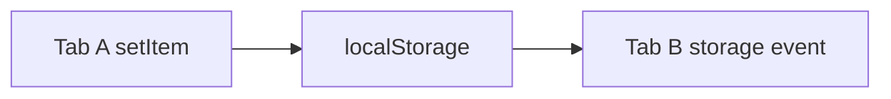

# Storage Event

## Detailed explanation
`storage` event fires in other tabs/windows from same origin when localStorage changes. It does not fire in same tab that made change. It is useful for logout sync, preference sync, and simple cross-tab communication.

For richer cross-tab messaging, use BroadcastChannel.

## 1. One-line mental model
`storage` event notifies other tabs about localStorage changes.

## 2. Problem it solves
Multiple tabs need to know when shared browser storage changes.

## 3. Core idea
- Fires on other same-origin documents.
- Triggered by localStorage changes.
- Includes key, oldValue, newValue.
- Same tab does not receive its own event.
- Useful for logout sync.

## 4. Visual / analogy
One tab writes notice; other tabs hear bell.



## 5. Minimal example

```js
window.addEventListener("storage", (event) => {
  console.log(event.key, event.newValue);
});
```

## 6. Real-world example

```js
window.addEventListener("storage", (event) => {
  if (event.key === "logout") redirectToLogin();
});
```

## 7. Common interview questions
- What is storage event?
- Does it fire in same tab?
- What triggers it?
- How sync logout across tabs?
- Storage event vs BroadcastChannel?

## 8. Active recall test
1. Which storage triggers it?
2. Which tabs receive it?
3. Does writer tab receive it?
4. What values available?
5. Name use case.

## 9. Mistakes / traps
- Expecting same tab event.
- Using for high-frequency messages.
- Storing sensitive data in localStorage.
- Forgetting same-origin limit.

## 10. Compare with related concepts
- **Storage event vs BroadcastChannel:** storage-change signal vs direct message channel.
- **localStorage vs sessionStorage:** shared per origin vs per tab session.
- **Storage event vs custom event:** cross-tab browser event vs same-document event.

## 11. Summary from memory
Explain logout sync with `storage` event.

## 12. Spaced revision prompts
- 1 day: Define storage event.
- 3 days: Explain same-tab caveat.
- 7 days: Implement logout sync.
- 14 days: Compare BroadcastChannel.

