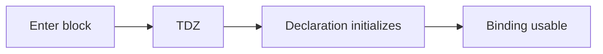

# Temporal Dead Zone

## Detailed explanation
The temporal dead zone is the period from entering a scope until a `let` or `const` declaration is initialized. During this period the binding exists, but accessing it throws a `ReferenceError`.

TDZ prevents code from reading block-scoped variables before their declaration has executed, making bugs more visible than `var`'s `undefined` behavior.

## 1. One-line mental model
TDZ is the unsafe time before a `let` or `const` binding is initialized.

## 2. Problem it solves
It prevents accidental use of block-scoped variables before they are ready.

## 3. Core idea
- Applies to `let`, `const`, and class declarations.
- Starts when scope is entered.
- Ends when the declaration line runs.
- Access before initialization throws.
- It proves `let` and `const` are hoisted but not usable early.

## 4. Visual / analogy
TDZ is like a reserved seat before the person has checked in.



## 5. Minimal example

```js
{
  console.log(total); // ReferenceError
  const total = 10;
}
```

## 6. Real-world example
TDZ catches mistakes during refactors when a block-scoped value is read before the code path that initializes it.

## 7. Common interview questions

#### What is temporal dead zone?
- **The Engine Mechanism (Why it behaves this way):** The Temporal Dead Zone (TDZ) is a strict runtime behavior in JavaScript. It describes the temporal window (or duration of execution) starting from the point the engine enters a block scope containing block-scoped declarations, up until the moment the thread of execution compiles and evaluates the literal declaration statement of that block-scoped variable. Internally, when the scope is entered, the engine registers these identifiers in the Lexical Environment, leaving them with an internal specification marker representing "uninitialized". Any runtime bytecode read or write instruction targeting an identifier in this uninitialized state forces the engine to halt execution and throw a `ReferenceError`.
- **The Unforgettable Mental Model:** A newly built high-security research facility. The moment you walk into the facility (enter the scope), all research rooms (variables) are locked and guarded by lasers. Only when the security team turns off the lasers for a specific room (evaluates the declaration statement) can you walk in and touch the files. If you touch the door handle before the lasers are deactivated, you set off a screaming alarm (ReferenceError).
- **The Trap:** Thinking that the TDZ is spatial (based on line position) rather than temporal (based on time of execution). You can syntactically write a reference to `x` *above* its declaration line, but as long as that reference is inside a function that is only called *after* the declaration line is executed (e.g., inside an event handler), no error will occur because the TDZ for `x` has already ended at the moment of access.
- **Senior Interview Playbook (Verbal Script):** When asked this in an interview, say: "The Temporal Dead Zone is the runtime execution period beginning when a block scope is entered and ending when a block-scoped variable's declaration statement is evaluated. Internally, during this period, the variable is registered in the Lexical Environment but remains marked as uninitialized. Accessing it during this window triggers a ReferenceError, forcing developers to declare variables before use."

#### Are `let` and `const` hoisted?
- **The Engine Mechanism (Why it behaves this way):** Yes. During the context Creation Phase, the compiler scans the AST for all declarations. It registers `let` and `const` bindings in the current block's Lexical Environment record. The critical difference is initialization: `var` is hoisted and immediately initialized to `undefined`. `let` and `const` are hoisted but kept in an uninitialized state.
- **The Unforgettable Mental Model:** Placing a name tag on a conference table before guests arrive. The name tag is physically there on the table (the variable occupies a memory slot), but the chair is locked down until the guest checks in.
- **The Trap:** Stating that `let` and `const` are not hoisted. If they were not hoisted, referencing them before declaration would resolve to the outer/global scope or throw a generic `is not defined` ReferenceError. Instead, it throws a specific `Cannot access variable before initialization` ReferenceError, proving the engine knows about the identifier's local presence.
- **Senior Interview Playbook (Verbal Script):** When asked this in an interview, say: "Yes, block-scoped declarations are fully hoisted. The compiler registers them in the block's Lexical Environment during the creation phase. However, they are left in an uninitialized state in memory, triggering the Temporal Dead Zone until their physical declaration line is evaluated at runtime."

#### Why does `typeof` sometimes throw?
- **The Engine Mechanism (Why it behaves this way):** Historically, in JavaScript, `typeof` was a completely safe operator that was guaranteed never to throw an error. If you did `typeof undeclaredVar`, the resolver checked the global scope, found no such binding, and returned the string `"undefined"` safely. However, with the introduction of block scoping in ES6, if you apply `typeof` to a variable that is currently in the Temporal Dead Zone (e.g., `typeof myLet` before `let myLet`), the engine's Resolver intercepts the read operation, detects the "uninitialized" state marker in the local Lexical Environment record, and instantly throws a `ReferenceError`.
- **The Unforgettable Mental Model:** A security scanner at an airport. Normally, if the scanner checks a regular passenger with no ticket (an undeclared variable), it says "unknown traveler" (`"undefined"`) safely. But if it scans a passenger carrying a flagged, locked briefcase containing unverified contents (a variable locked in the TDZ), it goes off instantly, locks the doors, and triggers an emergency alarm (ReferenceError).
- **The Trap:** Thinking `typeof` is always safe in modern JS. It is *not* safe for block-scoped variables in the TDZ.
- **Senior Interview Playbook (Verbal Script):** When asked this in an interview, say: "While `typeof` is historically safe and returns the string `'undefined'` for completely undeclared variables, it will throw a ReferenceError if applied to a block-scoped identifier currently residing within its Temporal Dead Zone. This occurs because the engine intercepts the read operation and throws a protection violation before `typeof` can execute."

#### Do classes have TDZ?
- **The Engine Mechanism (Why it behaves this way):** Yes, both Class Declarations (`class MyClass {}`) and Class Expressions (`const MyClass = class {}`) are subject to the Temporal Dead Zone. When the engine enters their containing block scope, the class identifier is registered in the Lexical Environment record during the Creation Phase but is left uninitialized. Attempting to instantiate the class via `new MyClass()` or reference the class name before the execution thread evaluates the `class` declaration statement throws a `ReferenceError`.
- **The Unforgettable Mental Model:** A template for a 3D-printer. Before the printer receives and compiles the file containing the 3D-model design (the class declaration statement), you cannot ask the printer to produce a plastic toy (instantiate an object). You must compile the design first.
- **The Trap:** Thinking that class declarations behave like function declarations. While function declarations hoist with their compiled bodies (and are immediately usable), class declarations hoist *without* their bodies, entering the TDZ exactly like a `let` or `const` variable.
- **Senior Interview Playbook (Verbal Script):** When asked this in an interview, say: "Yes, class declarations are fully subject to the Temporal Dead Zone. Unlike standard function declarations, they are hoisted but left uninitialized in the Lexical Environment. Any attempt to reference or instantiate the class before its declaration line is executed will throw a ReferenceError."

#### How is TDZ different from `var`?
- **The Engine Mechanism (Why it behaves this way):** The core difference lies in the **Creation Phase initialization behavior** of the engine.
  - For `var`: The engine registers it in the Variable Environment and immediately initializes it to the value `undefined`. It is fully readable from the start of context execution.
  - For `let`/`const`/`class`: The engine registers them in the Lexical Environment but keeps them in an uninitialized state in memory, rendering them completely unreadable and unwritable (TDZ) until the declaration line executes.
- **The Unforgettable Mental Model:** `var` is a rented apartment pre-furnished with a generic, plain chair (initialized to `undefined`). You can sit on it immediately. `let` is an empty apartment where you are not even allowed to step inside the living room until the moving truck arrives and officially delivers your furniture (executes the declaration line).
- **The Trap:** Believing `let` and `const` behave the same way under hoisting. `const` has an additional compile-time restriction: it must be initialized with a value at the moment of declaration (e.g., `const a = 10`), whereas `let` can be declared empty (e.g., `let a;` which is dynamically initialized to `undefined` when the statement runs).
- **Senior Interview Playbook (Verbal Script):** When asked this in an interview, say: "The primary difference lies in the engine's initialization pipeline. `var` is registered in the Variable Environment and immediately initialized to `undefined` during context creation. `let` and `const` are registered in the Lexical Environment but left uninitialized, blocking all access via a ReferenceError until their literal declaration is evaluated at runtime."

## 8. Active recall test

1. **When does TDZ start?**
   - **Answer:** It starts the moment the execution thread enters the containing block scope that houses the block-scoped variable declaration.

2. **When does it end?**
   - **Answer:** It ends the instant the execution thread compiles and evaluates the literal declaration statement of that variable in the source code.

3. **Which declarations are affected?**
   - **Answer:** Block-scoped declarations: `let`, `const`, Class Declarations, and Class Expressions.

4. **What error is thrown?**
   - **Answer:** A runtime `ReferenceError: Cannot access 'variable' before initialization`.

5. **Why is TDZ safer than `var`?**
   - **Answer:** It prevents silent bugs where variables are accessed as `undefined` before they are initialized, instead throwing an immediate, loud runtime crash that highlights invalid execution flow geography.

## 9. Mistakes / traps
- Saying TDZ means variables do not exist.
- Forgetting class declarations.
- Thinking `typeof undeclared` and `typeof tdzVariable` behave the same.
- Confusing TDZ with normal scope errors.

## 10. Compare with related concepts
- **TDZ vs hoisting:** hoisted binding exists, but access is blocked.
- **`var` vs `let`:** `var` initializes to `undefined`; `let` stays uninitialized until declaration.
- **ReferenceError vs undefined:** illegal access vs valid value.

## 11. Summary from memory
Explain why accessing `let` before its line throws instead of returning `undefined`.

## 12. Spaced revision prompts
- After 1 day: Define TDZ.
- After 3 days: Compare `var` with `let`.
- After 7 days: Explain `typeof` and TDZ.
- After 14 days: Predict output in nested blocks.
