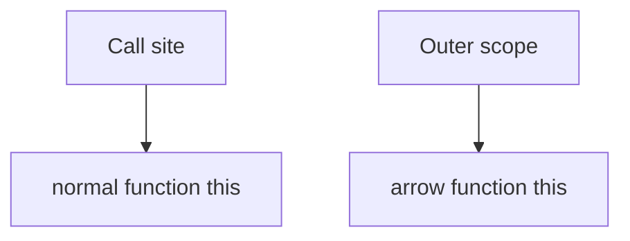

# `this` Binding

## Detailed explanation
`this` is a runtime value determined by how a function is called, except for arrow functions, which capture `this` lexically from the surrounding scope. In JavaScript interviews, `this` questions test method calls, detached functions, constructors, `bind`, `call`, `apply`, event handlers, and arrow functions.

Senior answers should identify the call site first instead of looking only at where the function is written.

## 1. One-line mental model
For normal functions, `this` comes from the call site; for arrows, it comes from the surrounding scope.

## 2. Problem it solves
JavaScript needs a way for reusable functions to operate against different receiver objects.

## 3. Core idea
- `obj.method()` sets `this` to `obj`.
- Detached function calls lose the object receiver.
- `new` creates a new object as `this`.
- `call`, `apply`, and `bind` set `this` explicitly.
- Arrow functions do not define their own `this`.

## 4. Visual / analogy
`this` is like the current owner of a borrowed tool; the owner depends on who hands it over.



## 5. Minimal example

```js
const user = {
  name: "Asha",
  say() {
    return this.name;
  },
};

const fn = user.say;
```

`user.say()` has `this === user`; `fn()` does not.

## 6. Real-world example
Class component methods historically needed binding because passing `this.handleClick` detached the method from the instance.

## 7. Common interview questions
#### How is `this` determined?
- **The Engine Mechanism (Why it behaves this way):** When a function is called, the JavaScript engine creates a new Execution Context. Along with setting up the Lexical Environment, the engine initializes a special binding called the `ThisBinding` in the execution context's environment record. Its value is determined strictly by the **call site** and the call syntax:
  1. *Default Binding:* A plain function call (e.g. `fn()`) binds `this` to the global object (`window` or `globalThis`) in non-strict mode, or `undefined` in strict mode.
  2. *Implicit Binding:* A method call (e.g. `obj.method()`) binds `this` to the object preceding the dot (`obj`).
  3. *Explicit Binding:* Using `.call()`, `.apply()`, or `.bind()` sets `this` to the first argument passed.
  4. *Constructor Binding:* A function called with `new` (e.g. `new Constructor()`) binds `this` to a brand-new object created in the heap that inherits from `Constructor.prototype`.
- **The Unforgettable Mental Model:** The **Call-Site Phone Call**. `this` is not who wrote the letter (where the function is declared); it's the person who picks up the phone *at the exact moment the call is made* (the call site).
- **The Trap:** Thinking that a nested normal function inside a method will inherit `this` from the method. If invoked as `fn()`, the inner function will revert to the Default Binding (`window` or `undefined`).
- **Senior Interview Playbook (Verbal Script):** "When asked this in an interview, say: `this` is a dynamic execution context binding determined strictly at runtime based on the function's call site. The engine checks four precedence rules in order: constructor binding via `new`, explicit binding via `call`, `apply`, or `bind`, implicit binding via an object reference dot-notation, and finally, default binding which falls back to the global object or `undefined` in strict mode."

#### How do arrow functions handle `this`?
- **The Engine Mechanism (Why it behaves this way):** Arrow functions do not possess their own internal `[[ThisValue]]` slot in their execution contexts. When the compiler evaluates an arrow function, it resolves the `this` identifier lexically. It simply traverses up the Lexical Environment scope chain to find the nearest enclosing execution context that *does* have a `this` binding (such as a normal function context or the global context) and reads that value.
- **The Unforgettable Mental Model:** The **Chameleon**. The arrow function does not have its own color (its own `this`); it simply copies the color of the room (enclosing lexical scope) it is currently sitting in.
- **The Trap:** Trying to re-bind `this` in an arrow function using `.bind()`, `.call()`, or `.apply()`. The engine will ignore the binding completely and execute the function with its original lexical `this`.
- **Senior Interview Playbook (Verbal Script):** "When asked this in an interview, say: Arrow functions do not define their own `this` binding. Instead, they capture the `this` value of their enclosing lexical scope at creation time. Because they lack a `[[ThisValue]]` slot, their `this` is completely immutable and cannot be altered by `call`, `apply`, or `bind`."

#### What do `call`, `apply`, and `bind` do?
- **The Engine Mechanism (Why it behaves this way):** 
  - `call` and `apply` invoke the target function immediately. The engine pushes a new execution context onto the Call Stack where the `ThisBinding` is explicitly set to the first argument. `call` accepts arguments individually as a comma-separated list, while `apply` accepts them as a single array-like structure.
  - `bind` does not execute the function. Instead, it creates a new **bound function** object in the Heap. The bound function wraps the original function and permanently forces its execution context's `ThisBinding` to the provided value, regardless of how or where the returned function is subsequently called.
- **The Unforgettable Mental Model:** 
  - `call`/`apply` are like a **Rental Lease**. You rent the tool for immediate use right now, specifying who owns it.
  - `bind` is like a **Custom Remote Control**. It returns a physical remote control pre-programmed to turn on only one specific television (the bound context) forever.
- **The Trap:** Attempting to call `.bind()` multiple times on the same function to change the context again. Once a function is bound, further binds cannot override the original bound context.
- **Senior Interview Playbook (Verbal Script):** "When asked this in an interview, say: `call`, `apply`, and `bind` are methods on `Function.prototype` used to explicitly control `this` binding. `call` and `apply` execute the function immediately, setting `this` to the first argument; `call` takes arguments individually, while `apply` takes them as an array. `bind` returns a new, permanently bound wrapper function that, when called later, always executes with the specified `this` receiver."

#### What happens when a method is assigned to a variable?
- **The Engine Mechanism (Why it behaves this way):** When you execute `const fn = obj.method`, you are copying the reference to the function object from the heap, not the relationship to `obj`. The variable `fn` on the stack now holds a direct pointer to the function object. When you subsequently invoke `fn()`, the call site is a plain, detached call without dot-notation. The engine executes this call using the **Default Binding** rule, so `this` is bound to the global object (`window` or `globalThis`) or `undefined` in strict mode.
- **The Unforgettable Mental Model:** **Stealing the Tool**. If you copy a tool (the method reference) out of a workshop (the object) and bring it to your home yard (the global stack), the tool no longer knows anything about the workshop; it is now running in the context of your yard.
- **The Trap:** Detaching methods in event listeners (e.g. `button.addEventListener('click', obj.method)`) or React callbacks, leading to runtime crashes because `this` inside the method resolves to the DOM element or `undefined`.
- **Senior Interview Playbook (Verbal Script):** "When asked this in an interview, say: Assigning a method to a variable detaches it from its host object. This is because method invocation context is determined by the call site syntax, not where the function reference is stored. Once assigned to a bare variable, calling it defaults to the global context, or `undefined` in strict mode, resulting in a loss of the original receiver."

#### How does `new` affect `this`?
- **The Engine Mechanism (Why it behaves this way):** The `new` keyword triggers a specific 4-step protocol in the engine:
  1. A brand new, empty object is created in the heap.
  2. The new object's prototype link (`[[Prototype]]`) is bound to the constructor function's `prototype` object.
  3. The constructor function is executed with the `ThisBinding` of its execution context explicitly set to this newly created object.
  4. If the constructor function does not explicitly return a non-primitive object, the engine automatically returns the newly created object.
- **The Unforgettable Mental Model:** The **Factory Assembly Line**. The `new` operator acts as the factory assembly line manager. It creates a blank metal chassis (new object), sets the brand logo (prototype link), sets the current worker's tool targets to that chassis (`this` binding), and rolls it off the line.
- **The Trap:** Forgetting to use `new` when calling a constructor function. Without `new`, it executes as a plain function call, polluting the global object or throwing a strict-mode TypeError.
- **Senior Interview Playbook (Verbal Script):** "When asked this in an interview, say: The `new` keyword overrides all other binding rules. When a constructor function is invoked with `new`, the JS engine instantiates a fresh empty object in the heap, binds its internal prototype chain, and sets the execution context's `this` to point directly to this new instance. Unless a different object is explicitly returned by the constructor, this new instance is returned automatically."

## 8. Active recall test
1. **What is the first thing to inspect for `this`?**
   - **Explanation:** Inspect the **call site**—the exact syntax and location of how the function is invoked, rather than where the function is declared.
2. **What is `this` in `obj.fn()`?**
   - **Explanation:** In `obj.fn()`, `this` evaluates to the object reference preceding the dot, which is `obj` (Implicit Binding).
3. **What happens after method detachment?**
   - **Explanation:** The function reference is decoupled from its parent object. Calling it as a plain variable defaults to the global object (`window`) or `undefined` in strict mode.
4. **Can arrow `this` be rebound?**
   - **Explanation:** No. Arrow functions resolve `this` lexically from their surrounding scope at declaration. Their `this` is completely immutable and cannot be rebound by `call`, `apply`, or `bind`.
5. **What does `bind` return?**
   - **Explanation:** `bind` returns a new bound function wrapper that, when called at any point in the future, is guaranteed to execute with the permanently set `this` context.

## 9. Mistakes / traps
- Assuming `this` is where the function is declared.
- Using arrow functions for object methods that need receiver `this`.
- Forgetting strict mode changes bare function `this`.
- Confusing lexical scope with normal `this` binding.

## 10. Compare with related concepts
- **`this` vs scope:** `this` is a runtime receiver; scope is lexical name lookup.
- **Arrow vs normal function:** lexical `this` vs call-site `this`.
- **`bind` vs `call`:** permanent wrapper vs immediate invocation.

## 11. Summary from memory
Explain `this` by comparing method call, detached call, arrow function, and `bind`.

## 12. Spaced revision prompts
- After 1 day: Define `this` binding.
- After 3 days: Predict detached method output.
- After 7 days: Compare arrow and normal functions.
- After 14 days: Implement basic `bind`.
