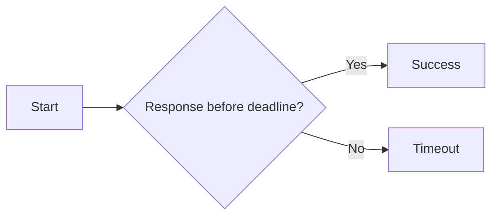

# Timeout Handling

## Detailed explanation
Timeout handling means failing, canceling, or ignoring async work when it takes too long. Frontend apps need this for unreliable networks, slow APIs, autocomplete, uploads, and third-party scripts.

In modern code, combine `setTimeout` with `AbortController` for fetch, or use `Promise.race` when API cannot be aborted directly.

## 1. One-line mental model
Timeout handling stops waiting forever for async work.

## 2. Problem it solves
Requests and tasks can hang, leaving UI stuck in loading state.

## 3. Core idea
- Define max wait time.
- Abort request when possible.
- Clear timeout on success/failure.
- Show user-safe error.
- Avoid leaving pending UI forever.

## 4. Visual / analogy
Timeout is deadline for async work.



## 5. Minimal example

```js
const timeoutId = setTimeout(() => controller.abort(), 5000);
```

## 6. Real-world example

```js
async function fetchWithTimeout(url, ms = 5000) {
  const controller = new AbortController();
  const id = setTimeout(() => controller.abort(), ms);
  try {
    return await fetch(url, { signal: controller.signal });
  } finally {
    clearTimeout(id);
  }
}
```

## 7. Common interview questions
- How do you implement request timeout?
- Why clear timeout?
- `Promise.race` vs AbortController?
- How do you show timeout error?
- What happens to in-flight fetch?

## 8. Active recall test
1. Why timeout async work?
2. How does AbortController help?
3. Why use `finally`?
4. What if API cannot abort?
5. What UI state follows timeout?

## 9. Mistakes / traps
- Not clearing timeout.
- Treating timeout same as server error always.
- Using `Promise.race` without canceling underlying work.
- Leaving spinner forever.

## 10. Compare with related concepts
- **Timeout vs retry:** timeout fails slow attempt; retry starts new attempt.
- **Timeout vs abort:** timeout is policy; abort is mechanism.
- **Timeout vs race condition:** timeout handles slowness; race handles ordering.

## 11. Summary from memory
Explain fetch timeout with AbortController and cleanup.

## 12. Spaced revision prompts
- 1 day: Define timeout handling.
- 3 days: Write `fetchWithTimeout`.
- 7 days: Compare timeout and retry.
- 14 days: Explain `Promise.race` caveat.

