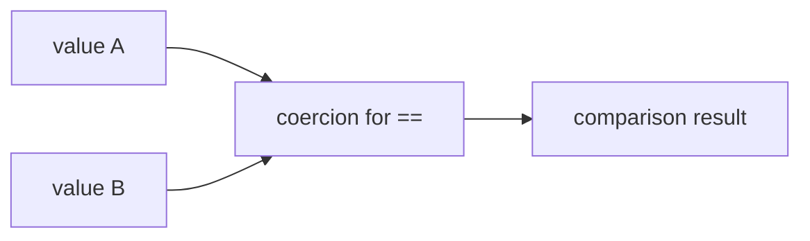

# Type Coercion and Equality

## Detailed explanation
Type coercion is JavaScript converting a value from one type to another. Equality operators expose this sharply: `==` allows coercion, while `===` compares without most coercion.

Senior frontend engineers should know enough coercion rules to avoid traps, read legacy code, and explain why strict equality is the default in production code.

## 1. One-line mental model
Coercion converts types automatically; strict equality avoids most surprise conversions.

## 2. Problem it solves
JavaScript operators need rules for comparing and combining values of different types.

## 3. Core idea
- `===` compares type and value, except object identity rules still apply.
- `==` may convert operands before comparing.
- Objects convert through primitive conversion rules.
- `null == undefined` is true, but neither equals other falsy values.
- `Object.is` handles `NaN` and `-0` differently from `===`.

## 4. Visual / analogy
Coercion is like translating currencies before comparing prices; sometimes the exchange rule surprises you.



## 5. Minimal example

```js
0 == false; // true
0 === false; // false

Number.isNaN(NaN); // true
Object.is(NaN, NaN); // true
```

## 6. Real-world example
Form inputs return strings. Comparing `input.value == 0` can accidentally treat empty strings and numeric zero similarly in validation logic.

## 7. Common interview questions

#### What is type coercion?
- **The Engine Mechanism (Why it behaves this way):** Type coercion is the automatic or implicit conversion of a value from one data type to another (e.g., from String to Number, or Object to Primitive) performed by the JS runtime engine during operations. The engine evaluates these using abstract operational algorithms defined in the ECMAScript specification, such as `ToPrimitive`, `ToNumber`, `ToString`, and `ToBoolean`. For example, in an addition operation `1 + '2'`, the binary `+` operator detects a string operand and triggers the implicit conversion of the number `1` to its string equivalent `'1'` via `ToString`, concatenating them to return `'12'`.
- **The Unforgettable Mental Model:** A multi-national vending machine that automatically converts your coins (types) into the currency it expects. If you insert a euro coin (Number) into a dollar slot (String), the machine automatically routes your coin through a currency converter (coercion) behind the glass before dispensing the product.
- **The Trap:** The difference between implicit coercion (triggered by operators) and explicit conversion (using built-in constructors like `Number()` or `String()`). Implicit coercion can yield silent runtime bugs (like `true + true === 2` or `[] + {} === '[object Object]'`) because JavaScript rarely throws runtime errors for type mismatches, opting to coerce them instead.
- **Senior Interview Playbook (Verbal Script):** "When asked this in an interview, say: Type coercion is JavaScript's implicit conversion of values between different data types at runtime, driven by internal ECMAScript algorithms like `ToPrimitive` and `ToNumber`. Unlike statically typed languages that throw compile-time errors on type mismatches, the V8 engine silently coerces operands to compatible types to complete operations, which can lead to unpredictable side effects if the underlying operational rules are not thoroughly understood."

#### Difference between `==` and `===`?
- **The Engine Mechanism (Why it behaves this way):** Loose equality (`==`) executes the internal `IsHTMLDDA`-aware *Abstract Equality Comparison Algorithm*. If the operands are of different types, the engine performs a series of recursive, implicit conversions (such as converting booleans to numbers, strings to numbers, or objects to primitives) until both operands share the same primitive type, and then compares them. Strict equality (`===`) executes the *Strict Equality Comparison Algorithm*. It checks the types of both operands first. If the types do not match, it immediately returns `false` without performing any conversion. If the types are identical, it compares the values (e.g., matching string characters, number values, or object memory addresses).
- **The Unforgettable Mental Model:** `===` is a strict border patrol officer who checks both your passport country (type) and your name (value)—if your passport doesn't match the required country, you are immediately rejected. `==` is a lax officer who takes your foreign ID and translates it through a thick dictionary (coercion rules) to see if they can somehow map your identity to the local country before letting you pass.
- **The Trap:** The common myth that `==` compares value and `===` compares type and value. Both operators compare values; the difference is that `==` allows type translation beforehand, whereas `===` fails immediately if types differ. Furthermore, neither operator performs deep structural comparison on objects; both use strict reference comparison (`===` and `==` on objects return `true` only if they reference the exact same memory address).
- **Senior Interview Playbook (Verbal Script):** "When asked this in an interview, say: The key distinction is that strict equality, `===`, bypasses type coercion entirely: if the operand types differ, it immediately evaluates to `false`. Loose equality, `==`, triggers the ECMAScript Abstract Equality Comparison Algorithm, recursively coercing differing types—typically down to numeric values—before performing the comparison. For production systems, strict equality is the industry standard to eliminate the class of silent runtime bugs introduced by loose coercion rules."

#### Why is `[] == false` surprising?
- **The Engine Mechanism (Why it behaves this way):** The comparison `[] == false` is surprising because an empty array `[]` is a truthy object (e.g., `if ([])` will execute its block). However, the loose equality operator (`==`) evaluates this through a multi-step coercion chain:
  1. The engine sees an Object (`[]`) compared to a Boolean (`false`). According to step 7 of the Abstract Equality Comparison Algorithm, if one of the operands is a Boolean, it converts the Boolean to a Number: `Number(false)` is `0`. So the expression becomes `[] == 0`.
  2. The engine now has an Object and a Number. It invokes the `ToPrimitive` algorithm on the array `[]`. This calls the array's `toString()` method, which joins elements with commas. For an empty array, this yields the empty string `""`. The expression becomes `"" == 0`.
  3. The engine now has a String and a Number. According to the algorithm, a String is coerced to a Number: `Number("")` evaluates to `0`. The expression becomes `0 == 0`, which evaluates to `true`.
- **The Unforgettable Mental Model:** A Rube Goldberg machine. You drop a ball labeled `[]` and a block labeled `false` into a sorting machine. The machine melts `false` into `0`, crushes `[]` into `""` (empty string), melts `""` into `0`, and then announces: "Look, they are both 0! They are equal!" despite them starting as entirely different objects.
- **The Trap:** Believing that because `[] == false` is true, the array `[]` itself is falsy. In an `if` statement, there is no `==` operator, so the engine uses `ToBoolean([])`, which immediately returns `true` because all objects in JavaScript are truthy. Thus, `if ([]) { ... }` runs, but `[] == false` is `true`.
- **Senior Interview Playbook (Verbal Script):** "When asked this in an interview, say: The expression `[] == false` returns `true` because loose equality forces a cascading coercion chain. First, the boolean `false` is coerced to the number `0`. Next, the array `[]` undergoes a `ToPrimitive` conversion, calling its `toString` method to produce an empty string `""`. Finally, the empty string is coerced to the number `0`. Since `0 == 0` is true, the entire expression evaluates to `true`, even though an empty array is structurally a truthy object when evaluated directly in conditional statements."

#### What is `Object.is`?
- **The Engine Mechanism (Why it behaves this way):** `Object.is()` executes the *SameValue* algorithm defined in ECMAScript. It behaves exactly like strict equality (`===`) except for two highly specific edge cases:
  1. **NaN:** Under strict equality, `NaN === NaN` evaluates to `false` because the IEEE 754 standard dictates that a NaN (Not-a-Number) cannot equal anything, including itself. `Object.is(NaN, NaN)` evaluates to `true`.
  2. **Signed Zeros:** Under strict equality, `-0 === +0` evaluates to `true`. However, in the CPU's memory register, signed zeros have distinct binary representations (differing in their most significant sign bit), which can affect mathematical calculations (e.g., `1 / -0` is `-Infinity`, while `1 / +0` is `+Infinity`). `Object.is(-0, +0)` evaluates to `false`.
- **The Unforgettable Mental Model:** A hyper-detailed microscope. While standard reading glasses (`===`) see two piles of sand (`NaN` and `NaN`) as unrecognizable and therefore unequal, or positive and negative zero as the same flat number, the microscope (`Object.is`) inspects their precise atomic coordinates and correctly classifies them according to their exact physical structure.
- **The Trap:** Thinking `Object.is()` performs deep comparison on objects. It does not. Like `===`, it compares objects by reference identity, not by structural value.
- **Senior Interview Playbook (Verbal Script):** "When asked this in an interview, say: `Object.is` is a static method that implements the ECMAScript SameValue algorithm. It behaves identically to strict equality, `===`, with two critical exceptions: first, it correctly identifies `NaN` as equal to itself, whereas `===` returns `false`. Second, it distinguishes between negative zero and positive zero, evaluating them as unequal due to their differing sign bits. This makes `Object.is` the standard primitive for checking structural mutations in reactive frameworks like React's reconciliation engine."

#### How should form input values be normalized?
- **The Engine Mechanism (Why it behaves this way):** Web forms are bound to the DOM `HTMLInputElement` interface. By default, accessing `input.value` always returns a primitive `string` type, regardless of whether the input element's type attribute is set to `number`, `date`, or `range`. If JavaScript performs comparisons on raw values (e.g., `input.value === 0`), they will fail due to strict type matching. Normalization involves explicitly parsing inputs into their expected type schemas—using `Number()`, `parseInt()`, or `parseFloat()` for numbers, and `Boolean()` or custom comparison for checkboxes—immediately at the network/state boundary before any comparison or business logic is executed.
- **The Unforgettable Mental Model:** A customs processing warehouse at a border. You don't let cargo containers pass straight into the country unopened (raw string inputs); you force every container to open, inspect its items, label them exactly by their content type (Number, Boolean, Date), and put them into standardized boxes before they enter the shipping yard (your state management code).
- **The Trap:** Relying on implicit coercion (like `input.value == 0` or using `+input.value`) for parsing. If `input.value` is an empty string `""`, `+input.value` or `"" == 0` will evaluate to `0`, which can silently corrupt form validations where `0` is a valid entered number but an empty string represents a blank, unanswered input.
- **Senior Interview Playbook (Verbal Script):** "When asked this in an interview, say: Form inputs must be normalized explicitly at the entry boundary. Because DOM input values are persistently string types, using implicit coercion to compare them introduces severe vulnerabilities—such as treating empty strings as numerical zeros. To prevent this, we must explicitly cast inputs using utilities like `parseInt`, `parseFloat`, or native DOM helpers like `input.valueAsNumber` immediately, establishing a robust, statically typed state boundary for the application."

## 8. Active recall test

#### 1. Which JavaScript equality operator permits implicit type coercion?
The loose equality operator (`==`) permits implicit type coercion via the Abstract Equality Comparison Algorithm.

#### 2. Does the comparison `null == undefined` evaluate to true, and does null loosely equal other falsy values?
Yes, `null == undefined` evaluates to `true` according to the specification's loose equality algorithm. However, neither `null` nor `undefined` loosely equals any other falsy values, such as `0`, `false`, `""`, or `[]`.

#### 3. How does strict equality (`===`) behave when comparing objects?
Strict equality checks if the two object operands point to the exact same reference address in the heap memory. If they reference different objects, it returns `false`, even if the two objects are structurally identical (e.g., `{} === {}` evaluates to `false`).

#### 4. Why does `NaN === NaN` evaluate to false in JavaScript?
Because the IEEE 754 standard dictates that a NaN (Not-a-Number) represents an unrepresentable or undefined value, and thus cannot be structurally equal to any value, including itself.

#### 5. When does Object.is behave differently from the strict equality (===) operator?
`Object.is` differs from `===` in two scenarios: it treats `NaN` as equal to another `NaN`, and it treats negative zero (`-0`) and positive zero (`+0`) as unequal due to their differing binary representation signs.

## 9. Mistakes / traps
- Using loose equality in validation.
- Forgetting all DOM input values are strings unless converted.
- Comparing objects by structure with `===`.
- Ignoring `NaN` and `-0` edge cases.

## 10. Compare with related concepts
- **`==` vs `===`:** coercive comparison vs strict comparison.
- **`===` vs `Object.is`:** mostly same, different for `NaN` and signed zero.
- **Primitive equality vs object identity:** value comparison vs reference comparison.

## 11. Summary from memory
Explain why `===` is the default and when coercion appears in frontend code.

## 12. Spaced revision prompts
- After 1 day: Define coercion.
- After 3 days: Compare `==` and `===`.
- After 7 days: Explain object identity.
- After 14 days: Predict tricky equality outputs.
