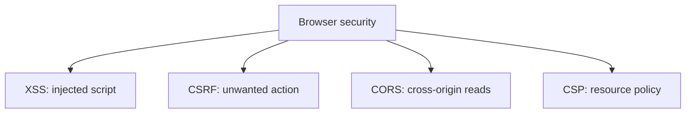

# XSS, CSRF, CORS, and CSP

## Detailed explanation
XSS, CSRF, CORS, and CSP are separate browser security concepts that are often confused. XSS is script injection. CSRF is unwanted authenticated requests from another site. CORS is a browser-controlled cross-origin read permission system. CSP is a policy that restricts what the page can execute or load.

For senior frontend interviews, the key is explaining the difference and knowing which control mitigates which class of problem.

## 1. One-line mental model
XSS is injected script, CSRF is forced authenticated action, CORS is cross-origin read control, and CSP is a browser-enforced allowlist.

## 2. Problem it solves
Frontend apps run untrusted network content inside powerful browsers and need layered defenses.

## 3. Core idea
- Prevent XSS with escaping, sanitization, safe DOM APIs, and CSP.
- Prevent CSRF with SameSite cookies, CSRF tokens, and server-side validation.
- CORS protects browser reads across origins, not server-to-server requests.
- CSP limits script/style/resource execution sources.
- Frontend checks are not a substitute for backend authorization.

## 4. Visual / analogy
These controls protect different doors: script entry, action submission, cross-origin reading, and allowed resources.



## 5. Minimal example

```js
// XSS sink if html is untrusted:
element.innerHTML = userControlledHtml;
```

Use text APIs or sanitize untrusted HTML before insertion.

## 6. Real-world example
A banking site using cookie auth needs CSRF protections even if its API rejects unauthorized users, because the browser automatically sends cookies with eligible requests.

## 7. Common interview questions

#### What is XSS?
- **The Engine Mechanism (Why it behaves this way):** Cross-Site Scripting (XSS) occurs when an application receives untrusted user data and executes it as active code inside the browser's execution thread. There are three categories: Reflected (payload is in the URL query and reflected in the immediate response), Stored (payload is stored in a database and rendered to multiple users), and DOM-based (the execution happens entirely on the client, where a client-side "source" like `location.search` flows into an unsafe "sink" like `element.innerHTML` or `eval()`). When V8 encounters raw HTML strings inserted into unsafe DOM sinks, the HTML parser parses the string. If it contains a script block (e.g. `<script>`, ``), V8 compiles and executes the script as a high-privilege context, giving the attacker access to session tokens, active closure scopes, and the ability to exfiltrate page contents.
- **The Unforgettable Mental Model:** A waiter (the application) who takes an order from a customer. If the customer writes: "Go to the register and steal all the cash" (XSS payload) on their order slip and the waiter reads and executes that command verbatim, the restaurant is compromised.
- **The Trap:** Believing that using React or modern frameworks completely prevents XSS. While React's `{variable}` syntax uses `textContent` internally to escape variables, developers often introduce severe DOM-based XSS vulnerabilities by using `dangerouslySetInnerHTML`, dynamically generating `href` attributes (e.g., `<a href="javascript:...">`), or using low-level libraries that manipulate `innerHTML` directly.
- **Senior Interview Playbook (Verbal Script):** "When asked this in an interview, say: Cross-Site Scripting, or XSS, is a code-injection vulnerability where malicious scripts are executed inside a victim's browser context. It is categorized into Reflected, Stored, and DOM-based variants. DOM-based XSS is particularly critical for frontend architects, as it occurs entirely on the client when untrusted data sources flow into unsafe DOM sinks like `innerHTML` or `eval`. Mitigation requires robust escaping, sanitization using libraries like DOMPurify, and strict Content Security Policies to block unauthorized script execution."

#### What is CSRF?
- **The Engine Mechanism (Why it behaves this way):** Cross-Site Request Forgery (CSRF) is a one-click session-hijacking vulnerability that exploits the browser's automatic credential transmission behavior. When a user is authenticated on a target site (e.g. `bank.com`) via cookies, and then visits a malicious site (`malicious.com`), the malicious site can load an image or trigger a form submission targeting `bank.com/transfer`. Because the browser is designed to automatically append all eligible, non-SameSite cookies associated with `bank.com` to any request heading to that domain, the server receives the malicious request with the user's authentic session cookie and processes the transaction as if the user authorized it.
- **The Unforgettable Mental Model:** A bank clerk who recognizes your signature (the session cookie). A scammer locks you in a room (malicious site) and slips a blank check under the door, forcing your hand to sign it. They run the check to the bank. The bank clerk sees your valid signature on the check, doesn't realize you were forced to sign it, and transfers the money.
- **The Trap:** Thinking that transitioning to token-based authorization (JWTs) completely eliminates CSRF. If you store your JWT in a standard cookie, you are still 100% vulnerable to CSRF. Transitioning to custom request headers (like `Authorization: Bearer <token>`) eliminates CSRF because third-party domains cannot forge custom headers in cross-origin requests due to CORS restrictions, but only if the token is *not* read from a cookie.
- **Senior Interview Playbook (Verbal Script):** "When asked this in an interview, say: Cross-Site Request Forgery, or CSRF, is a vulnerability that exploits the browser's default behavior of automatically attaching cookies to outbound requests. If a user has an active session cookie on an authenticated site, an attacker on a third-party site can forge request payloads targeting that authenticated site, and the browser will silently transmit the user's credentials. We mitigate this using SameSite cookie directives, anti-CSRF token verification, and requiring custom HTTP request headers which the browser blocks in cross-origin contexts by default."

#### What does CORS actually protect?
- **The Engine Mechanism (Why it behaves this way):** CORS (Cross-Origin Resource Sharing) is a security mechanism enforced by the *browser*—not the server—that governs whether a client-side script executing on one origin is allowed to read a response fetched from a different origin. Crucially, CORS is a *permission* system, not an access blocker. When a cross-origin request is initiated, the browser sends the request to the target server. If the request is complex (e.g., using POST or custom headers), the browser sends an HTTP `OPTIONS` preflight request first. The server responds with headers like `Access-Control-Allow-Origin`. If these headers do not match the requesting origin, the browser's rendering engine blocks the JavaScript execution context from reading the response body. It does *not* guarantee that the server did not execute the request! The server may have fully processed the database update; the browser simply prevented JavaScript from reading the outcome.
- **The Unforgettable Mental Model:** A security guard at a private archive. If you (Origin A) walk up and ask the archivist (Origin B) for a document, the archivist actually goes into the back, retrieves the document, and brings it to the desk. But the security guard (the browser's CORS engine) checks if your name is on the approved reader list. If not, the guard grabs the document, shreds it, and says: "Access Denied." You didn't get to read it, but the archivist still performed the physical work of pulling it out.
- **The Trap:** Confusing CORS with server-side authentication. CORS does *not* protect your API endpoints from direct attacks launched via `curl`, Postman, or server-to-server calls, as these clients do not enforce the browser's Same-Origin Policy.
- **Senior Interview Playbook (Verbal Script):** "When asked this in an interview, say: CORS is a browser-enforced security mechanism designed to control cross-origin *reading* of response data, rather than blocking the execution of requests. It governs whether client-side JavaScript is permitted to inspect responses from another origin. Crucially, CORS provides no security against non-browser clients like curl or Postman, and it does not prevent server-side mutations from executing; it simply restricts client-side read permissions."

#### What is CSP?
- **The Engine Mechanism (Why it behaves this way):** Content Security Policy (CSP) is a declarative defense-in-depth security layer communicated to the browser via the `Content-Security-Policy` HTTP response header. When parsed, the browser's layout and rendering engines compile a strict set of directives (like `script-src`, `style-src`, or `img-src`) that restrict the origins from which the page can load and execute resources. If a script attempts to run or load from an origin not explicitly specified in the CSP allowlist, the browser's compiler immediately terminates the thread and logs a console error. A highly secure CSP uses nonces (cryptographic numbers used once) or SHA-256 hashes to verify the integrity of inline scripts, completely blocking the execution of untrusted scripts injected via XSS attacks.
- **The Unforgettable Mental Model:** A highly restrictive bouncer at a private club. The bouncer has an exact, pre-approved guest list (CSP directives). If a guest arrives (a script or image resource) and they are not on the list, the bouncer immediately throws them out, regardless of what they say, ensuring no uninvited party crashers can mingle inside the club (your page).
- **The Trap:** Using wildcards or weak directives like `script-src 'unsafe-inline' 'unsafe-eval' *`. An insecure CSP directive that allows inline execution or wildcards completely defeats the security guarantees of CSP, allowing attackers to bypass the policy and execute XSS payloads with ease.
- **Senior Interview Playbook (Verbal Script):** "When asked this in an interview, say: Content Security Policy, or CSP, is a powerful HTTP header that establishes a browser-enforced declarative allowlist for resource loading and script execution. By restricting where resources can be fetched from and utilizing cryptographically secure nonces or hashes for inline scripts, CSP serves as a critical defense-in-depth boundary. Even if an attacker succeeds in injecting a malicious script into our DOM, a robust CSP will cause the browser to refuse execution of the payload outright."

#### Why is frontend route protection not enough?
- **The Engine Mechanism (Why it behaves this way):** Client-side route protection (such as checking auth tokens inside router guards in React, Angular, or Vue) is purely a cosmetic UI/UX control. The entire client bundle, including the routing configuration, the JavaScript views, and the client-side state, is executing inside an environment controlled by the client. An attacker or curious user can open the DevTools, modify the runtime JavaScript variables (e.g. overriding `isAuthenticated = true`), bypass the routing logic, and inspect the rendered view components in DOM. True security boundary enforcement only exists at the network/data level: the API backend must intercept every incoming request, parse and validate the authorization token, and refuse to serve data to unauthorized clients.
- **The Unforgettable Mental Model:** A locked screen door on the front of a house. It keeps bugs out and lets visitors know they shouldn't walk in without knocking (UX route guard). But if a burglar wants to enter, they can simply cut the mesh screen with scissors (client-side override). The real security is the heavy, double-locked deadbolt solid wood door behind it (server-side authentication).
- **The Trap:** Thinking that hiding a UI tab or blocking a route path prevents an unauthorized user from accessing the underlying database. If the API endpoint that supplies the data to that protected tab is not authenticated on the server, anyone can fetch the endpoint directly via their terminal and steal the records.
- **Senior Interview Playbook (Verbal Script):** "When asked this in an interview, say: Client-side route guards are solely UI/UX design tools to direct user navigation—they are never security boundaries. Because client-side execution contexts are fully transparent and modifiable by the end-user via browser tools, any routing logic can be easily manipulated or bypassed. True authorization must be enforced statelessly at the API level, where every single database query and transaction is validated against cryptographically secure session credentials."

## 8. Active recall test

#### 1. Which browser security vulnerability is defined by injecting and compiling unauthorized script payloads?
Cross-Site Scripting (XSS).

#### 2. Which attack vector exploits the browser's automatic cookie transmission to submit malicious actions?
Cross-Site Request Forgery (CSRF).

#### 3. Does a CORS failure block a command-line client like curl or Postman from accessing a database endpoint?
No. CORS is strictly a browser-enforced mechanism. External command-line HTTP clients bypass it entirely as they do not respect Same-Origin constraints.

#### 4. What resources does a Content Security Policy (CSP) restrict the loading and execution of?
It restricts all external and inline assets, including scripts (`script-src`), stylesheets (`style-src`), fonts (`font-src`), images (`img-src`), and iframes (`frame-src`).

#### 5. Where must the ultimate, uncompromisable security boundaries and user auth validations reside?
They must reside statelessly on the backend web server or API layer, verifying every database call directly. Client-side state is easily manipulated and insecure.

## 9. Mistakes / traps
- Saying CORS is authentication.
- Thinking CSP fixes all XSS.
- Ignoring CSRF when using cookies.
- Trusting client-side permission checks.
- Using `innerHTML` with untrusted content.

## 10. Compare with related concepts
- **XSS vs CSRF:** script execution vs unwanted authenticated request.
- **CORS vs CSP:** cross-origin data access control vs resource execution/loading policy.
- **Sanitization vs escaping:** clean allowed HTML vs render data as text.

## 11. Summary from memory
Explain the difference between XSS, CSRF, CORS, and CSP in one minute.

## 12. Spaced revision prompts
- After 1 day: Define each acronym.
- After 3 days: Match mitigations to attacks.
- After 7 days: Explain why CORS is not auth.
- After 14 days: Review a risky HTML rendering flow.
