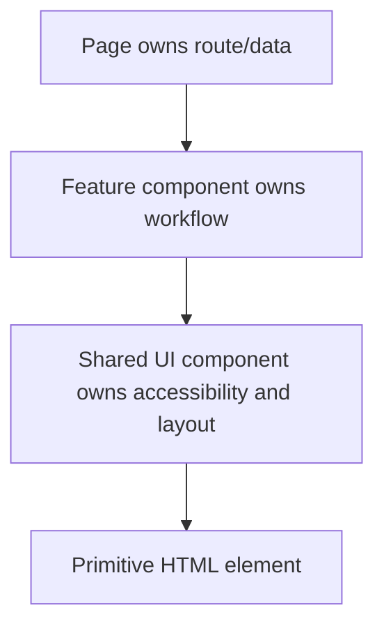

# Component Design in React

## Detailed explanation
Component design is the craft of deciding what a component owns, what it receives, what it exposes, and how other developers should use it. Good design keeps components focused, accessible, predictable, and easy to change.

This topic becomes senior-level because reusable components sit at the center of large React apps. Poor component APIs create prop explosion, duplicated behavior, accessibility bugs, and difficult refactors.

## 1. One-line mental model
Component design is choosing clean ownership boundaries and APIs so UI pieces are reusable without becoming hard to change.

## 2. Problem it solves
React apps become difficult to maintain when components own too much, expose unclear props, duplicate behavior, hide accessibility details, or abstract every small similarity too early.

## 3. Core idea
- A component should own one clear responsibility.
- Props should describe intent, not internal implementation.
- Composition is usually more flexible than configuration-heavy components.
- Shared UI components should be accessible and predictable by default.
- Abstract only when the repeated code represents the same stable concept.

## 4. Visual / analogy
Components are like building blocks. A good block has a clear shape and connects predictably; a bad block tries to fit every possible structure and becomes awkward everywhere.



## 5. Minimal example

```tsx
function EmptyState({ title, action }: { title: string; action?: React.ReactNode }) {
  return (
    <section aria-label={title}>
      <h2>{title}</h2>
      {action}
    </section>
  );
}
```

## 6. Real-world example

```tsx
<Tabs defaultValue="profile">
  <Tabs.List>
    <Tabs.Trigger value="profile">Profile</Tabs.Trigger>
    <Tabs.Trigger value="billing">Billing</Tabs.Trigger>
  </Tabs.List>
  <Tabs.Panel value="profile">Profile content</Tabs.Panel>
  <Tabs.Panel value="billing">Billing content</Tabs.Panel>
</Tabs>
```

This compound component API keeps related pieces together while letting the caller control layout and content.

## 7. Common interview questions
- What is component composition?
- What are compound components?
- What are render props?
- What are higher-order components?
- Controlled vs uncontrolled component pattern?
- What is the provider pattern?
- What is the state reducer pattern?
- What is a headless component?
- How do you design reusable component APIs?
- How do you avoid over-abstraction?

## 8. Active recall test
- What should a page component own?
- What should a shared UI component own?
- When is duplication better than abstraction?
- Why are compound components useful for tabs and accordions?
- How does a headless component differ from a styled component?

## 9. Mistakes / traps
- Building a generic component before the API is stable.
- Passing many boolean props that create impossible combinations.
- Hiding important accessibility behavior from consumers.
- Putting route data fetching inside a low-level shared UI component.
- Making every component global too early.
- Using inheritance-style thinking instead of composition.

## 10. Compare with related concepts
- **Not styling only:** component design includes state, accessibility, API shape, ownership, and testing.
- **Not folder structure only:** folders help, but boundaries matter more.
- **Not maximum reuse:** reusable code that is hard to use is still bad design.
- **Not design system architecture:** design systems are a larger discipline built from many well-designed components.

## 11. Summary from memory
Explain how you would design a reusable accessible tabs component, including API shape, state ownership, keyboard behavior, and testing.

## 12. Spaced revision prompts
- After 1 day: Explain composition vs configuration.
- After 3 days: Describe compound components from memory.
- After 7 days: Design a controlled/uncontrolled select component API.
- After 14 days: Explain how to decide whether a component belongs in `shared/ui` or a feature folder.
