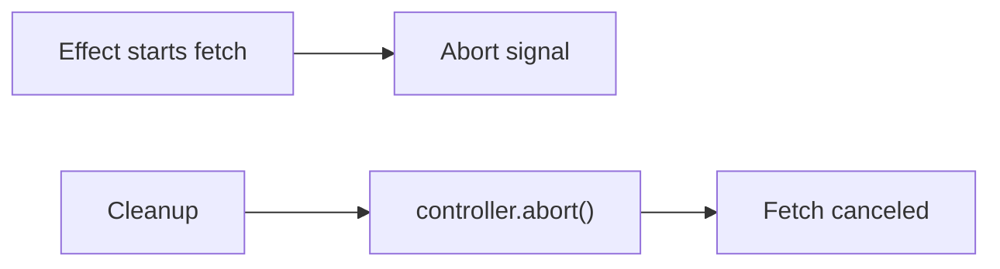

# AbortController Inside Effects

## Detailed explanation
`AbortController` is a browser API that cancels abortable async work, especially `fetch`. Inside effects, it is used to cancel in-flight requests when dependencies change or the component unmounts.

This prevents wasted network work and reduces the chance that outdated responses update state. It is a core tool for safe manual fetching, though server-state libraries often handle cancellation for you.

## 1. One-line mental model
`AbortController` cancels outdated effect requests.

## 2. Problem it solves
In-flight requests may no longer be needed when props change or the component unmounts.

## 3. Core idea
- Create a controller inside effect.
- Pass `controller.signal` to `fetch`.
- Return cleanup that calls `controller.abort()`.
- Ignore abort errors as expected cancellation.
- Use per-request controllers.

## 4. Visual / analogy
AbortController is a cancel button for a request that is no longer relevant.



## 5. Minimal example

```tsx
React.useEffect(() => {
  const controller = new AbortController();
  fetch(url, { signal: controller.signal });
  return () => controller.abort();
}, [url]);
```

## 6. Real-world example

```tsx
React.useEffect(() => {
  const controller = new AbortController();

  async function load() {
    try {
      const data = await api.getUser(userId, { signal: controller.signal });
      setUser(data);
    } catch (error) {
      if (!controller.signal.aborted) setError(error);
    }
  }

  load();
  return () => controller.abort();
}, [userId]);
```

## 7. Common interview questions
- What is AbortController?
- How do you use it inside `useEffect`?
- Why cancel requests?
- What is `signal`?
- How do you handle abort errors?
- AbortController vs active flag?
- How do query libraries use cancellation?

## 8. Active recall test
1. Where do you create controller?
2. What do you pass to fetch?
3. What does cleanup call?
4. How do you avoid showing abort as an error?
5. Why create a new controller per request?

## 9. Mistakes / traps
- Reusing one controller for unrelated requests.
- Treating abort as a user-visible failure.
- Forgetting cleanup.
- Not passing signal to the request.
- Assuming every async API supports abort.

## 10. Compare with related concepts
- **AbortController vs cleanup flag:** abort cancels work; flag ignores result.
- **AbortController vs timeout:** abort is explicit cancellation; timeout is time-based cancellation.
- **AbortController vs query cancellation:** query libraries integrate cancellation into query lifecycle.

## 11. Summary from memory
Explain how to cancel a user details request when `userId` changes.

## 12. Spaced revision prompts
- After 1 day: Define AbortController.
- After 3 days: Write fetch cancellation effect.
- After 7 days: Handle abort error.
- After 14 days: Compare abort and ignore flag.

