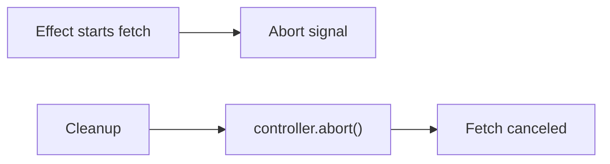

# AbortController Inside Effects

## Detailed explanation
`AbortController` is a browser API that cancels abortable async work, especially `fetch`. Inside effects, it is used to cancel in-flight requests when dependencies change or the component unmounts.

This prevents wasted network work and reduces the chance that outdated responses update state. It is a core tool for safe manual fetching, though server-state libraries often handle cancellation for you.

## 1. One-line mental model
`AbortController` cancels outdated effect requests.

## 2. Problem it solves
In-flight requests may no longer be needed when props change or the component unmounts.

## 3. Core idea
- Create a controller inside effect.
- Pass `controller.signal` to `fetch`.
- Return cleanup that calls `controller.abort()`.
- Ignore abort errors as expected cancellation.
- Use per-request controllers.

## 4. Visual / analogy
AbortController is a cancel button for a request that is no longer relevant.



## 5. Minimal example

```tsx
React.useEffect(() => {
  const controller = new AbortController();
  fetch(url, { signal: controller.signal });
  return () => controller.abort();
}, [url]);
```

## 6. Real-world example

```tsx
React.useEffect(() => {
  const controller = new AbortController();

  async function load() {
    try {
      const data = await api.getUser(userId, { signal: controller.signal });
      setUser(data);
    } catch (error) {
      if (!controller.signal.aborted) setError(error);
    }
  }

  load();
  return () => controller.abort();
}, [userId]);
```

## 7. Common interview questions
#### What is AbortController?
- **The Engine Mechanism (Why it behaves this way):** `AbortController` is a native browser API that provides a `signal` object and an `abort()` method. When the signal is passed to an abortable API like `fetch`, the API monitors the signal's `aborted` property. Calling `abort()` sets `aborted` to `true` and immediately rejects any pending promises with a `DOMException` named `AbortError`. The browser's networking layer cancels the underlying TCP connection, freeing resources.
- **The Unforgettable Mental Model:** The **Emergency Stop Button**. Like the red button on industrial machinery — one press and the machine stops immediately, cutting power and halting all operations in progress.
- **The Trap:** Assuming AbortController works with all async APIs. It only works with APIs that explicitly accept a `signal` option (like `fetch`). It won't cancel `setTimeout`, `XMLHttpRequest` (without extra work), or third-party library calls that don't support signals.
- **Senior Interview Playbook (Verbal Script):** "When asked this in an interview, say: AbortController is a browser API for cancelling abortable async operations, primarily fetch requests. It provides a signal object that you pass to the API, and an abort method that cancels the operation and rejects the promise with an AbortError. In React effects, it's the cleanest way to cancel in-flight requests when dependencies change or the component unmounts."

#### How do you use it inside `useEffect`?
- **The Engine Mechanism (Why it behaves this way):** Inside the effect callback, you create a new `AbortController` instance. You pass `controller.signal` to `fetch` (or other abortable APIs) via the options object. The effect returns a cleanup function that calls `controller.abort()`. When dependencies change, React runs this cleanup before the new effect, aborting the previous request. Each effect instance gets its own controller, ensuring clean isolation between request lifecycles.
- **The Unforgettable Mental Model:** The **One-Use Remote**. Each effect gets its own TV remote (controller). When the channel changes (dependency updates), you press the power button (abort) on the old remote before picking up the new one.
- **The Trap:** Creating the controller outside the effect. The controller must be created inside the effect so each effect instance has its own controller. A controller created outside would be shared across renders and can't be reused after abort.
- **Senior Interview Playbook (Verbal Script):** "When asked this in an interview, say: I create the AbortController inside the effect body, pass its signal to fetch via the options object, and return a cleanup function that calls `controller.abort()`. This ensures each effect instance has its own controller, and when dependencies change, the cleanup aborts the previous request before the new one starts. The pattern is: create, pass signal, abort in cleanup."

#### Why cancel requests?
- **The Engine Mechanism (Why it behaves this way):** Cancelling requests serves three purposes: (1) It prevents race conditions where stale responses overwrite fresh data. (2) It saves network bandwidth and server resources by stopping unnecessary in-flight requests. (3) It prevents memory leaks from pending promises holding closures that reference component state. Without cancellation, the browser continues downloading the response even if the component that requested it has unmounted.
- **The Unforgettable Mental Model:** The **Cancelled Subscription**. If you cancel a magazine subscription, you stop receiving issues you no longer want. Without cancellation, the publisher keeps sending magazines to an empty house — wasting paper and cluttering the mailbox.
- **The Trap:** Thinking cancellation is only about UI correctness. It's also about resource efficiency — uncanceled requests consume bandwidth, server CPU, and browser memory even when their results are discarded.
- **Senior Interview Playbook (Verbal Script):** "When asked this in an interview, say: I cancel requests for three reasons: correctness, efficiency, and memory safety. Correctness — stale responses can overwrite fresh data. Efficiency — uncanceled requests waste bandwidth and server resources. Memory safety — pending promises hold closures that prevent garbage collection. AbortController handles all three by stopping the request at the network level."

#### What is `signal`?
- **The Engine Mechanism (Why it behaves this way):** The `signal` is an `AbortSignal` object exposed by `controller.signal`. It's a read-only object with an `aborted` boolean property and an `onabort` event handler. When passed to `fetch`, the fetch implementation registers a listener on the signal. When `abort()` is called, the signal's `aborted` becomes `true`, the listener fires, and fetch rejects its promise. The signal can also be checked manually: `if (signal.aborted) return` to skip work after cancellation.
- **The Unforgettable Mental Model:** The **Traffic Light**. The signal is like a traffic light for the request. Green means proceed. When `abort()` is called, it turns red, and the request must stop at the intersection.
- **The Trap:** Trying to set `signal.aborted` manually. It's read-only — only `controller.abort()` can change it. Also, don't pass the same signal to multiple independent requests unless you want them all cancelled together.
- **Senior Interview Playbook (Verbal Script):** "When asked this in an interview, say: The signal is an AbortSignal object from `controller.signal`. It's a read-only communication channel between the controller and the abortable API. When passed to fetch, the API listens for the abort event. I can also check `signal.aborted` manually in my code to skip work after cancellation. The signal is the bridge that lets the controller communicate cancellation to the request."

#### How do you handle abort errors?
- **The Engine Mechanism (Why it behaves this way):** When `abort()` is called, the fetch promise rejects with a `DOMException` whose `name` property is `"AbortError"`. This is not a network failure — it's expected cancellation. In the catch block, you check `if (error.name === 'AbortError')` and return early without setting error state. Alternatively, check `if (controller.signal.aborted)` before setting error state. This prevents the UI from showing a cancellation as if it were a real error.
- **The Unforgettable Mental Model:** The **"Do Not Disturb" Sign**. An abort error is like a "do not disturb" sign on a hotel door — the housekeeper (error handler) should see it and walk away quietly, not report it as a problem.
- **The Trap:** Showing abort errors to users as "Request failed" messages. This confuses users because nothing actually failed — the request was intentionally cancelled.
- **Senior Interview Playbook (Verbal Script):** "When asked this in an interview, say: Abort errors are expected cancellation, not real failures. In the catch block, I check `if (error.name === 'AbortError')` and return early without updating error state. This prevents the UI from showing a misleading error message. Only non-abort errors should trigger error state and user-facing messages."

#### AbortController vs active flag?
- **The Engine Mechanism (Why it behaves this way):** Both patterns prevent stale state updates, but they differ fundamentally. The active flag (`let active = true`) lets the request complete normally but ignores the result in the `.then()` callback. AbortController actually cancels the request at the network layer, stopping the download and freeing the connection. The active flag is simpler and works with any async API. AbortController is more efficient but only works with APIs that support signals.
- **The Unforgettable Mental Model:** The **Two Approaches to Stopping Mail**. Active flag: the mail arrives, but you throw it in the trash without reading. AbortController: you call the post office and tell them not to deliver it at all.
- **The Trap:** Using the active flag for large responses. The browser still downloads the entire response even though you'll ignore it, wasting bandwidth. AbortController stops the download mid-stream.
- **Senior Interview Playbook (Verbal Script):** "When asked this in an interview, say: The active flag is simpler and works with any async API — it lets the request complete but ignores the result. AbortController is more efficient because it cancels the request at the network level, saving bandwidth. I prefer AbortController for fetch requests since it's more complete, but I use the active flag for APIs that don't support signals, like third-party SDKs or WebSocket connections."

#### How do query libraries use cancellation?
- **The Engine Mechanism (Why it behaves this way):** Query libraries like TanStack Query integrate AbortController into their query lifecycle. When a query key changes, the library automatically calls `abort()` on the previous request's controller. The library passes the signal to the `queryFn` via the context object: `queryFn: ({ signal }) => fetch(url, { signal })`. The library also handles abort error filtering, retry logic (skipping retries for aborted requests), and cache consistency — all automatically.
- **The Unforgettable Mental Model:** The **Concierge Service**. Instead of managing your own luggage (requests), the hotel concierge (query library) handles everything — checking in new bags, returning old ones, and making sure nothing gets lost in transit.
- **The Trap:** Forgetting to pass the signal to fetch inside the queryFn. The library provides the signal, but you must explicitly pass it to the fetch call for cancellation to work.
- **Senior Interview Playbook (Verbal Script):** "When asked this in an interview, say: Query libraries like TanStack Query handle cancellation automatically. When a query key changes, the library aborts the previous request and starts a new one. I just need to accept the signal in my queryFn and pass it to fetch: `queryFn: ({ signal }) => api.get(url, { signal })`. The library also filters abort errors, skips retries for cancelled requests, and keeps the cache consistent — all without manual cleanup code."

## 8. Active recall test
1. **Where do you create the controller?**
   - **Explanation:** Inside the effect body, not outside. Each effect instance needs its own controller because a controller can only be aborted once. Creating it inside ensures a fresh controller for each effect run, and the cleanup function captures the correct controller via closure.
2. **What do you pass to fetch?**
   - **Explanation:** `controller.signal` via the options object: `fetch(url, { signal: controller.signal })`. The signal is the communication channel that lets the controller tell fetch to cancel. Without passing the signal, the controller has no way to affect the request.
3. **What does cleanup call?**
   - **Explanation:** `controller.abort()`. This sets the signal's `aborted` property to `true`, rejects the fetch promise with an `AbortError`, and cancels the network request at the browser level. It runs before the effect re-runs and on component unmount.
4. **How do you avoid showing abort as an error?**
   - **Explanation:** In the catch block, check `if (error.name === 'AbortError')` and return early without updating error state. Alternatively, check `if (controller.signal.aborted)` before setting error. This filters out expected cancellations from real network failures.
5. **Why create a new controller per request?**
   - **Explanation:** An AbortController can only be aborted once. After `abort()` is called, the controller is permanently in the aborted state and cannot be reset. Creating a new controller for each effect instance ensures each request has a fresh, controllable signal.

## 9. Mistakes / traps
- Reusing one controller for unrelated requests.
- Treating abort as a user-visible failure.
- Forgetting cleanup.
- Not passing signal to the request.
- Assuming every async API supports abort.

## 10. Compare with related concepts
- **AbortController vs cleanup flag:** abort cancels work; flag ignores result.
- **AbortController vs timeout:** abort is explicit cancellation; timeout is time-based cancellation.
- **AbortController vs query cancellation:** query libraries integrate cancellation into query lifecycle.

## 11. Summary from memory
Explain how to cancel a user details request when `userId` changes.

## 12. Spaced revision prompts
- After 1 day: Define AbortController.
- After 3 days: Write fetch cancellation effect.
- After 7 days: Handle abort error.
- After 14 days: Compare abort and ignore flag.

