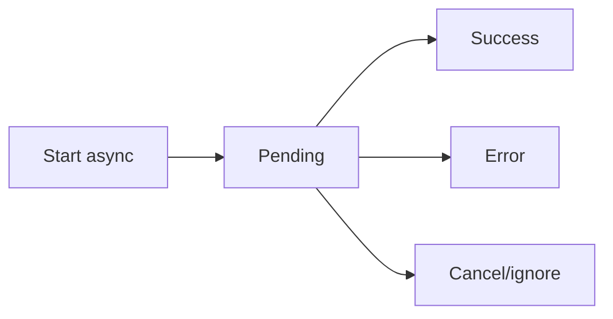

# Handling Async Logic Inside Hooks

## Detailed explanation
Async logic inside hooks usually means starting asynchronous work from an effect or event handler and then updating state when it completes. Effects cannot directly be `async` because an async function returns a promise, while React expects either nothing or a cleanup function.

Safe async hooks handle loading, error, cancellation, stale responses, and cleanup. For shared server data, prefer server-state libraries over repeatedly writing manual async effect logic.

## 1. One-line mental model
Async hook logic must handle time, cancellation, and stale results explicitly.

## 2. Problem it solves
Async work can finish after dependencies change, fail unexpectedly, or update unmounted components.

## 3. Core idea
- Do not make the effect callback itself `async`.
- Define and call an inner async function.
- Track loading/error states intentionally.
- Cancel or ignore outdated work.
- Prefer query libraries for server state.

## 4. Visual / analogy
Async logic is like sending mail: by the time the reply arrives, the address may have changed.



## 5. Minimal example

```tsx
React.useEffect(() => {
  let active = true;

  async function load() {
    const data = await fetchData();
    if (active) setData(data);
  }

  load();
  return () => {
    active = false;
  };
}, []);
```

## 6. Real-world example

```tsx
function useUser(userId: string) {
  return useQuery({
    queryKey: ["user", userId],
    queryFn: ({ signal }) => userApi.get(userId, { signal }),
  });
}
```

## 7. Common interview questions
#### How do you handle async logic in hooks?
- **The Engine Mechanism (Why it behaves this way):** Async logic in hooks requires managing the full lifecycle: loading state, success state, error state, and cancellation. Inside `useEffect`, you define an inner async function (because the effect callback itself can't be async) and call it immediately. You track loading/error with `useState`, handle cancellation via cleanup (AbortController or active flag), and update state only if the component is still relevant. The Fiber scheduler doesn't coordinate with async operations, so you must manually manage the timing.
- **The Unforgettable Mental Model:** The **Mission Control**. Launching a rocket (async request) requires tracking: countdown (loading), orbit achieved (success), anomaly (error), and abort sequence (cancellation). Mission control manages all four states explicitly.
- **The Trap:** Making the effect callback `async` directly. This returns a Promise, and React expects either nothing or a cleanup function. Returning a Promise confuses React's effect cleanup system.
- **Senior Interview Playbook (Verbal Script):** "When asked this in an interview, say: I handle async logic by defining an inner async function inside the effect and calling it immediately. I track loading and error states with `useState`, handle cancellation in the cleanup function with AbortController, and only update state if the request is still relevant. For shared server data, I prefer TanStack Query because it handles all of this automatically — loading, error, caching, deduplication, and cancellation."

#### Why can't effect callback be async?
- **The Engine Mechanism (Why it behaves this way):** React's `useEffect` expects the callback to return either nothing (`undefined`) or a cleanup function. An `async` function always returns a Promise, even if you don't explicitly return anything. React would interpret this Promise as the cleanup function, which is incorrect — Promises don't have the cleanup behavior React expects. The Fiber scheduler stores the return value and calls it during cleanup; a Promise is not callable as a cleanup function.
- **The Unforgettable Mental Model:** The **Wrong Return Ticket**. React expects a return ticket (cleanup function) that it can use later. An async function hands it a receipt (Promise) instead. The receipt proves something happened, but it can't be used to clean up.
- **The Trap:** Using an IIFE pattern that hides the issue: `useEffect(async () => { ... }())`. This still returns a Promise and breaks cleanup.
- **Senior Interview Playbook (Verbal Script):** "When asked this in an interview, say: React expects the effect callback to return either nothing or a cleanup function. An async function always returns a Promise, which React would mistakenly treat as the cleanup function. Since Promises aren't callable as cleanup, this breaks the effect lifecycle. The fix is to define and call an inner async function: `useEffect(() => { async function load() { ... } load(); })`."

#### How do you avoid race conditions?
- **The Engine Mechanism (Why it behaves this way):** Race conditions in async effects occur when multiple requests are in-flight and complete out of order. Two patterns prevent this: (1) AbortController cancels the previous request when dependencies change, ensuring only the latest request can succeed. (2) An active flag (`let active = true`) set to `false` in cleanup lets the request complete but prevents the state update. Both patterns leverage the effect's cleanup function, which React calls before re-running the effect.
- **The Unforgettable Mental Model:** The **Single-File Queue**. Only one person (request) should be at the counter at a time. When a new person arrives, the previous one is either sent home (abort) or told their number is no longer called (active flag).
- **The Trap:** Using only the active flag for large responses. The request still downloads fully, wasting bandwidth. AbortController is more efficient because it stops the download mid-stream.
- **Senior Interview Playbook (Verbal Script):** "When asked this in an interview, say: I avoid race conditions with AbortController — I create a new controller in the effect, pass its signal to fetch, and abort in cleanup. This cancels the previous request when dependencies change, ensuring only the latest response updates state. For APIs that don't support AbortController, I use an active flag pattern: `let active = true` in the effect, set to `false` in cleanup, and check before state updates."

#### How do you cancel requests?
- **The Engine Mechanism (Why it behaves this way):** `AbortController` creates a signal that's passed to `fetch` via `{ signal }`. When `controller.abort()` is called in the effect's cleanup, the browser's networking layer cancels the TCP connection and rejects the fetch promise with an `AbortError`. The catch block filters this error and returns early. This is the cleanest cancellation pattern because it stops the work at the source, not just the result handling.
- **The Unforgettable Mental Model:** The **Recall Wire**. Like the movie trope where someone calls back a message before it's delivered. The abort wire reaches the request mid-flight and tells it to turn around.
- **The Trap:** Not filtering `AbortError` in the catch block. This causes the UI to show a cancellation as if it were a real network error, confusing users.
- **Senior Interview Playbook (Verbal Script):** "When asked this in an interview, say: I use AbortController — create it inside the effect, pass the signal to fetch, and call `controller.abort()` in cleanup. In the catch block, I check `if (error.name === 'AbortError')` and return early, since cancellation is expected behavior, not a failure. This pattern cancels the request at the network level, saving bandwidth and preventing stale responses."

#### How do you model loading and error?
- **The Engine Mechanism (Why it behaves this way):** Loading and error are derived states that reflect the async operation's lifecycle. `useState` tracks three states: `isLoading` (boolean), `data` (the result), and `error` (the failure). The async function sets `isLoading(true)` before the request, `setData(result)` on success, and `setError(err)` on failure. `isLoading` is set to `false` in both success and error branches. React's reconciliation updates the UI based on these state values, showing a spinner, data, or error message.
- **The Unforgettable Mental Model:** The **Traffic Light System**. Green (data loaded), yellow (loading), red (error). The UI shows different content based on which light is active, and only one light is on at a time.
- **The Trap:** Not resetting error state before a new request. If a previous request failed and a new one starts, the old error may still be displayed until the new request completes. Always set `setError(null)` before starting a new request.
- **Senior Interview Playbook (Verbal Script):** "When asked this in an interview, say: I model async state with three pieces of state: `isLoading`, `data`, and `error`. Before the request, I set loading to true and clear any previous error. On success, I set the data and clear loading. On error, I set the error and clear loading. This gives the UI three clear branches to render: a spinner, the data, or an error message. I always reset error before starting a new request to avoid showing stale errors."

#### When should you use TanStack Query?
- **The Engine Mechanism (Why it behaves this way):** TanStack Query should be used for any shared server state — data that comes from an API and may be needed by multiple components. It handles caching, background refetching, request deduplication, automatic cancellation, pagination, infinite scrolling, and optimistic updates. Instead of writing manual effects for each data fetch, you declare a query with a key and a fetch function, and the library manages the entire lifecycle. The query result is available to any component that requests the same query key.
- **The Unforgettable Mental Model:** The **Central Library**. Instead of every student (component) buying their own copy of a textbook (fetching data), they check it out from the central library (TanStack Query). The library manages copies, handles reservations, and ensures everyone gets the latest edition.
- **The Trap:** Using TanStack Query for client-only state like form inputs or UI toggles. It's designed for server state — data that lives outside your app and needs to be fetched, cached, and synchronized.
- **Senior Interview Playbook (Verbal Script):** "When asked this in an interview, say: I use TanStack Query for any server state — data fetched from APIs that may be shared across components. It eliminates manual effect logic by handling caching, deduplication, background refetching, cancellation, and error retries automatically. I don't use it for client-only state like form inputs or UI toggles — that's what `useState` and `useReducer` are for. The rule is simple: if the data lives on a server, use a query library."

#### How do custom async hooks work?
- **The Engine Mechanism (Why it behaves this way):** A custom async hook wraps the async effect logic in a reusable function. It accepts parameters (like a user ID), uses `useState` for loading/error/data, and `useEffect` for the fetch logic with AbortController cleanup. It returns an object with `data`, `isLoading`, `error`, and sometimes a `refetch` function. Consumers call the hook with their parameters and get a ready-to-use async state object. When built on TanStack Query, the custom hook is even simpler — it just wraps `useQuery` with the appropriate query key and fetch function.
- **The Unforgettable Mental Model:** The **Vending Machine**. The custom hook is a vending machine — you insert a coin (parameter), and it dispenses a complete package (data, loading, error). You don't need to know how the machine works inside; you just use the interface.
- **The Trap:** Making the custom hook too specific. A good async hook is parameterized and reusable — not hardcoded to one endpoint or one component's needs.
- **Senior Interview Playbook (Verbal Script):** "When asked this in an interview, say: A custom async hook encapsulates the fetch logic, state management, and cleanup in a reusable function. It accepts parameters, manages loading/error/data state internally, and returns them to the consumer. When built on TanStack Query, it's even cleaner — just a `useQuery` call with the right key and fetch function. The hook abstracts away the async complexity so components just consume the result."

## 8. Active recall test
1. **Why not `useEffect(async () => {})`?**
   - **Explanation:** An async function always returns a Promise. React expects the effect callback to return either nothing or a cleanup function. Returning a Promise confuses React's cleanup system, as Promises aren't callable as cleanup functions. The fix is to define and call an inner async function inside the effect.
2. **What states should async UI model?**
   - **Explanation:** Three states: `isLoading` (request in progress), `data` (successful result), and `error` (failure). The UI renders different branches based on these states: a spinner for loading, the data for success, or an error message for failure. Error should be cleared before starting a new request.
3. **How do you ignore outdated results?**
   - **Explanation:** Use an active flag (`let active = true`) set to `false` in cleanup, and check `if (active)` before calling `setState`. Alternatively, use AbortController to cancel the request entirely. Both prevent stale responses from overwriting fresh data when dependencies change.
4. **How does AbortController help?**
   - **Explanation:** It cancels in-flight fetch requests at the network level when the effect's cleanup runs. This prevents stale responses from arriving, saves bandwidth, and frees the browser connection. The fetch promise rejects with `AbortError`, which should be filtered in the catch block.
5. **When should manual fetching be avoided?**
   - **Explanation:** When data is shared across multiple components, needs caching, requires background refetching, or benefits from request deduplication. In these cases, TanStack Query handles the entire lifecycle automatically — manual effects would duplicate this logic and introduce bugs like race conditions and stale caches.

## 9. Mistakes / traps
- Making effect callback async.
- Missing cleanup.
- Not handling errors.
- Showing stale results.
- Duplicating query logic across components.

## 10. Compare with related concepts
- **Async effect vs event async:** effects sync with rendering; events respond to user actions.
- **Manual async vs query library:** manual controls one request; library handles cache lifecycle.
- **Cancellation vs error:** cancellation is expected invalidation, not a failure state.

## 11. Summary from memory
Explain how to write a safe async effect and when to replace it with TanStack Query.

## 12. Spaced revision prompts
- After 1 day: Explain async effect pattern.
- After 3 days: Add loading and error state.
- After 7 days: Add cancellation.
- After 14 days: Convert manual fetch to query hook.

