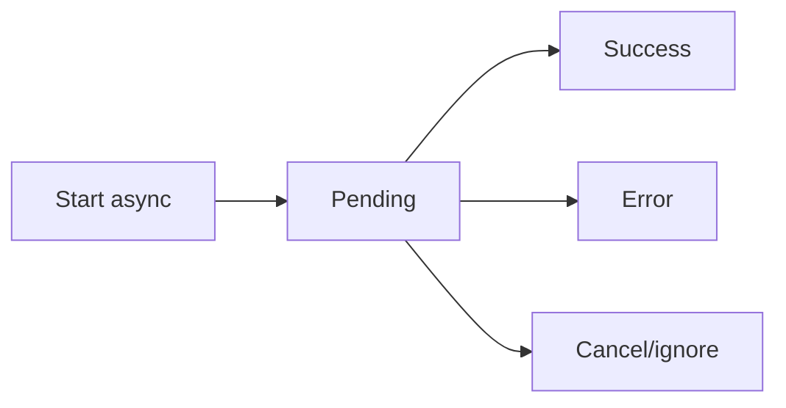

# Handling Async Logic Inside Hooks

## Detailed explanation
Async logic inside hooks usually means starting asynchronous work from an effect or event handler and then updating state when it completes. Effects cannot directly be `async` because an async function returns a promise, while React expects either nothing or a cleanup function.

Safe async hooks handle loading, error, cancellation, stale responses, and cleanup. For shared server data, prefer server-state libraries over repeatedly writing manual async effect logic.

## 1. One-line mental model
Async hook logic must handle time, cancellation, and stale results explicitly.

## 2. Problem it solves
Async work can finish after dependencies change, fail unexpectedly, or update unmounted components.

## 3. Core idea
- Do not make the effect callback itself `async`.
- Define and call an inner async function.
- Track loading/error states intentionally.
- Cancel or ignore outdated work.
- Prefer query libraries for server state.

## 4. Visual / analogy
Async logic is like sending mail: by the time the reply arrives, the address may have changed.



## 5. Minimal example

```tsx
React.useEffect(() => {
  let active = true;

  async function load() {
    const data = await fetchData();
    if (active) setData(data);
  }

  load();
  return () => {
    active = false;
  };
}, []);
```

## 6. Real-world example

```tsx
function useUser(userId: string) {
  return useQuery({
    queryKey: ["user", userId],
    queryFn: ({ signal }) => userApi.get(userId, { signal }),
  });
}
```

## 7. Common interview questions
- How do you handle async logic in hooks?
- Why can't effect callback be async?
- How do you avoid race conditions?
- How do you cancel requests?
- How do you model loading and error?
- When should you use TanStack Query?
- How do custom async hooks work?

## 8. Active recall test
1. Why not `useEffect(async () => {})`?
2. What states should async UI model?
3. How do you ignore outdated results?
4. How does AbortController help?
5. When should manual fetching be avoided?

## 9. Mistakes / traps
- Making effect callback async.
- Missing cleanup.
- Not handling errors.
- Showing stale results.
- Duplicating query logic across components.

## 10. Compare with related concepts
- **Async effect vs event async:** effects sync with rendering; events respond to user actions.
- **Manual async vs query library:** manual controls one request; library handles cache lifecycle.
- **Cancellation vs error:** cancellation is expected invalidation, not a failure state.

## 11. Summary from memory
Explain how to write a safe async effect and when to replace it with TanStack Query.

## 12. Spaced revision prompts
- After 1 day: Explain async effect pattern.
- After 3 days: Add loading and error state.
- After 7 days: Add cancellation.
- After 14 days: Convert manual fetch to query hook.

