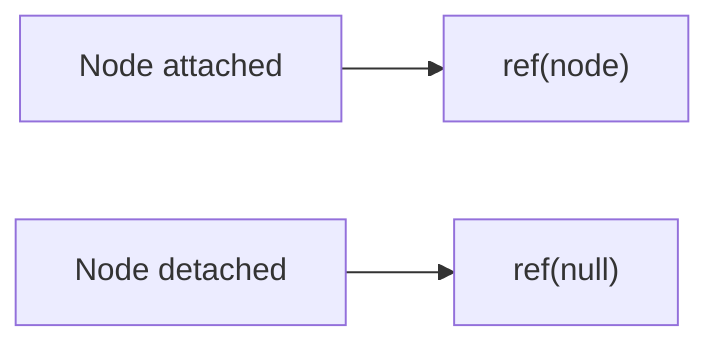

# Callback Refs

## Detailed explanation
Callback refs are functions React calls with a DOM node or component instance when it is attached, and with `null` when detached. They are useful when ref assignment itself needs logic, when nodes appear dynamically, or when measuring/observing elements.

Object refs from `useRef` are more common, but callback refs are more flexible because they can react immediately to node changes.

## 1. One-line mental model
A callback ref is a function that runs when React attaches or detaches a ref target.

## 2. Problem it solves
Sometimes you need to run code exactly when a DOM node becomes available or changes.

## 3. Core idea
- Pass a function to `ref`.
- React calls it with the node on attach.
- React calls it with `null` on detach.
- Keep callback identity stable when possible.
- Useful for dynamic measurement and observers.

## 4. Visual / analogy
A callback ref is like a check-in desk: when a node arrives, it signs in; when it leaves, it signs out.



## 5. Minimal example

```tsx
function MeasuredBox() {
  const ref = React.useCallback((node: HTMLDivElement | null) => {
    if (node) console.log(node.getBoundingClientRect());
  }, []);

  return <div ref={ref}>Measure me</div>;
}
```

## 6. Real-world example

```tsx
function ObservedRow({ onVisible }: { onVisible: () => void }) {
  const rowRef = React.useCallback((node: HTMLDivElement | null) => {
    if (!node) return;
    const observer = new IntersectionObserver(([entry]) => {
      if (entry.isIntersecting) onVisible();
    });
    observer.observe(node);
  }, [onVisible]);

  return <div ref={rowRef}>Row</div>;
}
```

## 7. Common interview questions
#### What is a callback ref?
- **The Engine Mechanism (Why it behaves this way):** A callback ref is a function passed to the `ref` prop instead of an object created by `useRef`. React calls this function with the DOM node (or component instance) when the element is mounted, and with `null` when it's unmounted. The callback runs during the commit phase, after the DOM has been updated but before `useEffect` fires. React stores the callback in the Fiber node and invokes it at the appropriate lifecycle moments. Unlike object refs, callback refs give you a notification exactly when the node becomes available or is removed, enabling immediate setup or cleanup logic.
- **The Unforgettable Mental Model:** The **Doorbell**. An object ref (`useRef`) is like a mailbox — you check it whenever you want. A callback ref is like a doorbell — it rings automatically when someone arrives (node mounts) or leaves (node unmounts). You don't need to check; you get notified.
- **The Trap:** Forgetting that the callback is called with `null` on unmount. If you set up an observer or listener in the callback, you must handle the `null` case to clean it up.
- **Senior Interview Playbook (Verbal Script):** "When asked this in an interview, say: A callback ref is a function passed to the `ref` prop that React calls with the DOM node when it mounts and with `null` when it unmounts. Unlike `useRef` which gives you a mutable object, a callback ref notifies you immediately when the node becomes available. This is useful for setup logic like measuring elements, creating observers, or integrating with imperative libraries. The callback runs during the commit phase, after DOM mutations but before effects fire."

#### Callback ref vs object ref?
- **The Engine Mechanism (Why it behaves this way):** An object ref (`useRef`) returns a stable `{ current: null }` object that React populates with the DOM node during commit. You read `.current` when you need the node. A callback ref is a function that React calls directly with the node — no intermediate object. The key difference is timing and control: with an object ref, you decide when to read `.current`; with a callback ref, React tells you exactly when the node is available. Callback refs also run cleanup logic automatically — React calls the callback with `null` before the node is removed, giving you a chance to tear down observers or listeners. Object refs require manual cleanup in `useEffect`.
- **The Unforgettable Mental Model:** The **Subscription vs. the Library Card**. An object ref is like a library card — you go to the library (read `.current`) whenever you want a book. A callback ref is like a book delivery subscription — the book arrives at your door (callback fires) without you needing to go anywhere.
- **The Trap:** Using callback refs when object refs are simpler. If you just need to access a node in an event handler, `useRef` is cleaner. Callback refs add complexity that's only justified when you need immediate notification.
- **Senior Interview Playbook (Verbal Script):** "When asked this in an interview, say: Object refs (`useRef`) give you a stable object with a `.current` property that you read when needed. Callback refs are functions that React calls with the node on mount and `null` on unmount. The key difference: callback refs notify you immediately when the node changes, while object refs require you to check `.current` manually. Use callback refs when you need to run logic on node assignment (like setting up observers). Use object refs for simpler cases like focusing in an event handler."

#### When does React call a callback ref?
- **The Engine Mechanism (Why it behaves this way):** React calls the callback ref during the commit phase, specifically during the mutation stage where DOM nodes are created, updated, or removed. When a node is created or updated, React calls `callback(node)`. When a node is about to be removed, React calls `callback(null)`. If the callback ref identity changes between renders (a new function is created), React calls the old callback with `null` to clean up, then calls the new callback with the node. This detach-then-attach sequence ensures that cleanup always runs before setup, preventing resource leaks.
- **The Unforgettable Mental Model:** The **Hotel Check-In/Check-Out**. When a guest arrives, the front desk calls them (callback with node). When they leave, the desk calls them one more time to settle the bill (callback with null). If the guest switches rooms (callback identity changes), they check out of the old room first, then check into the new one.
- **The Trap:** Creating a new callback function on every render without stabilizing it. This causes React to call the old callback with `null` and the new one with the node on every render, triggering unnecessary setup/teardown cycles.
- **Senior Interview Playbook (Verbal Script):** "When asked this in an interview, say: React calls the callback ref during the commit phase — with the DOM node when it's mounted or updated, and with `null` when it's unmounted. If the callback identity changes between renders, React calls the old callback with `null` first (cleanup), then the new callback with the node (setup). This is why callback identity matters: an unstable callback causes unnecessary detach-attach cycles on every render, which can be expensive for operations like setting up observers."

#### Why can unstable callback refs cause extra calls?
- **The Engine Mechanism (Why it behaves this way):** When React detects that the callback ref function has changed (different reference), it assumes the old callback is no longer valid and the new one needs to take over. React calls the old callback with `null` to clean up the previous node assignment, then calls the new callback with the node to set up the new assignment. If the callback is created inline on every render (e.g., `ref={(node) => { ... }}`), it's a new function each time, triggering this detach-attach cycle on every render. This can cause expensive operations like creating IntersectionObservers, ResizeObservers, or measuring elements to run repeatedly, degrading performance.
- **The Unforgettable Mental Model:** The **Changing Locks**. If you change the lock on your door every day (new callback each render), the old key stops working (old callback gets `null`), and you need a new key (new callback gets the node). This is wasteful — you'd be better off keeping the same lock (stable callback).
- **The Trap:** Defining the callback inline in JSX without `useCallback`. Even if the callback's logic is the same, a new function reference triggers the cleanup/setup cycle.
- **Senior Interview Playbook (Verbal Script):** "When asked this in an interview, say: When a callback ref's identity changes between renders, React calls the old callback with `null` and the new one with the node. If you create the callback inline on every render, it's a new function each time, triggering this cleanup/setup cycle repeatedly. This can cause expensive operations like creating observers or measuring elements to run on every render. The fix is to stabilize the callback with `useCallback` or define it outside the component so its identity doesn't change."

#### How do callback refs help measurement?
- **The Engine Mechanism (Why it behaves this way):** Callback refs are ideal for measurement because they fire exactly when the DOM node becomes available, before `useEffect` runs. This means you can measure the node's dimensions (`getBoundingClientRect`, `offsetWidth`, etc.) and store the result immediately. With an object ref, you'd need a `useEffect` that depends on the ref, which adds an extra render cycle. With a callback ref, you measure in a single pass: the node is attached, the callback fires, you measure, and you store the result. This is especially useful for dynamic layouts, animations, or responsive components that need to know their size before rendering children.
- **The Unforgettable Mental Model:** The **Tailor's Tape Measure**. A callback ref is like a tailor who measures you the moment you step into the shop — no waiting, no extra appointments. An object ref with `useEffect` is like scheduling a fitting for next week — it works, but takes longer.
- **The Trap:** Measuring in the callback and triggering a state update that causes a re-render, which triggers the callback again (if the callback identity changed), creating an infinite loop.
- **Senior Interview Playbook (Verbal Script):** "When asked this in an interview, say: Callback refs are ideal for measurement because they fire immediately when the DOM node is available, before effects run. You can measure dimensions in the callback and store the result, avoiding the extra render cycle that `useEffect` with an object ref would require. This is useful for dynamic layouts and animations. The pattern: create a stable callback with `useCallback`, measure the node when it's non-null, and store the measurement in state if the UI needs to react to it."

#### Can callback refs return cleanup?
- **The Engine Mechanism (Why it behaves this way):** No, callback refs themselves don't return cleanup functions. Unlike `useEffect`, which can return a cleanup function that React calls before the effect re-runs or the component unmounts, a callback ref is just a function that receives a node or `null`. Cleanup must be handled within the callback itself: when React calls the callback with `null`, you perform cleanup (disconnect observers, remove listeners). When called with a node, you perform setup. This is different from `useEffect`'s return-based cleanup pattern. However, you can achieve similar behavior by storing cleanup functions in a ref and calling them when the callback receives `null`.
- **The Unforgettable Mental Model:** The **One-Way Radio**. A callback ref is like a one-way radio — you receive messages (node or null) and act on them, but you can't send a response back (no return value). Cleanup is your responsibility when you receive the "null" message.
- **The Trap:** Trying to return a cleanup function from a callback ref like you would from `useEffect`. It won't work — the return value is ignored by React.
- **Senior Interview Playbook (Verbal Script):** "When asked this in an interview, say: Callback refs don't support return-based cleanup like `useEffect`. Instead, cleanup is handled within the callback itself: when React calls the callback with `null`, you clean up any observers or listeners you set up when the node was attached. When called with a node, you set up. The pattern is: `if (node) { setup } else { cleanup }`. This is different from `useEffect`'s return function pattern, but achieves the same goal of pairing setup with teardown."

#### When should you prefer `useRef`?
- **The Engine Mechanism (Why it behaves this way):** `useRef` is preferred when you need simple, passive access to a DOM node without immediate notification. Common cases include: focusing an element in an event handler (you read `.current` when the user clicks a button), storing a reference for later imperative access, or holding a value that doesn't need setup/teardown logic. `useRef` is simpler because it doesn't require stabilization with `useCallback`, doesn't trigger cleanup/setup cycles on identity changes, and has a more straightforward mental model. Callback refs should only be used when you need the immediate notification that `useRef` can't provide.
- **The Unforgettable Mental Model:** The **Parked Car**. `useRef` is like knowing where you parked your car — you go to it when you need it. A callback ref is like having a car that drives itself to you when you call it. Most of the time, just knowing where it is (`useRef`) is enough.
- **The Trap:** Using callback refs for everything "just in case." This adds unnecessary complexity and potential for bugs from unstable callbacks.
- **Senior Interview Playbook (Verbal Script):** "When asked this in an interview, say: Prefer `useRef` when you need simple access to a DOM node without immediate notification. If you're focusing an element in an event handler, storing a reference for later use, or holding a non-DOM value, `useRef` is simpler and safer. Callback refs are only needed when you must run logic the moment a node becomes available — like setting up observers or measuring dimensions. The rule: start with `useRef` and switch to a callback ref only when you need the immediate notification."

## 8. Active recall test
1. **What argument does a callback ref receive on attach?**
   - **Explanation:** The DOM node (or component instance). React calls the callback with the node during the commit phase when the element is mounted or updated.
2. **What argument does it receive on detach?**
   - **Explanation:** `null`. React calls the callback with `null` when the element is unmounted or when the callback ref identity changes, signaling that cleanup should be performed.
3. **Why stabilize callback ref identity?**
   - **Explanation:** An unstable callback (new function each render) causes React to call the old callback with `null` and the new one with the node on every render, triggering unnecessary setup/teardown cycles that can degrade performance.
4. **Name one use case for callback refs.**
   - **Explanation:** Setting up an IntersectionObserver on a DOM node. The callback ref fires when the node is available, allowing you to create the observer immediately. When the node is removed (callback gets `null`), you disconnect the observer.
5. **How is a callback ref different from `useRef`?**
   - **Explanation:** `useRef` returns a stable object you read when needed; a callback ref is a function React calls with the node on mount and `null` on unmount. Callback refs provide immediate notification; object refs provide passive access.

## 9. Mistakes / traps
- Creating a new callback every render without considering detach/attach behavior.
- Forgetting the `null` detach call.
- Doing expensive measurement too often.
- Leaking observers or listeners.
- Using callback refs when object refs are simpler.

## 10. Compare with related concepts
- **Callback ref vs object ref:** function notification vs mutable object.
- **Callback ref vs effect:** callback ref runs on node assignment; effects run after commit.
- **Callback ref vs forwardRef:** callback ref is a ref form; forwardRef passes refs through components.

## 11. Summary from memory
Explain when callback refs are better than `useRef` object refs.

## 12. Spaced revision prompts
- After 1 day: Define callback ref.
- After 3 days: Explain attach and detach calls.
- After 7 days: Use callback ref for measurement.
- After 14 days: Compare callback refs and effects.

