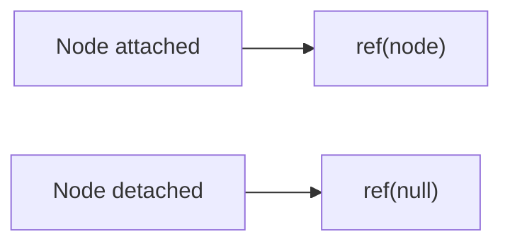

# Callback Refs

## Detailed explanation
Callback refs are functions React calls with a DOM node or component instance when it is attached, and with `null` when detached. They are useful when ref assignment itself needs logic, when nodes appear dynamically, or when measuring/observing elements.

Object refs from `useRef` are more common, but callback refs are more flexible because they can react immediately to node changes.

## 1. One-line mental model
A callback ref is a function that runs when React attaches or detaches a ref target.

## 2. Problem it solves
Sometimes you need to run code exactly when a DOM node becomes available or changes.

## 3. Core idea
- Pass a function to `ref`.
- React calls it with the node on attach.
- React calls it with `null` on detach.
- Keep callback identity stable when possible.
- Useful for dynamic measurement and observers.

## 4. Visual / analogy
A callback ref is like a check-in desk: when a node arrives, it signs in; when it leaves, it signs out.



## 5. Minimal example

```tsx
function MeasuredBox() {
  const ref = React.useCallback((node: HTMLDivElement | null) => {
    if (node) console.log(node.getBoundingClientRect());
  }, []);

  return <div ref={ref}>Measure me</div>;
}
```

## 6. Real-world example

```tsx
function ObservedRow({ onVisible }: { onVisible: () => void }) {
  const rowRef = React.useCallback((node: HTMLDivElement | null) => {
    if (!node) return;
    const observer = new IntersectionObserver(([entry]) => {
      if (entry.isIntersecting) onVisible();
    });
    observer.observe(node);
  }, [onVisible]);

  return <div ref={rowRef}>Row</div>;
}
```

## 7. Common interview questions
- What is a callback ref?
- Callback ref vs object ref?
- When does React call a callback ref?
- Why can unstable callback refs cause extra calls?
- How do callback refs help measurement?
- Can callback refs return cleanup?
- When should you prefer `useRef`?

## 8. Active recall test
1. What argument does callback ref receive on attach?
2. What argument on detach?
3. Why stabilize callback ref identity?
4. Name one use case.
5. How is it different from `useRef`?

## 9. Mistakes / traps
- Creating a new callback every render without considering detach/attach behavior.
- Forgetting the `null` detach call.
- Doing expensive measurement too often.
- Leaking observers or listeners.
- Using callback refs when object refs are simpler.

## 10. Compare with related concepts
- **Callback ref vs object ref:** function notification vs mutable object.
- **Callback ref vs effect:** callback ref runs on node assignment; effects run after commit.
- **Callback ref vs forwardRef:** callback ref is a ref form; forwardRef passes refs through components.

## 11. Summary from memory
Explain when callback refs are better than `useRef` object refs.

## 12. Spaced revision prompts
- After 1 day: Define callback ref.
- After 3 days: Explain attach and detach calls.
- After 7 days: Use callback ref for measurement.
- After 14 days: Compare callback refs and effects.

