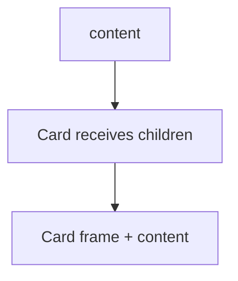

# Children Prop

## Detailed explanation
`children` is the special prop React uses for nested content. When a component is written with opening and closing tags, everything between those tags is passed as `children`. This makes wrapper components like cards, modals, layouts, tabs, and providers flexible.

The important idea is composition. A component can own the outer structure and behavior while letting the caller provide the inner content. This avoids rigid components with too many props for every possible layout.

## 1. One-line mental model
The `children` prop lets a component receive and render nested content passed between its opening and closing tags.

## 2. Problem it solves
Reusable layout components need to wrap unknown content without knowing exactly what that content is. `children` makes wrappers, cards, modals, layouts, and slots flexible.

## 3. Core idea
- Anything placed between component tags is passed as `children`.
- `children` can be text, elements, fragments, arrays, or `null`.
- Wrapper components use `children` for composition.
- Type `children` as `React.ReactNode` in TypeScript for normal renderable content.
- `children` should be rendered in the correct semantic location.

## 4. Visual / analogy
`children` is like the content inside an envelope. The envelope controls the outside; the sender controls what goes inside.



## 5. Minimal example

```tsx
function Card({ children }: { children: React.ReactNode }) {
  return <section className="card">{children}</section>;
}

<Card><h2>Billing</h2></Card>;
```

## 6. Real-world example

```tsx
function Modal({ title, children }: { title: string; children: React.ReactNode }) {
  return (
    <div role="dialog" aria-modal="true" aria-label={title}>
      <h2>{title}</h2>
      <div>{children}</div>
    </div>
  );
}
```

The modal owns dialog structure, while callers provide body content.

## 7. Common interview questions
#### What is the `children` prop?
- **The Engine Mechanism (Why it behaves this way):** `children` is a special prop that React automatically populates with whatever content is placed between a component's opening and closing tags. When you write `<Card><h2>Title</h2></Card>`, React passes `{ children: <h2>Title</h2> }` to the Card component. Under the hood, `children` is just another property in the props object — it's not magic, just a convention. During rendering, the child content is already evaluated as React elements before being passed to the parent, so the parent component receives ready-made element objects that it can render, transform, or ignore.
- **The Unforgettable Mental Model:** The **Gift Box**. The `children` prop is like a gift box — the caller decides what goes inside (content), and the component decides how to wrap it (layout/styling). The box doesn't care what's inside; it just provides the packaging.
- **The Trap:** Assuming `children` is always a single element. It can be a string, a number, an array of elements, a fragment, null, undefined, or a function (render prop pattern).
- **Senior Interview Playbook (Verbal Script):** "When asked this in an interview, say: The children prop is a special prop that contains whatever content is placed between a component's opening and closing tags. It's the primary mechanism for component composition in React — a wrapper component like Card or Modal defines the outer structure while letting the caller provide the inner content. Children can be any renderable value: text, elements, arrays, or even functions. I type it as React.ReactNode in TypeScript to accept all valid renderable content."

#### How do you type `children`?
- **The Engine Mechanism (Why it behaves this way):** In TypeScript, `children` should typically be typed as `React.ReactNode`, which is a union type that covers all valid renderable values: `string`, `number`, `boolean`, `null`, `undefined`, `ReactElement`, `ReactFragment`, and arrays of these. Typing `children` as `JSX.Element` is too narrow — it excludes strings, numbers, and arrays, which are valid children. Typing as `React.ReactNode` ensures the component accepts any content that React can render. For components that don't accept children, omit the `children` prop from the type entirely.
- **The Unforgettable Mental Model:** The **Universal Slot**. `React.ReactNode` is like a universal power outlet — it accepts any plug (renderable value) that React can process. `JSX.Element` is like a specific outlet that only accepts one plug type.
- **The Trap:** Using `JSX.Element` or `React.ReactElement` for children, which excludes valid renderable values like strings and numbers. Also, typing children as `React.ReactNode` on every component when some components shouldn't accept children at all.
- **Senior Interview Playbook (Verbal Script):** "When asked this in an interview, say: I type children as React.ReactNode, which covers all valid renderable content — strings, numbers, elements, fragments, arrays, and null. I avoid JSX.Element because it's too narrow and excludes primitives. If a component shouldn't accept children, I simply don't include children in its type definition. In React 18+, the FC type no longer includes children by default, so I explicitly add it when needed."

#### Can `children` be multiple elements?
- **The Engine Mechanism (Why it behaves this way):** Yes. When multiple elements are placed between a component's tags, React passes them as an array (or internally as a linked list in the Fiber tree). For example, `<Card><h2>Title</h2><p>Body</p></Card>` passes `children` as an array containing two React elements. React provides utility functions like `React.Children.map`, `React.Children.count`, and `React.Children.toArray` to safely work with children regardless of whether they're a single element, an array, or null. These utilities handle the edge cases of children being undefined, a single element, or a flat/nested array.
- **The Unforgettable Mental Model:** The **Playlist**. Children can be a single song (one element) or a playlist (multiple elements). The component plays whatever it receives, and React.Children utilities help you navigate the playlist safely.
- **The Trap:** Assuming `children` is always an array and calling `.map()` on it directly. If `children` is a single element or null, `.map()` will throw. Use `React.Children.map` instead.
- **Senior Interview Playbook (Verbal Script):** "When asked this in an interview, say: Yes, children can be multiple elements. When you place multiple elements between a component's tags, React passes them as an array. However, I never assume children is an array — it could be a single element, null, or undefined. When I need to iterate over children, I use React.Children.map, which safely handles all cases. In practice, most wrapper components just render `{children}` directly without needing to inspect or transform it."

#### What is component composition?
- **The Engine Mechanism (Why it behaves this way):** Component composition is the practice of building complex UIs by nesting components within each other, using `children` and other props to pass content and configuration between them. During the render phase, React processes the composed tree recursively — when it encounters a component that renders children, it renders those children in the context of the parent's layout and behavior. Composition creates a hierarchy where each component has a clear responsibility: outer components handle structure and behavior, inner components handle content. This is more flexible than inheritance because composed components can be mixed and matched at runtime.
- **The Unforgettable Mental Model:** The **Lego Castle**. Each Lego piece (component) has a specific shape and function. You compose them together to build a castle — the walls provide structure, the flags provide decoration, the gate provides behavior. You can swap pieces without rebuilding the entire castle.
- **The Trap:** Using inheritance (extending components) instead of composition in React. React's documentation explicitly recommends composition over inheritance. Extending components creates tight coupling and makes reuse harder.
- **Senior Interview Playbook (Verbal Script):** "When asked this in an interview, say: Component composition is building complex UIs by nesting and combining simpler components. Instead of creating one monolithic component, I build small, focused components and compose them together. For example, a Page composes a Header, Sidebar, and ContentArea, and the ContentArea composes Cards and Tables. Composition is more flexible than inheritance because components can be mixed and matched at runtime, and each component has a single, clear responsibility. React's children prop is the primary mechanism for composition."

#### How is `children` different from a normal prop?
- **The Engine Mechanism (Why it behaves this way):** `children` is syntactically different from normal props because it's passed implicitly through JSX nesting rather than as an explicit attribute. `<Card>content</Card>` passes `content` as `children`, while `<Card content={content} />` passes it as a named prop. Functionally, `children` is just another property in the props object — there's no special handling by React's engine. The difference is purely ergonomic: nesting is more natural for wrapping content, while named props are better for configuration values. Both are evaluated before being passed to the component.
- **The Unforgettable Mental Model:** The **Front Door vs. the Side Door**. `children` is like walking through the front door with your hands full of packages (nested content). A normal prop is like having someone hand you a specific item through the side door (named attribute). Both get the items inside, but the front door is more natural for bringing in lots of stuff.
- **The Trap:** Using `children` for configuration data that should be a named prop. If a component needs a `title` and `description`, those should be named props, not nested children.
- **Senior Interview Playbook (Verbal Script):** "When asked this in an interview, say: Children is functionally just another prop — it's a property in the props object. The difference is syntactic: children is passed through JSX nesting, which is more natural for wrapping content, while named props are passed as attributes and are better for configuration values. I use children for content that the caller provides freely, and named props for specific configuration like titles, callbacks, or variant settings."

#### When should you use named slots instead of `children`?
- **The Engine Mechanism (Why it behaves this way):** Named slots (explicit props like `header`, `footer`, `sidebar`) should be used when a component has multiple distinct insertion points that need to be rendered in specific locations. While `children` provides a single insertion point, named slots allow the caller to provide content for multiple areas of the component. During rendering, the component places each slot in its designated position. This is more explicit and type-safe than trying to parse a single `children` prop to extract different sections. Named slots also allow the caller to provide content in any order, since each slot is a separate prop.
- **The Unforgettable Mental Model:** The **Bento Box**. A bento box has separate compartments (named slots) for different foods. You can put rice in one compartment, fish in another, and vegetables in a third. A single `children` prop is like a single compartment — everything mixes together.
- **The Trap:** Using `children` for components that have multiple distinct areas (like a layout with header, sidebar, and footer). This forces the caller to wrap content in marker components or rely on positional ordering, which is fragile.
- **Senior Interview Playbook (Verbal Script):** "When asked this in an interview, say: I use named slots when a component has multiple distinct content areas that need to be rendered in specific locations. For example, a Layout component might have header, sidebar, and footer slots. Named slots are more explicit than children — the caller provides content for each area as a separate prop, and the component places each one in the right position. I use children when there's a single content area, and named slots when there are multiple. Named slots also work better with TypeScript because each slot can have its own type."

#### Can `children` be a function?
- **The Engine Mechanism (Why it behaves this way):** Yes, and this pattern is called a "render prop" or "function as children." When `children` is a function, the parent component calls it with arguments, and the return value is rendered. This allows the parent to pass data or state to the child's content dynamically. For example, a `<MouseTracker>` component could pass `{ x, y }` coordinates to its children function: `<MouseTracker>{({ x, y }) => <p>Mouse at {x}, {y}</p>}</MouseTracker>`. During rendering, the parent evaluates the function and renders the result. This pattern was popular before React hooks, as it allowed logic reuse without HOCs.
- **The Unforgettable Mental Model:** The **Mad Libs Game**. The parent provides the template with blanks (the function signature), and the caller fills in the blanks with content (the function body). The result is a customized sentence (rendered UI).
- **The Trap:** Overusing render props in the hooks era. Custom hooks now solve most of the same problems more elegantly. Render props are still useful for specific cases like virtualized lists where the parent needs to pass index-based data to each item.
- **Senior Interview Playbook (Verbal Script):** "When asked this in an interview, say: Yes, children can be a function — this is called the render prop pattern or function as children. The parent component calls the function with arguments, and renders the return value. This allows the parent to pass dynamic data to the child's content. For example, a virtualized list might pass item data and index to a render function. While custom hooks have replaced render props for many use cases, the pattern is still useful when a component needs to provide context-specific data to its content."

## 8. Active recall test
1. **Where does `children` come from?**
   - **Explanation:** `children` is automatically populated by React with whatever content is placed between a component's opening and closing tags in JSX. It's passed as a property in the props object, just like any other prop, but the syntax is implicit through nesting rather than explicit through attributes.
2. **What type should normal children use in TypeScript?**
   - **Explanation:** `React.ReactNode`. This type covers all valid renderable values: strings, numbers, booleans, null, undefined, React elements, fragments, and arrays of these. Using `JSX.Element` is too narrow because it excludes primitives like strings and numbers.
3. **Why is `children` useful for layout components?**
   - **Explanation:** Layout components like Card, Modal, and Page define the outer structure (borders, padding, positioning) while letting the caller provide the inner content. This separates structure from content, making the layout reusable across different use cases without knowing what content it will wrap.
4. **When is `children` not enough?**
   - **Explanation:** `children` is not enough when a component has multiple distinct insertion points that need to be rendered in specific locations — like a layout with header, sidebar, main content, and footer. In these cases, named slots (explicit props like `header`, `sidebar`, `footer`) are more appropriate.
5. **What is a render prop?**
   - **Explanation:** A render prop is a pattern where a component receives a function as a prop (often as `children`) and calls it to determine what to render. The function receives arguments from the component (like state or data) and returns React elements. This allows the component to share dynamic data with its content. While largely replaced by custom hooks in modern React, it's still useful for cases like virtualized lists.

## 9. Mistakes / traps
- Forgetting to render `children` inside a wrapper.
- Typing children too narrowly as `JSX.Element` when text or arrays are valid.
- Using `children` for too many unrelated slots.
- Cloning children unnecessarily.
- Assuming a component always receives children.

## 10. Compare with related concepts
- **Children vs props:** children is a special prop for nested content.
- **Children vs render prop:** render prop is usually a function child or function prop.
- **Children vs slot props:** named slots use explicit props for multiple insertion points.
- **Children vs composition:** children is one mechanism for composition.

## 11. Summary from memory
Explain how you would build a reusable `Card` or `Modal` using `children`.

## 12. Spaced revision prompts
- After 1 day: Define `children`.
- After 3 days: Type children in TypeScript.
- After 7 days: Compare children and named slots.
- After 14 days: Explain how children supports composition.
