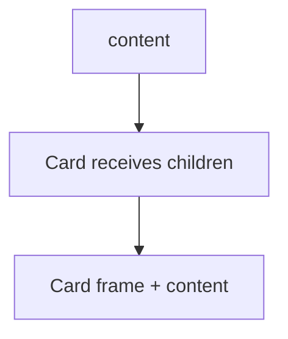

# Children Prop

## Detailed explanation
`children` is the special prop React uses for nested content. When a component is written with opening and closing tags, everything between those tags is passed as `children`. This makes wrapper components like cards, modals, layouts, tabs, and providers flexible.

The important idea is composition. A component can own the outer structure and behavior while letting the caller provide the inner content. This avoids rigid components with too many props for every possible layout.

## 1. One-line mental model
The `children` prop lets a component receive and render nested content passed between its opening and closing tags.

## 2. Problem it solves
Reusable layout components need to wrap unknown content without knowing exactly what that content is. `children` makes wrappers, cards, modals, layouts, and slots flexible.

## 3. Core idea
- Anything placed between component tags is passed as `children`.
- `children` can be text, elements, fragments, arrays, or `null`.
- Wrapper components use `children` for composition.
- Type `children` as `React.ReactNode` in TypeScript for normal renderable content.
- `children` should be rendered in the correct semantic location.

## 4. Visual / analogy
`children` is like the content inside an envelope. The envelope controls the outside; the sender controls what goes inside.



## 5. Minimal example

```tsx
function Card({ children }: { children: React.ReactNode }) {
  return <section className="card">{children}</section>;
}

<Card><h2>Billing</h2></Card>;
```

## 6. Real-world example

```tsx
function Modal({ title, children }: { title: string; children: React.ReactNode }) {
  return (
    <div role="dialog" aria-modal="true" aria-label={title}>
      <h2>{title}</h2>
      <div>{children}</div>
    </div>
  );
}
```

The modal owns dialog structure, while callers provide body content.

## 7. Common interview questions
- What is the `children` prop?
- How do you type `children`?
- Can `children` be multiple elements?
- What is component composition?
- How is `children` different from a normal prop?
- When should you use named slots instead of `children`?
- Can `children` be a function?

## 8. Active recall test
1. Where does `children` come from?
2. What type should normal children use in TypeScript?
3. Why is `children` useful for layout components?
4. When is `children` not enough?
5. What is a render prop?

## 9. Mistakes / traps
- Forgetting to render `children` inside a wrapper.
- Typing children too narrowly as `JSX.Element` when text or arrays are valid.
- Using `children` for too many unrelated slots.
- Cloning children unnecessarily.
- Assuming a component always receives children.

## 10. Compare with related concepts
- **Children vs props:** children is a special prop for nested content.
- **Children vs render prop:** render prop is usually a function child or function prop.
- **Children vs slot props:** named slots use explicit props for multiple insertion points.
- **Children vs composition:** children is one mechanism for composition.

## 11. Summary from memory
Explain how you would build a reusable `Card` or `Modal` using `children`.

## 12. Spaced revision prompts
- After 1 day: Define `children`.
- After 3 days: Type children in TypeScript.
- After 7 days: Compare children and named slots.
- After 14 days: Explain how children supports composition.
