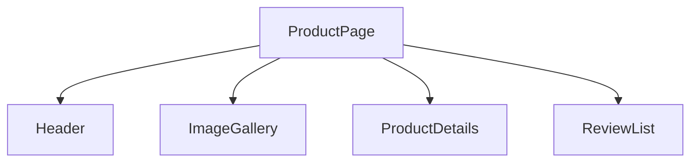

# Component-Based Architecture

## Detailed explanation
Component-based architecture means building an interface from independent pieces that can be composed together. Each component should have a clear responsibility: rendering a button, displaying a user card, controlling a modal, or orchestrating a route. This makes large UIs easier to test, reuse, replace, and reason about.

The skill is not just splitting files. Good component architecture is about ownership boundaries: which component owns data, which component owns layout, which component owns accessibility, and which component is reusable across domains.

## 1. One-line mental model
Component-based architecture builds UI from small reusable pieces that each own a clear part of rendering, behavior, or composition.

## 2. Problem it solves
Large pages become hard to maintain when markup, styling, state, and behavior are written as one big file. Components create boundaries so teams can reuse, test, and reason about UI pieces independently.

## 3. Core idea
- Components split UI into named units.
- Components can receive data through props.
- Components can hold local state when needed.
- Components compose together to build larger screens.
- Good components have clear ownership and minimal API surface.

## 4. Visual / analogy
Components are like Lego blocks: each block is simple, but many blocks can form a complex structure.



## 5. Minimal example

```tsx
function Avatar({ src, name }: { src: string; name: string }) {
  return ;
}
```

## 6. Real-world example

```tsx
function UserCard({ user }: { user: User }) {
  return (
    <article>
      <Avatar src={user.avatarUrl} name={user.name} />
      <h2>{user.name}</h2>
      <p>{user.role}</p>
    </article>
  );
}
```

The card composes avatar, text, and layout around one user concept.

## 7. Common interview questions
- What is component-based architecture?
- Why are components useful?
- What makes a component reusable?
- How do props support component reuse?
- What is component composition?
- How do you choose component boundaries?
- What is the difference between shared and domain components?

## 8. Active recall test
1. What should a component own?
2. What should a page component own?
3. When should repeated JSX become a component?
4. What is the danger of too many generic components?
5. How does composition help reuse?

## 9. Mistakes / traps
- Creating components only because a file is long, without a clear boundary.
- Making a component too generic too early.
- Passing too many unrelated props.
- Putting API fetching inside low-level shared UI components.
- Reusing a domain component in unrelated domains.

## 10. Compare with related concepts
- **Component vs function:** a component returns UI; a normal function returns data or behavior.
- **Component vs page:** a page usually owns routing and data orchestration.
- **Component vs design-system primitive:** a primitive is reusable across domains with stable accessibility and styling rules.

## 11. Summary from memory
Explain how you would break a user profile page into components and what each component should own.

## 12. Spaced revision prompts
- After 1 day: Define component boundary.
- After 3 days: Explain shared vs domain components.
- After 7 days: Refactor a large page into components on paper.
- After 14 days: Explain the cost of over-abstraction.
