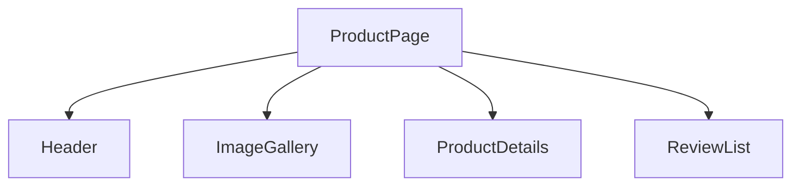

# Component-Based Architecture

## Detailed explanation
Component-based architecture means building an interface from independent pieces that can be composed together. Each component should have a clear responsibility: rendering a button, displaying a user card, controlling a modal, or orchestrating a route. This makes large UIs easier to test, reuse, replace, and reason about.

The skill is not just splitting files. Good component architecture is about ownership boundaries: which component owns data, which component owns layout, which component owns accessibility, and which component is reusable across domains.

## 1. One-line mental model
Component-based architecture builds UI from small reusable pieces that each own a clear part of rendering, behavior, or composition.

## 2. Problem it solves
Large pages become hard to maintain when markup, styling, state, and behavior are written as one big file. Components create boundaries so teams can reuse, test, and reason about UI pieces independently.

## 3. Core idea
- Components split UI into named units.
- Components can receive data through props.
- Components can hold local state when needed.
- Components compose together to build larger screens.
- Good components have clear ownership and minimal API surface.

## 4. Visual / analogy
Components are like Lego blocks: each block is simple, but many blocks can form a complex structure.



## 5. Minimal example

```tsx
function Avatar({ src, name }: { src: string; name: string }) {
  return ;
}
```

## 6. Real-world example

```tsx
function UserCard({ user }: { user: User }) {
  return (
    <article>
      <Avatar src={user.avatarUrl} name={user.name} />
      <h2>{user.name}</h2>
      <p>{user.role}</p>
    </article>
  );
}
```

The card composes avatar, text, and layout around one user concept.

## 7. Common interview questions
#### What is component-based architecture?
- **The Engine Mechanism (Why it behaves this way):** Component-based architecture means decomposing a UI into independent, composable units where each component is a JavaScript function that accepts props and returns a React element tree. During rendering, React builds a tree of these element objects, recursively calling child components to produce a complete Virtual DOM. Each component has its own execution context, state, and lifecycle, which React tracks internally through Fiber nodes. This tree structure enables React to isolate updates — when one component's state changes, only its subtree needs to be re-rendered.
- **The Unforgettable Mental Model:** The **Lego Set**. Each Lego brick (component) is simple on its own, but you can snap them together in infinite combinations to build complex structures. Each brick has a defined shape (props interface) and knows how to connect to others (composition).
- **The Trap:** Thinking component-based architecture just means splitting code into multiple files. True component architecture is about ownership boundaries — which component owns data, which owns layout, which owns behavior — not just file organization.
- **Senior Interview Playbook (Verbal Script):** "When asked this in an interview, say: Component-based architecture means building user interfaces from independent, reusable pieces that each have a clear responsibility. Each component encapsulates its own rendering logic, state, and behavior, and components compose together to form larger screens. This approach makes complex UIs easier to build, test, and maintain because changes to one component don't ripple through the entire application. It also enables teams to work in parallel on different parts of the interface."

#### Why are components useful?
- **The Engine Mechanism (Why it behaves this way):** Components are useful because they create isolated rendering boundaries. When React re-renders, it calls each component function independently, which means each component's logic is self-contained and testable. Components also enable React's reconciliation algorithm to efficiently update only the parts of the tree that changed. Without components, you'd have one massive render function that React would need to re-execute entirely on every state change.
- **The Unforgettable Mental Model:** The **Cell in a Body**. Each cell (component) has its own membrane (props boundary), internal machinery (state), and function (rendering). Cells combine to form tissues (sections), organs (pages), and organisms (applications). If one cell misbehaves, it doesn't necessarily kill the whole body.
- **The Trap:** Creating components for every small piece of JSX without considering whether it has a meaningful boundary. Over-fragmentation adds indirection without adding value.
- **Senior Interview Playbook (Verbal Script):** "When asked this in an interview, say: Components are useful because they create clear boundaries of ownership and responsibility. They enable code reuse — the same Button component can appear in a form, a modal, and a navbar. They improve testability — each component can be tested in isolation. They enhance maintainability — changes to one component's implementation don't affect others as long as the props interface stays the same. And they align with how humans think about UI: as a hierarchy of reusable pieces."

#### What makes a component reusable?
- **The Engine Mechanism (Why it behaves this way):** A reusable component is one whose output is entirely determined by its props and internal state, with no hidden dependencies on external context, global variables, or specific parent components. React's rendering model supports this because components are pure functions of their inputs — given the same props, they produce the same element tree. Reusability also depends on a well-designed props API: accepting configuration through props rather than hardcoding values, using sensible defaults, and avoiding props that are tightly coupled to a specific domain.
- **The Unforgettable Mental Model:** The **Universal Power Adapter**. A reusable component is like a power adapter that works in any country — it doesn't assume a specific voltage (data format) or plug type (parent structure). It accepts what it's given and adapts accordingly.
- **The Trap:** Making components "reusable" by accepting every possible prop combination, resulting in a component with 30 props and complex conditional logic. True reusability comes from simplicity, not flexibility.
- **Senior Interview Playbook (Verbal Script):** "When asked this in an interview, say: A component is reusable when it has a clear, minimal props API, no hidden dependencies on external state or specific parents, and sensible defaults. It should do one thing well and accept configuration through props rather than hardcoding behavior. I also avoid coupling reusable components to specific data shapes or business logic — a reusable Card component shouldn't know about 'users' or 'products'; it should just know about title, content, and actions."

#### How do props support component reuse?
- **The Engine Mechanism (Why it behaves this way):** Props are the mechanism by which parent components configure child components at render time. When React calls a component function, it passes the props object as the first argument. The child component uses these props to determine its output. Because props can be any JavaScript value — strings, numbers, objects, functions, React elements — a single component definition can produce vastly different outputs depending on what props it receives. This parameterization is what makes one component serve many purposes.
- **The Unforgettable Mental Model:** The **Vending Machine**. The machine (component) is the same, but what you get depends on what you put in (props). Insert different coins (prop values), get different products (UI output).
- **The Trap:** Passing props that create invalid combinations — like `variant="primary"` with `variant="danger"` simultaneously. Good prop design uses TypeScript unions to make invalid states unrepresentable.
- **Senior Interview Playbook (Verbal Script):** "When asked this in an interview, say: Props are the configuration interface for components. By accepting data, callbacks, and even React elements as props, a single component can render differently in different contexts. For example, a Button component can accept a `variant` prop for styling, an `onClick` prop for behavior, and `children` for content. The same Button definition works in a form, a modal, and a toolbar — props make it adaptable without duplicating code."

#### What is component composition?
- **The Engine Mechanism (Why it behaves this way):** Component composition is the practice of building complex UIs by nesting and combining simpler components. During the render phase, when React encounters a component that renders other components, it recursively calls each child component to build the complete element tree. Composition works through props — a parent passes children as the special `children` prop or through named props — and through the element tree structure itself. React's reconciliation algorithm handles composed trees naturally because every component, regardless of depth, produces the same type of output: React elements.
- **The Unforgettable Mental Model:** The **Russian Nesting Dolls**. Each doll (component) can contain other dolls (child components), and each layer adds its own structure while preserving the inner layers. The outermost doll defines the overall shape, but every layer contributes.
- **The Trap:** Creating deeply nested component hierarchies where props must pass through many intermediate layers (prop drilling). This is where context or state management solutions become necessary.
- **Senior Interview Playbook (Verbal Script):** "When asked this in an interview, say: Component composition is building complex UIs by combining simpler components together. Instead of creating one monolithic component, I build small, focused components and compose them into larger ones. For example, a Page component might compose a Header, a Sidebar, and a ContentArea, and the ContentArea might compose Cards, Tables, and Forms. Composition promotes reusability because the same Card component can appear in many different contexts, and it improves readability because each component has a single, clear responsibility."

#### How do you choose component boundaries?
- **The Engine Mechanism (Why it behaves this way):** Component boundaries determine where React splits the rendering work. When state changes in one component, only that component and its descendants re-render (unless optimized with memoization). Good boundaries minimize unnecessary re-renders by colocating state with the components that use it and separating concerns so that unrelated UI updates don't trigger each other. React's Fiber architecture processes each component as a unit of work, so well-defined boundaries also make the rendering tree more efficient to traverse and update.
- **The Unforgettable Mental Model:** The **City Zoning Map**. A city isn't divided into arbitrary squares — it's zoned by function: residential, commercial, industrial. Similarly, components should be divided by responsibility: one component owns the form, one owns the list, one owns the modal — not by arbitrary file size.
- **The Trap:** Splitting components only because a file is "too long." A 300-line component with a single clear responsibility is better than five 60-line components with unclear boundaries.
- **Senior Interview Playbook (Verbal Script):** "When asked this in an interview, say: I choose component boundaries based on responsibility, not file size. A component should own one clear concept — a UserCard owns the display of a user, a SearchForm owns search input and submission logic. I also consider reusability: if a piece of UI appears in multiple places, it's a candidate for extraction. And I think about state: components that share state should be close in the tree, while components with independent state can be separated. The goal is to make each component easy to understand, test, and change in isolation."

#### What is the difference between shared and domain components?
- **The Engine Mechanism (Why it behaves this way):** Shared components (also called UI primitives or design system components) are generic building blocks like Button, Input, Card, and Modal that have no knowledge of specific business logic. They render based purely on their props and are reusable across the entire application. Domain components (also called feature or business components) are specific to a particular area of the application — like UserCard, InvoiceRow, or ProductGallery — and encode business rules, data shapes, and domain-specific behavior. In React's rendering model, both types work identically, but their props APIs and internal logic differ significantly.
- **The Unforgettable Mental Model:** The **Hardware Store vs. Custom Workshop**. Shared components are like screws, nails, and boards — generic building blocks anyone can use. Domain components are like a custom-built bookshelf — assembled from those building blocks but designed for a specific purpose.
- **The Trap:** Putting business logic inside shared components (e.g., a Button that knows about user permissions) or making domain components so generic they lose their meaning.
- **Senior Interview Playbook (Verbal Script):** "When asked this in an interview, say: Shared components are generic UI building blocks like buttons, inputs, and cards that have no knowledge of business logic — they're reusable across the entire application. Domain components are specific to a particular feature area, like a UserCard or InvoiceRow, and they encode business rules and data shapes. I keep them separate: shared components live in a design system or UI library, while domain components live in feature folders. This prevents business logic from leaking into reusable primitives and keeps domain components focused on their specific use case."

## 8. Active recall test
1. **What should a component own?**
   - **Explanation:** A component should own its rendering logic, its local state (if any), and its behavior (event handlers). It should not own data that belongs to a parent or sibling component, and it should not directly manipulate DOM nodes that React manages.
2. **What should a page component own?**
   - **Explanation:** A page component typically owns routing-level concerns: data fetching orchestration, loading/error/empty state management, and the high-level layout that composes feature components together. It acts as the coordinator, not the implementer.
3. **When should repeated JSX become a component?**
   - **Explanation:** When the same JSX pattern appears in two or more places with only prop values changing, it should be extracted into a component. The extraction should also be considered if the repeated block has a clear conceptual identity (e.g., "user card," "invoice row") even if it only appears once currently.
4. **What is the danger of too many generic components?**
   - **Explanation:** Overly generic components accumulate props to handle every possible variation, resulting in complex conditional logic inside the component, a confusing API surface, and difficulty reasoning about what the component actually renders. This is sometimes called the "god component" anti-pattern.
5. **How does composition help reuse?**
   - **Explanation:** Composition lets you build complex UIs by combining simpler components rather than copying and modifying them. A Card component composed of Avatar, Text, and Button components can be reused anywhere those primitives make sense, without duplicating the Card's structure or the primitives' implementations.

## 9. Mistakes / traps
- Creating components only because a file is long, without a clear boundary.
- Making a component too generic too early.
- Passing too many unrelated props.
- Putting API fetching inside low-level shared UI components.
- Reusing a domain component in unrelated domains.

## 10. Compare with related concepts
- **Component vs function:** a component returns UI; a normal function returns data or behavior.
- **Component vs page:** a page usually owns routing and data orchestration.
- **Component vs design-system primitive:** a primitive is reusable across domains with stable accessibility and styling rules.

## 11. Summary from memory
Explain how you would break a user profile page into components and what each component should own.

## 12. Spaced revision prompts
- After 1 day: Define component boundary.
- After 3 days: Explain shared vs domain components.
- After 7 days: Refactor a large page into components on paper.
- After 14 days: Explain the cost of over-abstraction.
