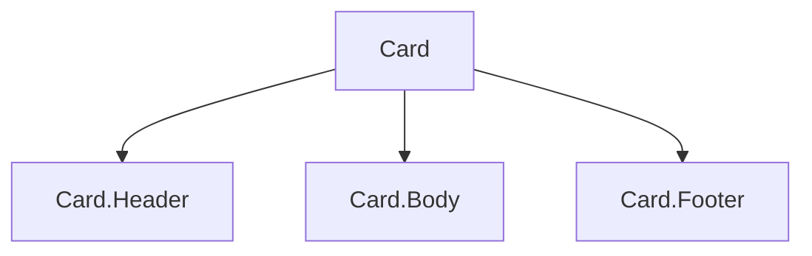

# Component Composition

## Detailed explanation
Component composition is the React pattern of building larger interfaces by nesting smaller components together. Instead of creating one component with many flags for every variation, composition lets the caller decide what content and subparts to place inside a reusable structure.

This is one of React's most important design ideas. It powers `children`, compound components, layout wrappers, slots, and headless components. Good composition keeps components flexible without making their APIs vague.

## 1. One-line mental model
Component composition builds complex UI by combining smaller components instead of creating one component that knows every variation.

## 2. Problem it solves
Large configurable components become hard to use and maintain. Composition lets consumers assemble UI from focused parts while each part keeps a clear responsibility.

## 3. Core idea
- Compose components through `children`, props, and named subcomponents.
- Prefer composition over inheritance.
- Let layout wrappers receive content instead of hardcoding it.
- Use compound components when related pieces share behavior.
- Composition keeps APIs flexible without endless boolean props.

## 4. Visual / analogy
Composition is like assembling a meal from dishes. You do not need one giant "all possible meals" dish.



## 5. Minimal example

```tsx
function Card({ children }: { children: React.ReactNode }) {
  return <section className="card">{children}</section>;
}

<Card><h2>Profile</h2><p>User details</p></Card>;
```

## 6. Real-world example

```tsx
<Dialog>
  <Dialog.Trigger>Edit profile</Dialog.Trigger>
  <Dialog.Content>
    <Dialog.Title>Edit profile</Dialog.Title>
    <ProfileForm />
  </Dialog.Content>
</Dialog>
```

The dialog owns behavior and accessibility; the caller composes the content.

## 7. Common interview questions
#### What is component composition?
- **The Engine Mechanism (Why it behaves this way):** Component composition is React's mechanism of building complex UIs by nesting components within each other. During the render phase, React calls the parent component function, which returns JSX containing child component calls. React then recursively calls each child's function, building a tree of React element objects. Each component receives its content through the `children` prop or named props, and each child renders independently with its own props and state. The Fiber reconciler then compares this new element tree with the previous one and commits only the changes. Composition works because React elements are just plain JavaScript objects — they can be passed, wrapped, and rearranged without any special framework machinery.
- **The Unforgettable Mental Model:** The **Russian Nesting Dolls with a Twist**. Each doll (component) can contain any other doll inside it, and the inner dolls don't need to know what the outer doll looks like. A small doll fits inside a big doll, and the big doll doesn't care what's inside — it just provides the space.
- **The Trap:** Confusing composition with inheritance. React doesn't use class extension for UI reuse. Composition is about nesting and props, not extending and overriding.
- **Senior Interview Playbook (Verbal Script):** "When asked this in an interview, say: Component composition is how React builds complex UIs by nesting smaller, focused components together. Instead of creating one mega-component with flags for every variation, we build flexible structures that accept content through children and named props. This keeps components small, testable, and reusable. Composition is React's primary mechanism for code reuse — not inheritance."

#### Why prefer composition over inheritance?
- **The Engine Mechanism (Why it behaves this way):** Inheritance in class-based UI frameworks creates rigid hierarchies where child classes inherit all parent behavior and must override what they don't want. This leads to fragile base classes, diamond inheritance problems, and components that carry unnecessary baggage. React's composition model avoids this entirely — components are plain functions that receive props and return elements. There's no prototype chain, no method resolution order, no super() calls. During reconciliation, React treats each component independently based on its element type and key, not its position in an inheritance hierarchy. This makes components independently testable, replaceable, and composable in any arrangement.
- **The Unforgettable Mental Model:** **LEGO vs. Clay Sculpture**. LEGO (composition) — snap together any pieces in any arrangement, swap pieces freely, each piece is independent. Clay sculpture (inheritance) — once you mold a base shape, changing it affects everything built on top. You can't easily swap out just the arms.
- **The Trap:** Trying to replicate class inheritance patterns in React with higher-order components or wrapper functions that pass through every prop. This creates the same rigidity inheritance had.
- **Senior Interview Playbook (Verbal Script):** "When asked this in an interview, say: Composition over inheritance is a core React principle because inheritance creates rigid, coupled hierarchies where changes to a base class ripple through all descendants. Composition keeps components loosely coupled — each component has a clear contract through props, can be tested in isolation, and can be combined in any arrangement. React's function component model naturally supports composition through children props and element passing, making inheritance unnecessary for UI reuse."

#### How does `children` support composition?
- **The Engine Mechanism (Why it behaves this way):** The `children` prop is a special prop that React automatically populates with whatever JSX is placed between a component's opening and closing tags. During the render phase, when React encounters `<Card><h2>Title</h2></Card>`, it creates a React element for `Card` with `children` set to the `h2` element object. The `Card` component function receives this as `props.children` and can render it anywhere in its output. The `children` prop can be a single element, an array of elements, a string, a number, or even a function (render props). React doesn't process or transform children — it passes them through as-is, letting the receiving component decide how to render them.
- **The Unforgettable Mental Model:** The **Picture Frame**. The frame (component) provides the border, styling, and structure. Whatever photo you place inside it (children) gets displayed within that structure. The frame doesn't care what the photo is — it just holds it.
- **The Trap:** Assuming `children` is always a single React element. It can be undefined, an array, a string, or a function. Always use `React.Children` utilities or check types before manipulating children.
- **Senior Interview Playbook (Verbal Script):** "When asked this in an interview, say: The children prop is React's built-in slot mechanism. Whatever content you place between a component's tags becomes its children prop. The component can render children directly, wrap them in additional markup, conditionally render them, or even transform them using React.Children utilities. This makes components like Card, Dialog, and Layout incredibly flexible — they provide structure and behavior while letting consumers supply the content."

#### What are compound components?
- **The Engine Mechanism (Why it behaves this way):** Compound components are a group of related components that work together to form a complete widget, sharing implicit state through React Context. The parent component (e.g., `<Tabs>`) creates a context with shared state (active tab index, change handler). Child components (e.g., `<TabList>`, `<Tab>`, `<TabPanel>`) consume this context to coordinate behavior without explicit prop passing. During render, the parent renders first, creating the context provider with its state. Children then render and consume the context, accessing the shared state. This creates a clean API where consumers compose the widget's parts while the compound component manages internal coordination. The Fiber tree structure naturally supports this because context providers and consumers are just nodes in the same render tree.
- **The Unforgettable Mental Model:** The **Orchestra**. The conductor (parent component) sets the tempo and key (shared state via context). Each musician (child component) plays their part independently but stays in sync because they're all listening to the same conductor. The audience (consumer) chooses which musicians to include.
- **The Trap:** Over-compounding — creating compound components for simple patterns that could be handled with regular props. Compound components shine when there's shared state and flexible composition.
- **Senior Interview Playbook (Verbal Script):** "When asked this in an interview, say: Compound components are a pattern where related components share implicit state through React Context. Think of Select with Select.Trigger, Select.Content, and Select.Item — they work together as a unit but can be composed flexibly by the consumer. The parent provides shared state via context, and children consume it. This gives consumers control over layout and content while the compound component manages the behavior and accessibility."

#### How does composition prevent prop explosion?
- **The Engine Mechanism (Why it behaves this way):** Prop explosion happens when a component accumulates dozens of boolean and configuration props to handle every possible variation (`showHeader`, `headerPosition`, `customHeader`, `headerComponent`, etc.). Each new prop increases the component's complexity and the reconciliation workload — React must process each prop during every render. Composition solves this by replacing configuration props with content slots. Instead of `showHeader={true} headerText="Title"`, the consumer writes `<Card><Card.Header>Title</Card.Header></Card>`. The component signature stays small, the API is more expressive, and React's reconciliation is simpler because the content is passed as element objects rather than configuration flags.
- **The Unforgettable Mental Model:** The **Restaurant Menu vs. Build-Your-Own Buffet**. A menu with 100 fixed dishes (prop explosion) is overwhelming. A buffet (composition) lets you pick exactly what you want and arrange it on your plate however you like. The kitchen (component) just provides the stations.
- **The Trap:** Over-composing — breaking a simple component into too many subcomponents when a single prop would be clearer. Composition should reduce complexity, not add ceremony.
- **Senior Interview Playbook (Verbal Script):** "When asked this in an interview, say: Prop explosion happens when a component tries to handle every variation through configuration props, creating a confusing API with dozens of options. Composition prevents this by letting consumers provide content directly through children and named slots. Instead of a Dialog component with title, body, footer, icon, and action props, we use Dialog.Title, Dialog.Content, and Dialog.Footer. The API stays clean, the component stays focused, and consumers have full control over content."

#### When should you use render props?
- **The Engine Mechanism (Why it behaves this way):** A render prop is a prop whose value is a function that returns React elements. During the render phase, the component calls this function, passing data as arguments, and renders the returned elements. This pattern inverts control — instead of the component deciding how to render its data, it delegates rendering to the consumer. The function is called during the parent's render phase, so it has access to the parent's current state and props. React treats the returned elements like any other children, reconciling them normally. The pattern was largely replaced by custom hooks for state sharing, but remains useful for rendering delegation.
- **The Unforgettable Mental Model:** The **Ghostwriter**. You provide the facts and data (state), and the ghostwriter (render prop function) decides how to tell the story (render the UI). You control the content; they control the presentation.
- **The Trap:** Nesting render prop functions deeply, which creates "callback hell" in JSX and makes code hard to read. Extract render functions as separate components or use custom hooks instead.
- **Senior Interview Playbook (Verbal Script):** "When asked this in an interview, say: Render props are useful when a component needs to share data or behavior but delegate the rendering decision to the consumer. The component provides a function prop that it calls during render, passing data as arguments. While custom hooks have largely replaced render props for state sharing, render props are still valuable for rendering delegation — like a VirtualizedList that knows how to scroll efficiently but lets consumers decide how each item looks."

#### What are slots in React?
- **The Engine Mechanism (Why it behaves this way):** Slots are named positions in a component where consumers can inject content. Unlike the single `children` prop, slots allow multiple injection points — `header`, `footer`, `sidebar`, `actions`, etc. During the render phase, the component receives these as named props (each containing React element objects) and renders them at the designated positions in its output. React reconciles each slot independently — if only the `footer` slot changes, only that part of the DOM updates. Slots are essentially named children props that create a structured composition API.
- **The Unforgettable Mental Model:** The **Magazine Layout Template**. The magazine has designated areas — cover story, sidebar, footer, ad space. Writers (consumers) fill each area with their content. The template (component) provides the structure and styling; the content varies per issue.
- **The Trap:** Creating too many slots, making the component as complex as the prop explosion it was meant to avoid. Slots should represent genuine structural positions, not every possible customization point.
- **Senior Interview Playbook (Verbal Script):** "When asked this in an interview, say: Slots are named content positions in a component — like header, footer, or actions — that let consumers inject content at specific locations. They're implemented as named props that accept React elements. Slots give consumers precise control over content placement while the component maintains the overall layout structure. This is cleaner than a single children prop when a component has multiple distinct content areas."

## 8. Active recall test
1. **What is composition?**
   - **Explanation:** Composition is building complex UIs by nesting smaller, focused components together. Components receive content through the `children` prop or named props, allowing consumers to assemble UI from reusable parts without the components knowing about each other's internals.
2. **How does composition reduce boolean props?**
   - **Explanation:** Instead of adding boolean flags like `showHeader`, `hasFooter`, `withIcon` to control what a component renders, composition lets consumers provide the actual content directly. `<Card><Card.Header>...</Card.Header></Card>` replaces `showHeader={true}` — the API is more expressive and the component doesn't need conditional rendering logic for every flag.
3. **What does a layout wrapper own?**
   - **Explanation:** A layout wrapper owns the structural arrangement — grid, flexbox, spacing, borders, positioning. It decides where content areas go and how they relate to each other visually. It does not own the content itself.
4. **What does the caller own?**
   - **Explanation:** The caller owns the content that goes inside the composition — the text, images, nested components, and business logic. The caller decides what appears in each slot or children position, giving them full control over the rendered output.
5. **Give one compound component example.**
   - **Explanation:** A Tabs compound component: `<Tabs><TabList><Tab>One</Tab><Tab>Two</Tab></TabList><TabPanels><TabPanel>Content 1</TabPanel><TabPanel>Content 2</TabPanel></TabPanels></Tabs>`. The Tabs parent manages active state via context, and Tab/TabPanel consume it to coordinate behavior.

## 9. Mistakes / traps
- Creating a configurable mega-component with many unrelated props.
- Hiding layout decisions that consumers need to control.
- Using composition when a simple prop would be clearer.
- Forgetting accessibility responsibilities in composed widgets.
- Nesting too many wrappers without purpose.

## 10. Compare with related concepts
- **Composition vs inheritance:** React reuses UI through nesting and props, not class inheritance.
- **Composition vs configuration:** composition lets caller provide structure; configuration asks one component to handle all variants.
- **Composition vs abstraction:** composition is one way to create flexible abstractions.

## 11. Summary from memory
Explain how you would design a reusable `Dialog` API using composition.

## 12. Spaced revision prompts
- After 1 day: Define composition.
- After 3 days: Compare composition and configuration.
- After 7 days: Design a card API with children.
- After 14 days: Explain compound component composition.
