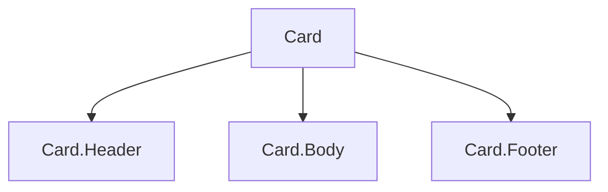

# Component Composition

## Detailed explanation
Component composition is the React pattern of building larger interfaces by nesting smaller components together. Instead of creating one component with many flags for every variation, composition lets the caller decide what content and subparts to place inside a reusable structure.

This is one of React's most important design ideas. It powers `children`, compound components, layout wrappers, slots, and headless components. Good composition keeps components flexible without making their APIs vague.

## 1. One-line mental model
Component composition builds complex UI by combining smaller components instead of creating one component that knows every variation.

## 2. Problem it solves
Large configurable components become hard to use and maintain. Composition lets consumers assemble UI from focused parts while each part keeps a clear responsibility.

## 3. Core idea
- Compose components through `children`, props, and named subcomponents.
- Prefer composition over inheritance.
- Let layout wrappers receive content instead of hardcoding it.
- Use compound components when related pieces share behavior.
- Composition keeps APIs flexible without endless boolean props.

## 4. Visual / analogy
Composition is like assembling a meal from dishes. You do not need one giant "all possible meals" dish.



## 5. Minimal example

```tsx
function Card({ children }: { children: React.ReactNode }) {
  return <section className="card">{children}</section>;
}

<Card><h2>Profile</h2><p>User details</p></Card>;
```

## 6. Real-world example

```tsx
<Dialog>
  <Dialog.Trigger>Edit profile</Dialog.Trigger>
  <Dialog.Content>
    <Dialog.Title>Edit profile</Dialog.Title>
    <ProfileForm />
  </Dialog.Content>
</Dialog>
```

The dialog owns behavior and accessibility; the caller composes the content.

## 7. Common interview questions
- What is component composition?
- Why prefer composition over inheritance?
- How does `children` support composition?
- What are compound components?
- How does composition prevent prop explosion?
- When should you use render props?
- What are slots in React?

## 8. Active recall test
1. What is composition?
2. How does composition reduce boolean props?
3. What does a layout wrapper own?
4. What does the caller own?
5. Give one compound component example.

## 9. Mistakes / traps
- Creating a configurable mega-component with many unrelated props.
- Hiding layout decisions that consumers need to control.
- Using composition when a simple prop would be clearer.
- Forgetting accessibility responsibilities in composed widgets.
- Nesting too many wrappers without purpose.

## 10. Compare with related concepts
- **Composition vs inheritance:** React reuses UI through nesting and props, not class inheritance.
- **Composition vs configuration:** composition lets caller provide structure; configuration asks one component to handle all variants.
- **Composition vs abstraction:** composition is one way to create flexible abstractions.

## 11. Summary from memory
Explain how you would design a reusable `Dialog` API using composition.

## 12. Spaced revision prompts
- After 1 day: Define composition.
- After 3 days: Compare composition and configuration.
- After 7 days: Design a card API with children.
- After 14 days: Explain compound component composition.
