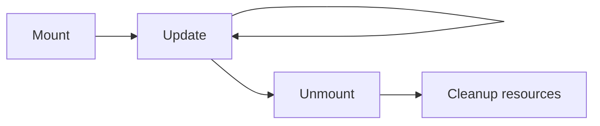

# Component Lifecycle

## Detailed explanation
Component lifecycle describes the stages a component goes through: mounting, updating, and unmounting. Class components expose lifecycle methods such as `componentDidMount`, `componentDidUpdate`, and `componentWillUnmount`. Functional components express similar synchronization needs with hooks and cleanup patterns.

The key interview point is that modern React does not require memorizing lifecycle methods as the primary model. Instead, understand render, commit, state updates, cleanup, and external synchronization.

## 1. One-line mental model
Lifecycle is the sequence of mount, update, and unmount work for a component.

## 2. Problem it solves
Components often need to start subscriptions, measure DOM, fetch data, clean up timers, or reset external resources at the correct time.

## 3. Core idea
- Mount means the component appears in the tree.
- Update means props or state changed and React rendered again.
- Unmount means the component is removed.
- Render should stay pure.
- Cleanup prevents memory leaks and stale external work.

## 4. Visual / analogy
Lifecycle is like renting a room: move in, use it, maintain it, and clean up when leaving.



## 5. Minimal example

```tsx
class Clock extends React.Component {
  componentDidMount() {}
  componentDidUpdate() {}
  componentWillUnmount() {}
  render() {
    return <time />;
  }
}
```

## 6. Real-world example

```tsx
function useWindowSizeStore() {
  return React.useSyncExternalStore(
    subscribeToResize,
    getWindowSnapshot,
    getServerSnapshot,
  );
}
```

Modern React prefers explicit subscription APIs for external stores instead of scattering lifecycle logic in components.

## 7. Common interview questions
#### What are mount, update, and unmount?
- **The Engine Mechanism (Why it behaves this way):** These are the three fundamental phases of a component's existence in React's tree. **Mount** occurs when React first renders a component — it calls the component function, creates the React element tree, and commits the resulting DOM nodes to the browser. During mount, `useEffect` callbacks are scheduled to run after the commit. **Update** occurs when props, state, or context change — React re-renders the component, compares the new element tree with the previous one during reconciliation, and commits only the DOM differences. **Unmount** occurs when React removes the component from the tree — it removes the DOM nodes and runs all cleanup functions returned from `useEffect` callbacks. The Fiber scheduler manages these phases, potentially pausing and resuming render work but always completing mount and unmount atomically.
- **The Unforgettable Mental Model:** The **Tenant Lifecycle**. Mount = moving in (furniture arrives, utilities connected). Update = renovating (repainting, rearranging — you stay but things change). Unmount = moving out (clean up, return keys, utilities disconnected).
- **The Trap:** Assuming mount happens exactly once. In React 18 StrictMode, components mount, unmount, and remount in development to surface cleanup bugs. Production doesn't do this.
- **Senior Interview Playbook (Verbal Script):** "When asked this in an interview, say: Mount is when a component first appears in the tree — React renders it, creates DOM nodes, and runs setup effects. Update is when props or state change — React re-renders, reconciles the differences, and commits DOM updates. Unmount is when the component is removed — React cleans up DOM nodes and runs cleanup effects. Understanding these phases is essential for managing subscriptions, timers, and external resources correctly."

#### What lifecycle methods exist in class components?
- **The Engine Mechanism (Why it behaves this way):** Class components have specific methods that React calls at different phases: `constructor` (initialization, before mount), `static getDerivedStateFromProps` (derives state from props, before render), `render` (produces React elements, pure), `componentDidMount` (after first commit, for subscriptions and DOM measurement), `componentDidUpdate` (after subsequent commits, for reacting to prop/state changes), `shouldComponentUpdate` (optimization, returns boolean to skip render), `getSnapshotBeforeUpdate` (captures DOM state before mutations), and `componentWillUnmount` (cleanup before removal). React calls these methods in a specific order during the render and commit phases. The render-phase methods (`getDerivedStateFromProps`, `shouldComponentUpdate`, `render`) must be pure. The commit-phase methods (`componentDidMount`, `componentDidUpdate`, `componentWillUnmount`) can perform side effects.
- **The Unforgettable Mental Model:** The **Hotel Check-In/Out Process**. Constructor = reservation created. getDerivedStateFromProps = checking if room preferences changed. render = preparing the room. componentDidMount = guest arrives. componentDidUpdate = guest requests extra towels. componentWillUnmount = guest checks out, room is cleaned.
- **The Trap:** Using deprecated lifecycle methods like `componentWillMount`, `componentWillReceiveProps`, or `componentWillUpdate`. These were deprecated because they caused bugs in async rendering modes.
- **Senior Interview Playbook (Verbal Script):** "When asked this in an interview, say: Class components have lifecycle methods organized by phase: render-phase methods like render and shouldComponentUpdate must be pure, while commit-phase methods like componentDidMount, componentDidUpdate, and componentWillUnmount handle side effects. Modern React discourages class components in favor of hooks, but understanding these methods helps when maintaining legacy code. The key insight is that render-phase methods calculate output, and commit-phase methods interact with the outside world."

#### What replaces lifecycle methods in functional components?
- **The Engine Mechanism (Why it behaves this way):** Hooks replace class lifecycle methods by organizing code by concern rather than by lifecycle phase. `useState` manages component state. `useEffect` handles side effects — it runs after the commit phase and can return a cleanup function that runs before the next effect or on unmount. The effect's dependency array controls when it re-runs: empty array (`[]`) mimics `componentDidMount`, no array runs after every render (like `componentDidMount` + `componentDidUpdate`), and a cleanup function mimics `componentWillUnmount`. `useLayoutEffect` runs synchronously after DOM mutations but before the browser paints, replacing `getSnapshotBeforeUpdate` + `componentDidUpdate` for DOM measurements. `useMemo` and `useCallback` replace `shouldComponentUpdate` optimization patterns. The key difference: hooks organize by concern (all subscription logic together) rather than by phase (all mount logic together).
- **The Unforgettable Mental Model:** The **Filing System**. Class lifecycle = files organized by date (all Monday tasks together, all Tuesday tasks together). Hooks = files organized by project (all subscription tasks together, all timer tasks together). Same documents, different organization.
- **The Trap:** Thinking `useEffect` with `[]` is exactly `componentDidMount`. It's close, but StrictMode remounts in development, and effects run after paint, not synchronously after commit.
- **Senior Interview Playbook (Verbal Script):** "When asked this in an interview, say: Hooks replace lifecycle methods by organizing code by concern instead of by phase. useEffect handles side effects with a dependency array controlling when it runs — empty array for mount-only, specific dependencies for updates, and a cleanup function for unmount. useLayoutEffect handles synchronous DOM measurements. useMemo and useCallback handle performance optimization. The shift from class to hooks is from time-based organization to concern-based organization, which makes related logic easier to find and maintain."

#### Why should render be pure?
- **The Engine Mechanism (Why it behaves this way):** React's render phase can be called multiple times for the same component — during StrictMode development, during concurrent rendering when React pauses and resumes work, and during error recovery. If render performs side effects (API calls, DOM mutations, state updates), those side effects would execute multiple times, causing duplicate API requests, corrupted DOM state, or infinite render loops. React's Fiber architecture relies on render being a pure computation: given the same props and state, render must produce the same React element tree. This purity enables React to safely pause, restart, and discard render work without side consequences. The commit phase is where side effects belong — it runs exactly once per completed render.
- **The Unforgettable Mental Model:** The **Math Function**. A pure math function like `f(x) = x * 2` always returns the same result for the same input, no matter how many times you call it. An impure function like `f(x) = x * random()` gives different results each time. React's render must be like the math function — predictable and repeatable.
- **The Trap:** Putting `console.log` in render and thinking it's harmless. While logging doesn't mutate state, it reveals that render may be called more times than you expect, which can confuse debugging.
- **Senior Interview Playbook (Verbal Script):** "When asked this in an interview, say: Render must be pure because React can call it multiple times — during StrictMode, concurrent rendering, and error recovery. If render has side effects like API calls or DOM mutations, those effects would run multiple times, causing bugs. Pure render means: given the same props and state, render always produces the same output with no external side effects. Side effects belong in useEffect or event handlers, which React guarantees run exactly once."

#### What is cleanup?
- **The Engine Mechanism (Why it behaves this way):** Cleanup is the function returned from a `useEffect` callback that React runs before the next effect execution or when the component unmounts. During the commit phase, when React detects that an effect's dependencies have changed, it first runs the previous cleanup function, then runs the new effect. On unmount, React runs all cleanup functions for all effects. This prevents memory leaks (dangling event listeners, unclosed WebSocket connections, unresolved promises), stale data (subscriptions returning outdated values), and race conditions (multiple concurrent API requests resolving out of order). Cleanup is React's mechanism for ensuring that external resources are properly released when they're no longer needed.
- **The Unforgettable Mental Model:** The **Restaurant Table Reset**. When a customer leaves (component unmounts or effect re-runs), the staff must clean the table (cleanup) before the next customer sits down. If they don't, the next customer finds dirty plates and leftover food (memory leaks, stale data).
- **The Trap:** Forgetting cleanup for event listeners, intervals, or subscriptions. This causes memory leaks that accumulate over the app's lifetime, especially in SPAs where components mount and unmount frequently.
- **Senior Interview Playbook (Verbal Script):** "When asked this in an interview, say: Cleanup is the function returned from useEffect that React runs before the next effect or on unmount. It's essential for releasing external resources — removing event listeners, clearing timers, canceling subscriptions, and aborting API requests. Without cleanup, these resources persist after the component is gone, causing memory leaks, stale data, and race conditions. I always ask: what external resource did this effect create, and how do I clean it up?"

#### Why does StrictMode remount in development?
- **The Engine Mechanism (Why it behaves this way):** React 18 StrictMode intentionally mounts, unmounts, and remounts components in development to surface bugs related to missing cleanup and non-idempotent effects. During the first mount, effects run. Then React immediately unmounts (running cleanup) and remounts (running effects again). This simulates what happens when a component quickly disappears and reappears in production — like a user rapidly navigating between pages. If an effect doesn't have proper cleanup, the second mount will have duplicate subscriptions or resources. If an effect isn't idempotent (produces the same result when run twice), the second run will cause incorrect behavior. StrictMode catches these bugs in development so they don't reach production.
- **The Unforgettable Mental Model:** The **Flight Simulator**. Pilots practice emergency procedures in a simulator (StrictMode) that creates artificial stress conditions. The simulator double-checks everything — if the pilot forgets a step, it's caught in training, not during a real flight (production).
- **The Trap:** Trying to disable StrictMode because "it causes double renders." The double render is intentional — it's finding bugs that would otherwise surface in production under concurrent rendering.
- **Senior Interview Playbook (Verbal Script):** "When asked this in an interview, say: StrictMode remounts components in development to catch bugs related to missing cleanup and non-idempotent effects. It simulates the behavior of concurrent rendering, where React may pause, discard, and restart render work. If your effects don't clean up properly or produce different results when run twice, StrictMode exposes this in development. It's not a bug — it's a safety net. The fix is always to add proper cleanup and make effects idempotent, not to disable StrictMode."

#### How do you avoid memory leaks?
- **The Engine Mechanism (Why it behaves this way):** Memory leaks in React occur when external resources persist after a component unmounts. Common sources: event listeners not removed, intervals not cleared, subscriptions not unsubscribed, API requests not aborted, and refs holding references to unmounted DOM nodes. The solution is cleanup in useEffect: return a function that reverses the effect's setup. For event listeners, call `removeEventListener`. For intervals, call `clearInterval`. For subscriptions, call the unsubscribe function. For API requests, use `AbortController` to cancel in-flight requests. React runs this cleanup on unmount, ensuring resources are released. Additionally, avoid storing references to component state in module-level variables or closures that outlive the component.
- **The Unforgettable Mental Model:** The **Campsite Rule**. "Leave no trace" — when you leave the campsite (component unmounts), you pack up everything you brought (cleanup resources). If you leave trash behind (uncleaned resources), it accumulates and pollutes the environment (memory leak).
- **The Trap:** Assuming garbage collection handles everything. JavaScript's GC collects unreachable objects, but event listeners, intervals, and subscriptions keep objects reachable, preventing GC from collecting them.
- **Senior Interview Playbook (Verbal Script):** "When asked this in an interview, say: I avoid memory leaks by always cleaning up external resources in useEffect's cleanup function. Event listeners get removed, intervals get cleared, subscriptions get unsubscribed, and API requests get aborted with AbortController. I also avoid storing component references in module-level variables. The rule is: for every external resource created in an effect, there must be a corresponding cleanup that releases it. This ensures that when a component unmounts, nothing from it persists in memory."

## 8. Active recall test
1. **What happens during mount?**
   - **Explanation:** React renders the component for the first time, creates the React element tree, commits DOM nodes to the browser, and schedules useEffect callbacks to run after the commit. This is when subscriptions, timers, and DOM measurements should be initialized.
2. **What can trigger update?**
   - **Explanation:** A change in props, state, or context triggers an update. React re-renders the component, reconciles the new element tree with the previous one, and commits only the DOM differences. Effects with changed dependencies also re-run.
3. **What should happen during unmount?**
   - **Explanation:** All cleanup functions returned from useEffect callbacks should run. This removes event listeners, clears intervals, cancels subscriptions, aborts API requests, and releases any external resources the component created.
4. **Why should render not perform side effects?**
   - **Explanation:** React may call render multiple times (StrictMode, concurrent rendering, error recovery). Side effects in render would execute multiple times, causing duplicate API calls, corrupted state, or infinite loops. Render must be a pure function of props and state.
5. **Which class lifecycle is used for cleanup?**
   - **Explanation:** `componentWillUnmount` is the class lifecycle method for cleanup. In functional components, the equivalent is the cleanup function returned from useEffect, which runs both before the next effect re-runs and when the component unmounts.

## 9. Mistakes / traps
- Treating hooks as one-to-one lifecycle method replacements.
- Performing subscriptions during render.
- Forgetting cleanup for timers or listeners.
- Depending on mount happening exactly once in development.
- Putting derived data into lifecycle state updates unnecessarily.

## 10. Compare with related concepts
- **Lifecycle vs render flow:** lifecycle names stages; render flow describes React's work phases.
- **Class lifecycle vs hooks:** classes organize by time; hooks organize by concern.
- **Unmount vs hidden:** a hidden component may still be mounted.

## 11. Summary from memory
Explain what should happen when a component subscribes to an external store and then unmounts.

## 12. Spaced revision prompts
- After 1 day: Define mount/update/unmount.
- After 3 days: Map class lifecycle methods to modern thinking.
- After 7 days: Explain cleanup.
- After 14 days: Explain why render must be pure.

