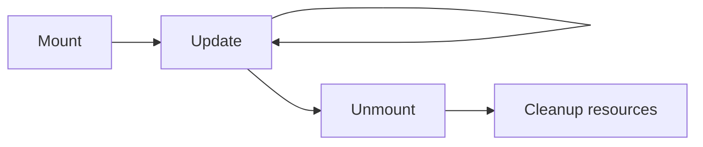

# Component Lifecycle

## Detailed explanation
Component lifecycle describes the stages a component goes through: mounting, updating, and unmounting. Class components expose lifecycle methods such as `componentDidMount`, `componentDidUpdate`, and `componentWillUnmount`. Functional components express similar synchronization needs with hooks and cleanup patterns.

The key interview point is that modern React does not require memorizing lifecycle methods as the primary model. Instead, understand render, commit, state updates, cleanup, and external synchronization.

## 1. One-line mental model
Lifecycle is the sequence of mount, update, and unmount work for a component.

## 2. Problem it solves
Components often need to start subscriptions, measure DOM, fetch data, clean up timers, or reset external resources at the correct time.

## 3. Core idea
- Mount means the component appears in the tree.
- Update means props or state changed and React rendered again.
- Unmount means the component is removed.
- Render should stay pure.
- Cleanup prevents memory leaks and stale external work.

## 4. Visual / analogy
Lifecycle is like renting a room: move in, use it, maintain it, and clean up when leaving.



## 5. Minimal example

```tsx
class Clock extends React.Component {
  componentDidMount() {}
  componentDidUpdate() {}
  componentWillUnmount() {}
  render() {
    return <time />;
  }
}
```

## 6. Real-world example

```tsx
function useWindowSizeStore() {
  return React.useSyncExternalStore(
    subscribeToResize,
    getWindowSnapshot,
    getServerSnapshot,
  );
}
```

Modern React prefers explicit subscription APIs for external stores instead of scattering lifecycle logic in components.

## 7. Common interview questions
- What are mount, update, and unmount?
- What lifecycle methods exist in class components?
- What replaces lifecycle methods in functional components?
- Why should render be pure?
- What is cleanup?
- Why does StrictMode remount in development?
- How do you avoid memory leaks?

## 8. Active recall test
1. What happens during mount?
2. What can trigger update?
3. What should happen during unmount?
4. Why should render not perform side effects?
5. Which class lifecycle is used for cleanup?

## 9. Mistakes / traps
- Treating hooks as one-to-one lifecycle method replacements.
- Performing subscriptions during render.
- Forgetting cleanup for timers or listeners.
- Depending on mount happening exactly once in development.
- Putting derived data into lifecycle state updates unnecessarily.

## 10. Compare with related concepts
- **Lifecycle vs render flow:** lifecycle names stages; render flow describes React's work phases.
- **Class lifecycle vs hooks:** classes organize by time; hooks organize by concern.
- **Unmount vs hidden:** a hidden component may still be mounted.

## 11. Summary from memory
Explain what should happen when a component subscribes to an external store and then unmounts.

## 12. Spaced revision prompts
- After 1 day: Define mount/update/unmount.
- After 3 days: Map class lifecycle methods to modern thinking.
- After 7 days: Explain cleanup.
- After 14 days: Explain why render must be pure.

