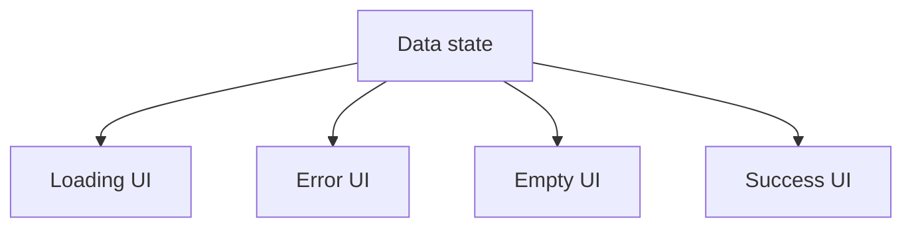

# Conditional Rendering

## Detailed explanation
Conditional rendering means returning different JSX depending on state, props, permissions, feature flags, or fetched data. React does not need a special template syntax for conditions because JSX is JavaScript. You can use `if`, ternaries, early returns, logical operators, or lookup maps.

This concept appears everywhere in real apps: loading screens, error pages, empty states, authenticated layouts, validation messages, disabled actions, and responsive feature variations.

## 1. One-line mental model
Conditional rendering means showing different UI based on current state, props, or data.

## 2. Problem it solves
Apps need to show loading states, error states, empty states, authenticated screens, feature flags, validation messages, and different layouts. Conditional rendering keeps those UI branches tied to data.

## 3. Core idea
- Use normal JavaScript conditions to choose JSX.
- Common tools are `if`, ternary, `&&`, early returns, and lookup maps.
- Prefer explicit branches for loading/error/empty/success states.
- Avoid deeply nested conditions inside JSX.
- Make impossible states impossible when using TypeScript unions.

## 4. Visual / analogy
Conditional rendering is a traffic signal for UI: the current state decides which path the user sees.



## 5. Minimal example

```tsx
function Status({ isOnline }: { isOnline: boolean }) {
  return <p>{isOnline ? "Online" : "Offline"}</p>;
}
```

## 6. Real-world example

```tsx
function UsersPage() {
  const users = useUsersQuery();

  if (users.isLoading) return <PageSkeleton />;
  if (users.isError) return <ErrorState onRetry={users.refetch} />;
  if (users.data.length === 0) return <EmptyState title="No users found" />;

  return <UserTable rows={users.data} />;
}
```

This keeps each state readable and avoids one large nested JSX block.

## 7. Common interview questions
- What is conditional rendering?
- Ternary vs `&&` rendering?
- Why use early returns?
- How do you render loading/error/empty states?
- How do feature flags affect rendering?
- What is the trap with `0 && <Component />`?
- How do TypeScript unions help conditional rendering?

## 8. Active recall test
1. Name three ways to render conditionally.
2. Why are early returns useful?
3. What should a data-fetching screen render first?
4. What happens with `{count && <Badge />}` when `count` is `0`?
5. How would you model loading/success/error states?

## 9. Mistakes / traps
- Using `condition &&` when the left side can be `0`.
- Nesting ternaries until the JSX is unreadable.
- Forgetting empty states.
- Rendering private UI before auth state is known.
- Duplicating conditions in many places instead of extracting a component.

## 10. Compare with related concepts
- **Conditional rendering vs conditional styling:** rendering changes the tree; styling changes appearance.
- **Conditional rendering vs routing:** routing chooses screens by URL; conditional rendering chooses UI by runtime state.
- **Conditional rendering vs feature flags:** flags are one input that may drive conditions.

## 11. Summary from memory
Explain how you would render a users page with loading, error, empty, and success states.

## 12. Spaced revision prompts
- After 1 day: List conditional rendering patterns.
- After 3 days: Explain the `0 &&` trap.
- After 7 days: Rewrite nested ternaries into early returns.
- After 14 days: Model data state with a discriminated union.
