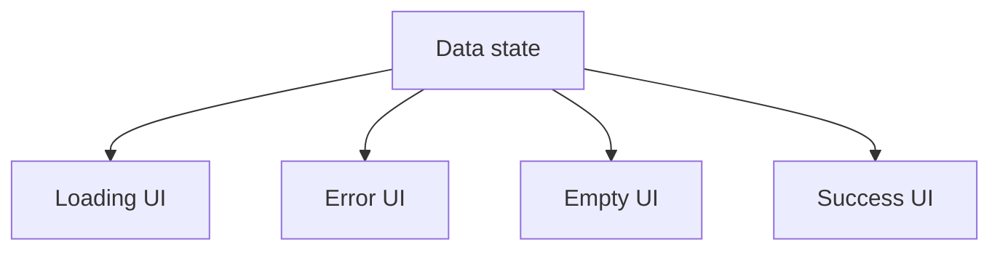

# Conditional Rendering

## Detailed explanation
Conditional rendering means returning different JSX depending on state, props, permissions, feature flags, or fetched data. React does not need a special template syntax for conditions because JSX is JavaScript. You can use `if`, ternaries, early returns, logical operators, or lookup maps.

This concept appears everywhere in real apps: loading screens, error pages, empty states, authenticated layouts, validation messages, disabled actions, and responsive feature variations.

## 1. One-line mental model
Conditional rendering means showing different UI based on current state, props, or data.

## 2. Problem it solves
Apps need to show loading states, error states, empty states, authenticated screens, feature flags, validation messages, and different layouts. Conditional rendering keeps those UI branches tied to data.

## 3. Core idea
- Use normal JavaScript conditions to choose JSX.
- Common tools are `if`, ternary, `&&`, early returns, and lookup maps.
- Prefer explicit branches for loading/error/empty/success states.
- Avoid deeply nested conditions inside JSX.
- Make impossible states impossible when using TypeScript unions.

## 4. Visual / analogy
Conditional rendering is a traffic signal for UI: the current state decides which path the user sees.



## 5. Minimal example

```tsx
function Status({ isOnline }: { isOnline: boolean }) {
  return <p>{isOnline ? "Online" : "Offline"}</p>;
}
```

## 6. Real-world example

```tsx
function UsersPage() {
  const users = useUsersQuery();

  if (users.isLoading) return <PageSkeleton />;
  if (users.isError) return <ErrorState onRetry={users.refetch} />;
  if (users.data.length === 0) return <EmptyState title="No users found" />;

  return <UserTable rows={users.data} />;
}
```

This keeps each state readable and avoids one large nested JSX block.

## 7. Common interview questions
#### What is conditional rendering?
- **The Engine Mechanism (Why it behaves this way):** Conditional rendering means returning different JSX based on runtime conditions like state, props, or data. Since JSX is JavaScript, you can use any JavaScript control flow — `if` statements, ternary operators, logical `&&`, early returns, or lookup maps — to choose which elements to return. During the render phase, React executes the component function, evaluates the conditions, and receives the resulting element tree. When conditions change, React's reconciliation algorithm compares the new tree with the old one, adds newly rendered elements, removes no-longer-rendered elements, and updates changed elements.
- **The Unforgettable Mental Model:** The **Traffic Light**. The current state (red, yellow, green) determines which light is on. Only one light is visible at a time, and the switch between them is automatic based on the timer (state).
- **The Trap:** Using `&&` with values that are falsy but renderable, like `0`. `0 && <Component />` renders `0` on screen because `0` is falsy but React renders falsy numbers.
- **Senior Interview Playbook (Verbal Script):** "When asked this in an interview, say: Conditional rendering is showing different UI based on runtime conditions like state, props, or data. Since JSX is JavaScript, I can use if statements, ternaries, logical AND, early returns, or lookup maps to choose what to render. For example, I show a loading spinner when data is fetching, an error message when the request fails, and the actual content when data arrives. The key is making the UI a direct reflection of the current state."

#### Ternary vs `&&` rendering?
- **The Engine Mechanism (Why it behaves this way):** A ternary operator `condition ? <A /> : <B />` always renders one of two branches — either A or B. The logical AND `condition && <A />` renders A when condition is truthy, and nothing (null) when condition is falsy. The critical difference is that `&&` has a trap: if the left side is `0`, React renders `0` on screen because `0` is falsy in JavaScript but React renders numbers as text. Ternaries don't have this trap because both branches are explicit. During reconciliation, switching between branches in a ternary causes React to unmount one subtree and mount the other, while `&&` simply adds or removes a subtree.
- **The Unforgettable Mental Model:** The **Fork in the Road vs. the Toll Gate**. A ternary is a fork in the road — you always go left or right. `&&` is a toll gate — if you have the ticket (truthy), you pass through; if not, you get nothing (or in the case of `0`, you get charged unexpectedly).
- **The Trap:** Using `count && <Badge />` when `count` can be `0`. This renders the literal `0` on screen. Use `count > 0 && <Badge />` or a ternary instead.
- **Senior Interview Playbook (Verbal Script):** "When asked this in an interview, say: I use ternaries when I have two explicit branches — like loading vs. content — because both outcomes are clear. I use `&&` when I want to render something or nothing — like showing an error banner only when there's an error. But I'm careful with `&&` because if the left side is 0, React renders 0 on screen. So I avoid `count && <Badge />` and use `count > 0 && <Badge />` or a ternary instead."

#### Why use early returns?
- **The Engine Mechanism (Why it behaves this way):** Early returns (guard clauses) exit the component function before the main JSX, returning a different UI for edge cases like loading, error, or empty states. This keeps the main render path clean and readable because it doesn't need to wrap everything in nested conditionals. During the render phase, React executes the component function from top to bottom — if an early return is hit, React receives that element tree and stops executing the rest of the function. This is more efficient than evaluating the entire function and then choosing a branch, though the performance difference is negligible in practice.
- **The Unforgettable Mental Model:** The **Security Checkpoint**. Early returns are like security checkpoints at an airport — if you don't pass the first check (loading), you don't proceed to the gate (main content). Each checkpoint handles one condition and either lets you through or stops you.
- **The Trap:** Having too many early returns that make the function hard to follow. If there are 5+ guard clauses, consider extracting them into separate components or using a state machine pattern.
- **Senior Interview Playbook (Verbal Script):** "When asked this in an interview, say: Early returns keep the main render path clean by handling edge cases at the top of the component. Instead of nesting the entire JSX inside `if (!loading && !error && data.length > 0)`, I return early for loading, error, and empty states, then the main content renders without any wrapping conditionals. This makes the code more readable and easier to maintain because each state is handled in its own block."

#### How do you render loading/error/empty states?
- **The Engine Mechanism (Why it behaves this way):** Loading, error, and empty states are rendered as conditional branches based on the state of a data-fetching operation. The typical pattern uses early returns: check `isLoading` first and return a skeleton or spinner, check `isError` and return an error message with a retry button, check if data is empty and return an empty state illustration, then render the main content. React's reconciliation handles the transitions between these states by unmounting the previous state's elements and mounting the new ones. Each state is a separate UI tree, and React efficiently swaps between them.
- **The Unforgettable Mental Model:** The **Weather Forecast**. The app shows different screens based on the weather: rain screen, sun screen, snow screen. Only one is visible at a time, and the transition is automatic based on the current conditions.
- **The Trap:** Not handling the empty state. Many apps handle loading and error but show a blank screen when data loads successfully but contains zero items. Empty states should guide the user on what to do next.
- **Senior Interview Playbook (Verbal Script):** "When asked this in an interview, say: I render loading, error, and empty states as early returns at the top of the component. First, I check if data is loading and return a skeleton. Then I check for errors and return an error message with a retry button. Then I check if data is empty and return an empty state with guidance. Finally, I render the main content. This pattern ensures every possible state has a corresponding UI, and the early returns keep the main content path clean and readable."

#### How do feature flags affect rendering?
- **The Engine Mechanism (Why it behaves this way):** Feature flags are boolean (or multi-value) configuration values that control whether certain UI or functionality is rendered. During the render phase, the component reads the flag value (from context, a hook, or props) and conditionally renders the feature. Feature flags enable gradual rollouts, A/B testing, and safe deployment of incomplete features. React handles flag changes like any other state change — when the flag value changes, React re-renders affected components and reconciles the new element tree. Flags can be evaluated at render time (client-side) or at build time (server-side with static rendering).
- **The Unforgettable Mental Model:** The **Light Switch**. A feature flag is like a light switch — flip it on, the feature appears; flip it off, it disappears. The wiring (code) is already there; the switch controls whether electricity (rendering) flows.
- **The Trap:** Leaving dead code behind after a flag is permanently enabled. Feature flags should have a cleanup plan — once a feature is fully rolled out, the flag and the old code path should be removed.
- **Senior Interview Playbook (Verbal Script):** "When asked this in an interview, say: Feature flags let me conditionally render features based on configuration values. I read the flag value during render and use it in a conditional to show or hide the feature. This enables gradual rollouts, A/B testing, and safe deployment of incomplete features. I always plan for flag cleanup — once a feature is fully rolled out, I remove the flag and the old code path to avoid accumulating dead conditionals."

#### What is the trap with `0 && <Component />`?
- **The Engine Mechanism (Why it behaves this way):** In JavaScript, `0 && <Component />` evaluates to `0` because `0` is falsy, so the `&&` operator short-circuits and returns the left operand. React renders `0` as text on screen because numbers are valid renderable values. This is different from `false && <Component />`, which evaluates to `false` and React renders nothing (React ignores boolean values in JSX). The trap occurs when a count variable can be zero: `{itemCount && <Badge count={itemCount} />}` will render `0` when `itemCount` is zero, which is almost never the intended behavior.
- **The Unforgettable Mental Model:** The **Bouncer Who Charges You**. The `&&` operator is like a bouncer who checks if you're on the list (truthy). If you're not (falsy), instead of just turning you away, the `0` bouncer charges you an entry fee (renders the zero on screen).
- **The Trap:** Assuming all falsy values behave the same in `&&`. `false`, `null`, and `undefined` render nothing, but `0` and `""` (empty string) render as visible text.
- **Senior Interview Playbook (Verbal Script):** "When asked this in an interview, say: The trap with `0 && <Component />` is that it renders the literal 0 on screen. This happens because JavaScript's && operator returns the left operand when it's falsy, and React renders numbers as text. To avoid this, I use an explicit boolean comparison: `count > 0 && <Badge />` or a ternary: `count > 0 ? <Badge /> : null`. I also avoid `&&` when the left side could be an empty string, which similarly renders as visible whitespace."

#### How do TypeScript unions help conditional rendering?
- **The Engine Mechanism (Why it behaves this way):** TypeScript discriminated unions model state as a type with a discriminant property that determines which fields are available. For example, `type DataState = { status: 'loading' } | { status: 'success'; data: User[] } | { status: 'error'; error: string }`. When you check `state.status` in a conditional, TypeScript narrows the type within that branch, giving you autocomplete and type safety for the available fields. This makes impossible states impossible — you can't access `state.data` in the loading branch because TypeScript knows it doesn't exist. During compilation, TypeScript erases these types, so they have zero runtime cost.
- **The Unforgettable Mental Model:** The **ID Badge**. The discriminant (`status`) is like an ID badge that tells you which role a person plays. Once you see the badge says "admin," you know they have admin privileges (access to `data`). If it says "guest," they don't.
- **The Trap:** Using separate boolean flags like `isLoading`, `isError`, `isSuccess` instead of a union. This allows impossible states like `isLoading: true && isError: true` simultaneously.
- **Senior Interview Playbook (Verbal Script):** "When asked this in an interview, say: TypeScript discriminated unions let me model state as a type with a discriminant property that determines which fields are available. For data fetching, I use a union like 'loading' | 'success' | 'error' with associated data for each state. When I check the status in a conditional, TypeScript narrows the type and gives me autocomplete for the available fields. This makes impossible states impossible — I can't have loading and error at the same time, and I can't access data in the loading branch. It's much safer than separate boolean flags."

## 8. Active recall test
1. **Name three ways to render conditionally.**
   - **Explanation:** (1) Early returns / guard clauses — return different JSX at the top of the component based on conditions. (2) Ternary operators — `condition ? <A /> : <B />` for inline branching. (3) Logical AND — `condition && <A />` for render-or-nothing patterns. Other options include lookup maps (objects keyed by state) and switch statements.
2. **Why are early returns useful?**
   - **Explanation:** Early returns handle edge cases (loading, error, empty) at the top of the component, keeping the main render path clean and readable. They avoid deeply nested conditionals and make each state's UI self-contained in its own block.
3. **What should a data-fetching screen render first?**
   - **Explanation:** It should check the loading state first and return a loading indicator (skeleton/spinner). Then check for errors and return an error state with retry. Then check for empty data and return an empty state. Only after all these checks should it render the main content. This ordering ensures the user always sees the most relevant state.
4. **What happens with `{count && <Badge />}` when `count` is `0`?**
   - **Explanation:** It renders the literal `0` on screen. JavaScript's `&&` operator returns the left operand (`0`) when it's falsy, and React renders numbers as text. The fix is to use `count > 0 && <Badge />` or a ternary: `count > 0 ? <Badge /> : null`.
5. **How would you model loading/success/error states?**
   - **Explanation:** Using a TypeScript discriminated union: `type State = { status: 'loading' } | { status: 'success'; data: T } | { status: 'error'; error: string }`. This makes impossible states impossible — you can't have loading and error simultaneously, and TypeScript narrows the type when you check `status`, providing type-safe access to `data` or `error`.

## 9. Mistakes / traps
- Using `condition &&` when the left side can be `0`.
- Nesting ternaries until the JSX is unreadable.
- Forgetting empty states.
- Rendering private UI before auth state is known.
- Duplicating conditions in many places instead of extracting a component.

## 10. Compare with related concepts
- **Conditional rendering vs conditional styling:** rendering changes the tree; styling changes appearance.
- **Conditional rendering vs routing:** routing chooses screens by URL; conditional rendering chooses UI by runtime state.
- **Conditional rendering vs feature flags:** flags are one input that may drive conditions.

## 11. Summary from memory
Explain how you would render a users page with loading, error, empty, and success states.

## 12. Spaced revision prompts
- After 1 day: List conditional rendering patterns.
- After 3 days: Explain the `0 &&` trap.
- After 7 days: Rewrite nested ternaries into early returns.
- After 14 days: Model data state with a discriminated union.
