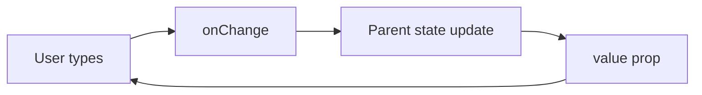

# Controlled Components

## Detailed explanation
A controlled component is driven by React state. For form elements, this means the input's displayed value comes from a `value` or `checked` prop, and user changes are reported through `onChange`. The component does not keep the source of truth hidden inside the DOM.

Controlled components are useful when the app must validate, format, submit, reset, or synchronize values with URL state or API queries. They are also used beyond forms in components like tabs, accordions, dialogs, and selects.

## 1. One-line mental model
A controlled component receives its current value from React state and reports changes through callbacks.

## 2. Problem it solves
Form inputs and reusable widgets need predictable state. Controlled components make React state the single source of truth so validation, formatting, conditional UI, and submit behavior can all use the same value.

## 3. Core idea
- The parent owns the value.
- The child receives `value` and `onChange` or a similar callback.
- User input calls the callback.
- Parent updates state.
- The updated state flows back into the component as props.

## 4. Visual / analogy
A controlled input is like a remote-controlled device: it does not decide its final state alone; the controller sends the value back.



## 5. Minimal example

```tsx
function NameInput() {
  const [name, setName] = React.useState("");

  return <input value={name} onChange={(event) => setName(event.target.value)} />;
}
```

## 6. Real-world example

```tsx
function StatusFilter({ value, onChange }: { value: string; onChange: (value: string) => void }) {
  return (
    <select value={value} onChange={(event) => onChange(event.target.value)}>
      <option value="all">All</option>
      <option value="open">Open</option>
      <option value="closed">Closed</option>
    </select>
  );
}
```

The parent can sync `value` with URL search params, server queries, or analytics.

## 7. Common interview questions
#### What is a controlled component?
- **The Engine Mechanism (Why it behaves this way):** A controlled component is one where React state is the single source of truth for the element's value. During the render phase, React reads the `value` prop from state and passes it to the DOM node. When the user types, the browser fires a native `input` event, React's synthetic `onChange` handler captures it, and the callback updates state via `setState`. This schedules a re-render, and during the next commit phase, React writes the updated state value back to the DOM's `value` property. The data flows in a closed loop: state → render → DOM → event → setState → state.
- **The Unforgettable Mental Model:** The **Remote-Controlled Car**. The car (input) doesn't decide where to go on its own. Every movement is commanded by the remote (React state). You press a button (type), the signal goes to the remote (onChange), the remote updates its internal position (setState), and sends the new command back to the car (value prop).
- **The Trap:** Thinking the DOM input value updates immediately when you type. In reality, your keystroke fires `onChange`, React updates state, and only on the next render does the DOM receive the new `value`. There's a full render cycle between typing and the displayed update.
- **Senior Interview Playbook (Verbal Script):** "When asked this in an interview, say: A controlled component is a form element whose value is driven entirely by React state. The component receives its current value through a `value` prop and reports user changes through an `onChange` callback. This creates a single source of truth — React state — which enables real-time validation, input formatting, conditional UI, and predictable form submission."

#### Why are controlled inputs useful?
- **The Engine Mechanism (Why it behaves this way):** Because React state holds the current value, every render cycle gives React a chance to intercept, transform, or validate the input before it's written back to the DOM. During reconciliation, React can compare the new state value with the previous one and conditionally render error messages, disable buttons, or format the display — all within the same render pass. The Fiber architecture allows React to batch multiple state updates from rapid keystrokes into a single render, preventing UI jank.
- **The Unforgettable Mental Model:** The **Security Checkpoint**. Every piece of data passes through a checkpoint (React state) before entering the building (the UI). The checkpoint can inspect, stamp, reject, or redirect each visitor (input value) in real time.
- **The Trap:** Assuming controlled inputs are always the right choice. For very large forms with dozens of fields, controlling every keystroke causes a re-render per field per keystroke, which can degrade performance.
- **Senior Interview Playbook (Verbal Script):** "When asked this in an interview, say: Controlled inputs are useful because they give React complete visibility and control over form values. Since the value lives in React state, we can validate in real time, format input as the user types (like phone numbers or currency), disable submit buttons conditionally, sync values with URL parameters, and access the complete form state at submission time without reading from the DOM."

#### What props define a controlled component?
- **The Engine Mechanism (Why it behaves this way):** A controlled component is defined by the pairing of a value prop (`value` for text/select inputs, `checked` for checkboxes/radios) with a change handler (`onChange`). During the render phase, React reads the value prop and sets the DOM property. Without `onChange`, React has no mechanism to update state when the user interacts, so the value prop remains static — making the input effectively read-only. React's reconciliation will also warn in development if `value` is provided without `onChange`, because the rendered output cannot change in response to user input.
- **The Unforgettable Mental Model:** The **Two-Walkie-Talkie System**. One walkie-talkie broadcasts the current position (`value`), the other listens for movement requests (`onChange`). If you only have the broadcast channel, nobody can request a move — you're stuck in place.
- **The Trap:** Providing `value` without `onChange` and wondering why the input is frozen. This is a common bug where developers forget the update handler, making the input read-only.
- **Senior Interview Playbook (Verbal Script):** "When asked this in an interview, say: A controlled component is defined by two props working together: a value prop — `value` for text inputs and selects, `checked` for checkboxes and radios — and a change handler, typically `onChange`. The value prop drives what the user sees, and onChange captures user input and updates the React state that feeds back into the value prop. Without both, the pattern breaks."

#### How do controlled components help validation?
- **The Engine Mechanism (Why it behaves this way):** Since every keystroke flows through React state via `onChange`, validation logic can run synchronously during the same event handler or as a derived computation during render. When state updates, React re-renders, and the validation result (error message, red border, disabled button) is computed as part of the new React element tree. The reconciliation phase then updates only the DOM nodes that changed — showing or hiding error text, toggling classes — without any manual DOM queries.
- **The Unforgettable Mental Model:** The **Spell-Checker Sidebar**. As you type in a document, a sidebar instantly highlights errors in real time. It doesn't wait until you finish — it evaluates every word as it appears. Controlled components work the same way: every character triggers a validation check.
- **The Trap:** Running expensive validation (like API calls for username availability) on every keystroke. This should be debounced. Also, showing errors before the user has finished typing creates a frustrating UX.
- **Senior Interview Playbook (Verbal Script):** "When asked this in an interview, say: Controlled components enable real-time validation because every input change flows through React state. In the onChange handler or during render, we can run validation logic — checking required fields, email format, password strength — and immediately reflect results in the UI. Error messages, field styling, and submit button states all derive from the same state, keeping validation logic centralized and the UI always consistent."

#### What are the performance trade-offs?
- **The Engine Mechanism (Why it behaves this way):** Each keystroke in a controlled input triggers `onChange` → `setState` → re-render → reconciliation → commit. For a single input, this is negligible. But in a form with 50 controlled fields, every keystroke re-renders the entire form tree unless components are memoized. React's default behavior re-renders all children when a parent's state changes. The Fiber scheduler can batch updates, but the render work still happens. Solutions include `React.memo`, splitting form into smaller controlled units, or switching to uncontrolled patterns with libraries like React Hook Form that use refs and subscriptions to avoid re-renders.
- **The Unforgettable Mental Model:** The **Town Crier**. Every time one person in a village (input field) has news, the town crier (parent state) announces it to everyone (re-renders all children). In a small village, no problem. In a city of 50 fields, every whisper causes a city-wide broadcast.
- **The Trap:** Assuming controlled components are always slow. They're only slow when a single state update triggers unnecessary re-renders of large subtrees. Proper component boundaries and memoization solve this.
- **Senior Interview Playbook (Verbal Script):** "When asked this in an interview, say: The trade-off with controlled components is that every input change triggers a React state update and re-render. For small forms, this is imperceptible. For large forms with many fields, each keystroke can cause the entire form tree to re-render. To mitigate this, we can split forms into smaller controlled sections, use React.memo to prevent unnecessary child re-renders, or adopt uncontrolled patterns with subscription-based libraries like React Hook Form that only re-render the specific field that changed."

#### Can non-form components be controlled?
- **The Engine Mechanism (Why it behaves this way):** The controlled pattern is not limited to form elements — it applies to any component that receives its current state from a parent via props and reports changes via callbacks. During render, React passes the controlled value down the component tree. When the user interacts (clicks a tab, toggles a switch, opens a dialog), the child fires its callback, the parent updates state, and React re-renders with the new value. This works identically to form inputs because the mechanism is simply props-down, callbacks-up — React's core data flow model.
- **The Unforgettable Mental Model:** The **Thermostat**. A thermostat doesn't decide the temperature itself. It displays the current setting (value prop), lets the user adjust it (callback), and the HVAC system (parent state) decides the actual temperature. Tabs, modals, and toggles work the same way.
- **The Trap:** Thinking "controlled" only applies to `<input>`, `<select>`, and `<textarea>`. Any component with a `value`/`onChange` or `open`/`onOpenChange` API follows the controlled pattern.
- **Senior Interview Playbook (Verbal Script):** "When asked this in an interview, say: Yes, the controlled pattern extends far beyond form elements. Tabs can be controlled with an `activeTab` prop and `onTabChange` callback. Dialogs use `open` and `onOpenChange`. Even custom sliders, color pickers, and tree selectors follow this pattern. The controlled pattern is really about any component where the parent owns the state and the child reports changes through callbacks — it's React's fundamental data flow model applied to any interactive UI."

#### What is a controlled/uncontrolled hybrid?
- **The Engine Mechanism (Why it behaves this way):** A hybrid component starts uncontrolled (using `defaultValue` and DOM state) but can switch to controlled mode when a `value` prop is explicitly provided. React detects this through the presence of `value` vs `defaultValue` in props. During the initial render, if only `defaultValue` exists, React sets the DOM value once and lets the browser manage it. If `value` is later provided, React takes over and writes the controlled value on every render. React warns in development if a component switches between controlled and uncontrolled during its lifetime, because this can cause unexpected UI behavior — the DOM value may not match what React expects.
- **The Unforgettable Mental Model:** The **Manual-to-Automatic Car**. It starts in manual mode (uncontrolled — you shift gears yourself), but when you flip a switch (provide a `value` prop), it switches to automatic (controlled — the system manages everything). Switching back and forth while driving causes jerky behavior.
- **The Trap:** Accidentally switching between controlled and uncontrolled modes by conditionally providing `value` (e.g., `value={state || undefined}`). This causes React warnings and UI glitches because the DOM value and React's expectation diverge.
- **Senior Interview Playbook (Verbal Script):** "When asked this in an interview, say: A controlled/uncontrolled hybrid is a component that supports both modes depending on how it's used. If the parent provides a `value` prop, the component is controlled. If only `defaultValue` is provided, it's uncontrolled. This pattern is common in component libraries where consumers want flexibility. However, switching between modes during a component's lifetime is an anti-pattern — React will warn because the source of truth becomes ambiguous and the UI can desynchronize."

## 8. Active recall test
1. **Who owns the value in a controlled component?**
   - **Explanation:** React state in the parent component owns the value. The input element merely displays whatever value React passes to it via the `value` prop.
2. **What happens after `onChange` fires?**
   - **Explanation:** The `onChange` callback receives the event, extracts the new value, calls `setState` to update React state, which schedules a re-render. React then re-renders the component with the new state value passed back as the `value` prop.
3. **Why is `value` without `onChange` usually a bug?**
   - **Explanation:** Without `onChange`, there's no mechanism to update the React state that feeds the `value` prop. The input becomes read-only because the value can never change from its initial state, which is almost never the intended behavior.
4. **How does controlled state help form submission?**
   - **Explanation:** Since all form values live in React state, the submit handler can access the complete, current form data directly from state variables without querying the DOM or reading refs. Validation state, dirty state, and submission state are all available in the same scope.
5. **Name one non-form controlled component.**
   - **Explanation:** A controlled tabs component — it receives `activeTab` as a prop and fires `onTabChange` when the user clicks a different tab. The parent owns which tab is active, and the tab component merely displays and reports changes.

## 9. Mistakes / traps
- Passing `value` without an update handler and making the input read-only.
- Switching between controlled and uncontrolled modes.
- Updating parent state too broadly and re-rendering huge forms.
- Duplicating the same value in child local state.
- Forgetting to handle checkboxes with `checked`, not `value`.

## 10. Compare with related concepts
- **Controlled vs uncontrolled:** controlled uses React state; uncontrolled uses DOM state.
- **Controlled vs derived state:** controlled value is passed in; derived state is computed from existing data.
- **Controlled component vs callback prop:** callback is the communication mechanism, not the whole pattern.

## 11. Summary from memory
Explain how a controlled search input updates state and triggers filtered results.

## 12. Spaced revision prompts
- After 1 day: Define controlled component.
- After 3 days: Write a controlled checkbox.
- After 7 days: Explain controlled component performance trade-offs.
- After 14 days: Design a controlled tabs API.
