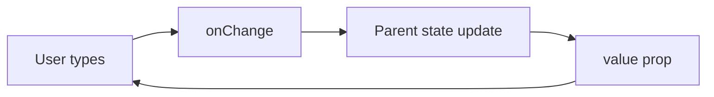

# Controlled Components

## Detailed explanation
A controlled component is driven by React state. For form elements, this means the input's displayed value comes from a `value` or `checked` prop, and user changes are reported through `onChange`. The component does not keep the source of truth hidden inside the DOM.

Controlled components are useful when the app must validate, format, submit, reset, or synchronize values with URL state or API queries. They are also used beyond forms in components like tabs, accordions, dialogs, and selects.

## 1. One-line mental model
A controlled component receives its current value from React state and reports changes through callbacks.

## 2. Problem it solves
Form inputs and reusable widgets need predictable state. Controlled components make React state the single source of truth so validation, formatting, conditional UI, and submit behavior can all use the same value.

## 3. Core idea
- The parent owns the value.
- The child receives `value` and `onChange` or a similar callback.
- User input calls the callback.
- Parent updates state.
- The updated state flows back into the component as props.

## 4. Visual / analogy
A controlled input is like a remote-controlled device: it does not decide its final state alone; the controller sends the value back.



## 5. Minimal example

```tsx
function NameInput() {
  const [name, setName] = React.useState("");

  return <input value={name} onChange={(event) => setName(event.target.value)} />;
}
```

## 6. Real-world example

```tsx
function StatusFilter({ value, onChange }: { value: string; onChange: (value: string) => void }) {
  return (
    <select value={value} onChange={(event) => onChange(event.target.value)}>
      <option value="all">All</option>
      <option value="open">Open</option>
      <option value="closed">Closed</option>
    </select>
  );
}
```

The parent can sync `value` with URL search params, server queries, or analytics.

## 7. Common interview questions
- What is a controlled component?
- Why are controlled inputs useful?
- What props define a controlled component?
- How do controlled components help validation?
- What are the performance trade-offs?
- Can non-form components be controlled?
- What is a controlled/uncontrolled hybrid?

## 8. Active recall test
1. Who owns the value in a controlled component?
2. What happens after `onChange` fires?
3. Why is `value` without `onChange` usually a bug?
4. How does controlled state help form submission?
5. Name one non-form controlled component.

## 9. Mistakes / traps
- Passing `value` without an update handler and making the input read-only.
- Switching between controlled and uncontrolled modes.
- Updating parent state too broadly and re-rendering huge forms.
- Duplicating the same value in child local state.
- Forgetting to handle checkboxes with `checked`, not `value`.

## 10. Compare with related concepts
- **Controlled vs uncontrolled:** controlled uses React state; uncontrolled uses DOM state.
- **Controlled vs derived state:** controlled value is passed in; derived state is computed from existing data.
- **Controlled component vs callback prop:** callback is the communication mechanism, not the whole pattern.

## 11. Summary from memory
Explain how a controlled search input updates state and triggers filtered results.

## 12. Spaced revision prompts
- After 1 day: Define controlled component.
- After 3 days: Write a controlled checkbox.
- After 7 days: Explain controlled component performance trade-offs.
- After 14 days: Design a controlled tabs API.
