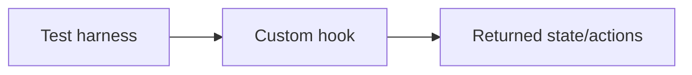

# Custom Hook Testing

## Detailed explanation
Custom hook testing verifies reusable hook behavior independently or through a small test component. The goal is to test the hook's observable behavior: returned values, state transitions, callbacks, async updates, cleanup, and integration with providers.

Prefer testing hooks through real components when the hook is tightly tied to UI behavior. For generic hooks like `useDebounce`, `usePrevious`, or `useLocalStorage`, hook-focused tests can be clear and efficient.

## 1. One-line mental model
Custom hook tests verify reusable hook behavior without testing implementation details.

## 2. Problem it solves
Shared hooks can contain complex logic that should not be retested manually through every component that uses them.

## 3. Core idea
- Test observable return values and behavior.
- Use wrapper providers when needed.
- Use fake timers for debounce/throttle hooks.
- Test cleanup for subscriptions.
- Avoid testing private implementation details.

## 4. Visual / analogy
Testing a hook is like testing an engine on a bench before installing it in many cars.



## 5. Minimal example

```tsx
function TestComponent() {
  const { value, toggle } = useBoolean();
  return <button onClick={toggle}>{String(value)}</button>;
}
```

## 6. Real-world example

```tsx
vi.useFakeTimers();
render(<DebounceExample />);
await user.type(screen.getByRole("textbox"), "react");
vi.advanceTimersByTime(300);
expect(screen.getByText("react")).toBeInTheDocument();
```

## 7. Common interview questions
#### How do you test custom hooks?
- **The Engine Mechanism (Why it behaves this way):** Custom hooks are tested by rendering a component that uses the hook and asserting on its observable behavior. The test component calls the hook, renders its returned values, and exposes actions (like buttons) that trigger the hook's behavior. Testing libraries (React Testing Library, Vitest, Jest) render the component, simulate user interactions, and assert on the DOM output. For pure logic hooks (like `useDebounce`), you can also use `@testing-library/react-hooks`'s `renderHook` API, which renders the hook without a visible component.
- **The Unforgettable Mental Model:** The **Test Bench**. Like testing an engine on a bench before installing it in a car. You connect the hook to a minimal test harness, feed it inputs, and measure its outputs — without the complexity of the full application.
- **The Trap:** Testing implementation details like internal refs, state variable names, or the number of times a function was called. Tests should assert on what the hook returns and how it affects the UI, not how it works internally.
- **Senior Interview Playbook (Verbal Script):** "When asked this in an interview, say: I test custom hooks by rendering a test component that uses the hook and asserting on its observable behavior — returned values, DOM output, and side effects. For pure logic hooks, I use `renderHook` from testing-library. I focus on what the hook does, not how it does it. I test initial state, state transitions, async updates, cleanup behavior, and edge cases like null inputs or rapid changes."

#### When test through a component?
- **The Engine Mechanism (Why it behaves this way):** Testing through a component is preferred when the hook is tightly coupled to UI behavior — when it reads DOM measurements, interacts with form elements, or its output is primarily visual. Component tests verify the full integration: hook logic + rendering + user interaction. They catch bugs that isolated hook tests miss, like incorrect DOM queries, missing ARIA attributes, or rendering timing issues. React Testing Library's philosophy is "test the way users use your app," which naturally leads to component-level testing.
- **The Unforgettable Mental Model:** The **Test Drive**. You can test an engine on a bench, but you really need to drive the car to know how it performs on the road. Component tests are the test drive — they verify the hook works in its natural habitat.
- **The Trap:** Over-isolating hooks that are meaningless without their UI. A `useForm` hook tested in isolation misses the actual user interactions (typing, submitting, validation messages) that matter.
- **Senior Interview Playbook (Verbal Script):** "When asked this in an interview, say: I test through a component when the hook is tightly coupled to UI — form hooks, scroll hooks, or any hook whose output is primarily visual. Component tests verify the full integration: hook logic, rendering, and user interaction. They catch bugs that isolated hook tests miss. For pure logic hooks like `useDebounce` or `usePrevious`, isolated hook tests are fine. The rule is: test at the level that captures the behavior users actually experience."

#### How do you test debounce hooks?
- **The Engine Mechanism (Why it behaves this way):** Debounce hooks require controlling time to test deterministically. Fake timers (`vi.useFakeTimers()` in Vitest) replace the browser's `setTimeout` and `Date.now()` with mock implementations. The test types into an input, asserts that the debounced value hasn't changed yet (because the delay hasn't elapsed), advances time by the delay with `vi.advanceTimersByTime(300)`, and then asserts that the debounced value has updated. This verifies both the delay behavior and the cleanup (rapid typing should reset the timer).
- **The Unforgettable Mental Model:** The **Time-Lapse Camera**. Fake timers let you take a time-lapse of the debounce behavior — skip the waiting period and jump straight to the result to verify it happened correctly.
- **The Trap:** Using real timers for debounce tests. The tests become slow (waiting for actual delays) and flaky (timing varies by machine load). Fake timers make tests instant and deterministic.
- **Senior Interview Playbook (Verbal Script):** "When asked this in an interview, say: I test debounce hooks with fake timers. I enable them, type into the input, verify the debounced value hasn't changed yet, advance time by the delay, and verify it has. I also test rapid typing — type multiple times, advance time, and verify only the last value is debounced. I always restore real timers in `afterEach` to prevent fake timers from leaking into other tests."

#### How do you test hooks with context?
- **The Engine Mechanism (Why it behaves this way):** Hooks that depend on context (like `useAuth`, `useTheme`, or hooks that call `useQuery`) need their provider wrappers in the test. React Testing Library's `render` function accepts a `wrapper` option — a component that wraps the test component with the required providers. For `useAuth`, you'd wrap with an `AuthProvider` that provides a mock user. For `useQuery`, you'd wrap with a `QueryClientProvider` configured with a test query client. This ensures the hook has access to the context values it expects.
- **The Unforgettable Mental Model:** The **Stage Set**. A hook that needs context is like an actor who needs a specific set. You can't test the actor in an empty room — you need to build the set (providers) so they can perform correctly.
- **The Trap:** Forgetting to wrap with providers. The hook will throw "cannot read property of undefined" or "must be used within a Provider" errors. Always check what context the hook consumes and provide it in the test.
- **Senior Interview Playbook (Verbal Script):** "When asked this in an interview, say: Hooks that depend on context need their providers wrapped around the test component. I use React Testing Library's `wrapper` option to provide `AuthProvider`, `QueryClientProvider`, or any other required context. I configure the providers with mock data specific to each test case — one test might provide an authenticated user, another an unauthenticated one. This ensures the hook has the context it needs while keeping tests isolated."

#### How do you test cleanup?
- **The Engine Mechanism (Why it behaves this way):** Cleanup is tested by rendering the component, triggering the hook's setup (like starting a subscription or timer), then unmounting the component with `unmount()` from React Testing Library. After unmount, you assert that the cleanup occurred: timers were cleared (check with fake timers), event listeners were removed (spy on `removeEventListener`), or subscriptions were cancelled (spy on the unsubscribe function). For AbortController, you can spy on `controller.abort` and verify it was called on unmount.
- **The Unforgettable Mental Model:** The **Exit Interview**. When an employee leaves (component unmounts), you verify they returned their badge (cleanup ran), closed their desk (timers cleared), and handed over their keys (subscriptions cancelled).
- **The Trap:** Not testing cleanup at all. Cleanup bugs are the hardest to catch in production because they manifest as memory leaks or duplicate listeners that only appear after hours of usage.
- **Senior Interview Playbook (Verbal Script):** "When asked this in an interview, say: I test cleanup by rendering the component, triggering the hook's setup, then calling `unmount()`. After unmount, I verify the cleanup occurred — timers were cleared using fake timers, event listeners were removed by spying on `removeEventListener`, or subscriptions were cancelled by spying on the unsubscribe function. Cleanup tests are critical because cleanup bugs cause memory leaks and duplicate handlers that are hard to reproduce in production."

#### What should hook tests avoid?
- **The Engine Mechanism (Why it behaves this way):** Hook tests should avoid testing implementation details: internal ref values, the number of times `setState` was called, the order of hook calls, or private helper functions. These are implementation details that can change without affecting the hook's observable behavior. Testing them creates brittle tests that break on refactoring. Instead, tests should assert on returned values, state transitions, DOM output, and side effects — the things consumers of the hook actually depend on.
- **The Unforgettable Mental Model:** The **Restaurant Review**. A restaurant reviewer judges the food, service, and atmosphere — not how many pots the kitchen has or what brand of stove they use. Implementation details are the kitchen's business; the output is what matters.
- **The Trap:** Testing that `useEffect` was called once or that a ref has a specific value. These are internal mechanics. If the hook returns the correct value and behaves correctly, the internal implementation is irrelevant.
- **Senior Interview Playbook (Verbal Script):** "When asked this in an interview, say: Hook tests should avoid implementation details — internal refs, state variable names, the number of effect calls, or private helper functions. These create brittle tests that break on refactoring. Instead, I test observable behavior: what the hook returns, how state transitions work, what the UI renders, and whether side effects like API calls or timers behave correctly. If the output is correct, the implementation can change freely."

#### How do you test async hooks?
- **The Engine Mechanism (Why it behaves this way):** Async hooks are tested by mocking the async operation (using `vi.mock()` or `msw` for API calls), rendering the hook, and waiting for the async result. With React Testing Library, you use `waitFor` or `findBy` queries that retry until the async state updates. The test verifies the loading state appears first, then the data or error state appears after the mock resolves or rejects. For race condition testing, you can control the timing of mock responses to verify the hook handles out-of-order results correctly.
- **The Unforgettable Mental Model:** The **Puppet Master**. You control the strings of the async operation — make it resolve fast, resolve slow, reject, or resolve out of order — and verify the hook responds correctly to each scenario.
- **The Trap:** Not testing the error path. Many tests only verify the happy path (successful response). Async hooks must also handle errors, loading states, and edge cases like empty responses or timeouts.
- **Senior Interview Playbook (Verbal Script):** "When asked this in an interview, say: I test async hooks by mocking the API call, rendering the hook, and waiting for the async state to update. I verify the loading state appears first, then the data appears after the mock resolves. I also test error paths by making the mock reject, and edge cases like empty responses. For race conditions, I control response timing to verify the hook handles out-of-order results. I use `waitFor` and `findBy` queries that retry until the async state settles."

## 8. Active recall test
1. **What should hook tests assert?**
   - **Explanation:** Observable behavior: returned values, state transitions, DOM output, and side effects. Tests should verify what the hook does from the consumer's perspective — not internal implementation details like ref values, effect call counts, or private helper functions.
2. **Why use wrapper providers?**
   - **Explanation:** Hooks that consume context (like `useAuth`, `useTheme`, or `useQuery`) require their provider components to be present in the React tree. Wrapper providers supply the mock context values the hook needs to function, preventing "must be used within a Provider" errors during tests.
3. **How do fake timers help?**
   - **Explanation:** Fake timers replace the browser's `setTimeout` and `Date.now()` with mock implementations, allowing tests to advance time instantly with `vi.advanceTimersByTime()`. This makes debounce/throttle tests deterministic and fast, avoiding the slowness and flakiness of real-time waiting.
4. **When is a component test better?**
   - **Explanation:** When the hook is tightly coupled to UI behavior — form handling, DOM measurements, scroll tracking, or any hook whose output is primarily visual. Component tests verify the full integration of hook logic, rendering, and user interaction, catching bugs that isolated hook tests miss.
5. **What is implementation-detail testing?**
   - **Explanation:** Testing internal mechanics that consumers don't depend on — like checking that a ref has a specific value, counting how many times `setState` was called, or verifying the order of hook calls. These tests break when the implementation changes even if the observable behavior is correct, making them brittle and high-maintenance.

## 9. Mistakes / traps
- Testing internal refs instead of behavior.
- Forgetting provider wrappers.
- Not wrapping state updates correctly in test utilities.
- Using real timers for debounce tests.
- Over-isolating hooks that are only meaningful with UI.

## 10. Compare with related concepts
- **Hook test vs component test:** hook behavior in isolation vs user-visible UI.
- **Unit test vs integration test:** isolated logic vs connected providers/events.
- **Fake timers vs real timers:** controlled time vs slow/flaky time.

## 11. Summary from memory
Explain how you would test `useDebounce` and `useAuth` differently.

## 12. Spaced revision prompts
- After 1 day: Define custom hook testing.
- After 3 days: Test a boolean hook.
- After 7 days: Test debounce with fake timers.
- After 14 days: Test a provider-based hook.

