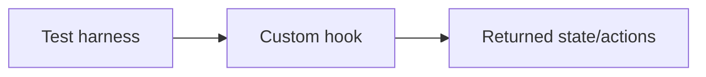

# Custom Hook Testing

## Detailed explanation
Custom hook testing verifies reusable hook behavior independently or through a small test component. The goal is to test the hook's observable behavior: returned values, state transitions, callbacks, async updates, cleanup, and integration with providers.

Prefer testing hooks through real components when the hook is tightly tied to UI behavior. For generic hooks like `useDebounce`, `usePrevious`, or `useLocalStorage`, hook-focused tests can be clear and efficient.

## 1. One-line mental model
Custom hook tests verify reusable hook behavior without testing implementation details.

## 2. Problem it solves
Shared hooks can contain complex logic that should not be retested manually through every component that uses them.

## 3. Core idea
- Test observable return values and behavior.
- Use wrapper providers when needed.
- Use fake timers for debounce/throttle hooks.
- Test cleanup for subscriptions.
- Avoid testing private implementation details.

## 4. Visual / analogy
Testing a hook is like testing an engine on a bench before installing it in many cars.



## 5. Minimal example

```tsx
function TestComponent() {
  const { value, toggle } = useBoolean();
  return <button onClick={toggle}>{String(value)}</button>;
}
```

## 6. Real-world example

```tsx
vi.useFakeTimers();
render(<DebounceExample />);
await user.type(screen.getByRole("textbox"), "react");
vi.advanceTimersByTime(300);
expect(screen.getByText("react")).toBeInTheDocument();
```

## 7. Common interview questions
- How do you test custom hooks?
- When test through a component?
- How do you test debounce hooks?
- How do you test hooks with context?
- How do you test cleanup?
- What should hook tests avoid?
- How do you test async hooks?

## 8. Active recall test
1. What should hook tests assert?
2. Why use wrapper providers?
3. How do fake timers help?
4. When is a component test better?
5. What is implementation-detail testing?

## 9. Mistakes / traps
- Testing internal refs instead of behavior.
- Forgetting provider wrappers.
- Not wrapping state updates correctly in test utilities.
- Using real timers for debounce tests.
- Over-isolating hooks that are only meaningful with UI.

## 10. Compare with related concepts
- **Hook test vs component test:** hook behavior in isolation vs user-visible UI.
- **Unit test vs integration test:** isolated logic vs connected providers/events.
- **Fake timers vs real timers:** controlled time vs slow/flaky time.

## 11. Summary from memory
Explain how you would test `useDebounce` and `useAuth` differently.

## 12. Spaced revision prompts
- After 1 day: Define custom hook testing.
- After 3 days: Test a boolean hook.
- After 7 days: Test debounce with fake timers.
- After 14 days: Test a provider-based hook.

