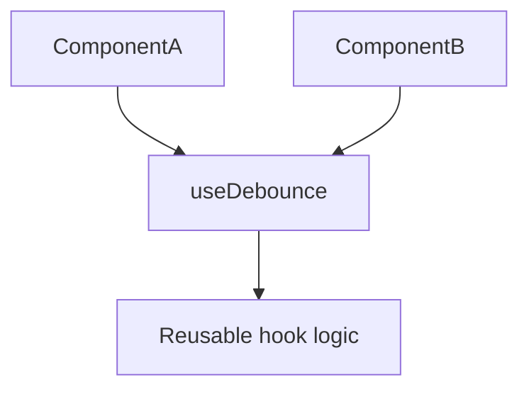

# Custom Hooks

## Detailed explanation
Custom hooks are functions that use React hooks to package reusable stateful logic. They let components share behavior without render props, higher-order components, or duplicated hook code.

A custom hook must follow the Rules of Hooks and usually starts with `use`, such as `useDebounce`, `useOnlineStatus`, or `useLocalStorage`. It should expose a clear API and hide implementation details.

## 1. One-line mental model
A custom hook extracts reusable React logic into a function.

## 2. Problem it solves
Components often repeat state, subscriptions, timers, data handling, or browser API logic.

## 3. Core idea
- Custom hooks are JavaScript functions.
- They can call built-in hooks.
- Names should start with `use`.
- Each call gets its own state.
- They share logic, not state by default.

## 4. Visual / analogy
A custom hook is like a reusable recipe: each kitchen follows the same steps but gets its own meal.



## 5. Minimal example

```tsx
function useBoolean(initial = false) {
  const [value, setValue] = React.useState(initial);
  return {
    value,
    toggle: () => setValue((current) => !current),
  };
}
```

## 6. Real-world example

```tsx
function useDebounce<T>(value: T, delay: number) {
  const [debounced, setDebounced] = React.useState(value);

  React.useEffect(() => {
    const id = window.setTimeout(() => setDebounced(value), delay);
    return () => window.clearTimeout(id);
  }, [value, delay]);

  return debounced;
}
```

## 7. Common interview questions
#### What is a custom hook?
- **The Engine Mechanism (Why it behaves this way):** A custom hook is a JavaScript function whose name starts with `use` and that calls one or more built-in React hooks internally. When a component calls a custom hook, React doesn't treat it specially — it simply executes the function. Each built-in hook called inside the custom hook registers itself on the calling component's Fiber node, using the same hook list that the component's direct hook calls use. The custom hook is essentially a function that groups multiple hook calls together, and each call site gets its own independent set of hook states on its own Fiber.
- **The Unforgettable Mental Model:** The **Recipe Card**. A recipe card (custom hook) groups together individual steps (built-in hooks). Each cook (component) who follows the recipe gets their own meal (state) — the recipe doesn't share ingredients between cooks.
- **The Trap:** Thinking custom hooks are a special React feature. They're just JavaScript functions that happen to call hooks. There's no `createCustomHook` API — the `use` prefix is the only convention.
- **Senior Interview Playbook (Verbal Script):** "When asked this in an interview, say: A custom hook is a JavaScript function that starts with `use` and calls React hooks internally. It's not a special React API — it's just a function that groups hook calls together for reusability. Each component that calls a custom hook gets its own independent state and effects. Custom hooks let you extract and share stateful logic without duplicating code, replacing older patterns like render props and higher-order components."

#### Why must hook names start with `use`?
- **The Engine Mechanism (Why it behaves this way):** React's ESLint plugin (`eslint-plugin-react-hooks`) uses the `use` prefix to identify which functions are hooks and therefore subject to the Rules of Hooks. The linter tracks all functions starting with `use` and ensures they're only called at the top level of components or other hooks. Without the prefix, the linter can't distinguish a custom hook from a regular function, and it won't enforce the rules. Additionally, React DevTools uses the prefix to display hook information in the component inspector.
- **The Unforgettable Mental Model:** The **Uniform**. The `use` prefix is like a uniform that tells the linter "I'm a hook — apply the hook rules to me." Without the uniform, the linter treats the function as a regular function and doesn't enforce hook constraints.
- **The Trap:** Naming a custom hook without the `use` prefix: `function fetchData() { useState(...) }`. The linter won't catch rule violations, and DevTools won't display it properly.
- **Senior Interview Playbook (Verbal Script):** "When asked this in an interview, say: The `use` prefix is a convention that serves two purposes. First, it tells the ESLint plugin that this function is a hook, so it enforces the Rules of Hooks — ensuring hooks aren't called conditionally or in loops. Second, it tells React DevTools to display the hook's state in the component inspector. Without the prefix, the linter won't catch violations and DevTools won't recognize it. It's not enforced by React at runtime, but it's essential for tooling and code safety."

#### Do custom hooks share state?
- **The Engine Mechanism (Why it behaves this way):** No. Each component that calls a custom hook gets its own independent set of hook states. When React processes a component's hooks, it builds a linked list of hook objects on that component's Fiber node. Each call site — whether it's a direct `useState` in the component or a `useState` inside a custom hook — creates a new entry in that component's hook list. Two different components calling the same custom hook each have their own Fiber, their own hook list, and their own state values. There is no shared state between them.
- **The Unforgettable Mental Model:** The **Franchise Restaurant**. Every branch (component) follows the same recipe (custom hook), but each has its own kitchen, its own ingredients, and its own meals. One branch running out of tomatoes doesn't affect the others.
- **The Trap:** Assuming that because two components call the same custom hook, they share state. They don't — each call creates independent state.
- **Senior Interview Playbook (Verbal Script):** "When asked this in an interview, say: No, custom hooks do not share state between components. Each component that calls a custom hook gets its own independent state, effects, and memoized values. The custom hook is just a function that groups hook calls — and each component's hooks are stored on its own Fiber node. If you need shared state, you'd use Context, a global store like Zustand, or lift state up to a common parent. Custom hooks share logic, not state."

#### How do custom hooks replace render props?
- **The Engine Mechanism (Why it behaves this way):** Render props pattern passes a function as a prop that returns JSX, allowing a component to share stateful logic with its children. This creates deeply nested component trees ("wrapper hell") when multiple render props are composed. Custom hooks achieve the same logic sharing by calling hooks directly in the component body, keeping the component tree flat. The hook returns data and functions that the component uses in its own JSX, eliminating the need for wrapper components and prop functions.
- **The Unforgettable Mental Model:** The **Russian Dolls vs. the Buffet**. Render props are like Russian dolls — each wrapper contains another, and you dig through layers to get to the content. Custom hooks are like a buffet — you pick what you need directly, no nesting required.
- **The Trap:** Over-engineering custom hooks to replicate the exact API of a render prop component. Custom hooks should return data and functions, not JSX.
- **Senior Interview Playbook (Verbal Script):** "When asked this in an interview, say: Render props share logic by wrapping components with a function-as-child pattern, which creates deep nesting when you compose multiple render props. Custom hooks achieve the same logic sharing by calling hooks directly in the component body. Instead of wrapping `<DataProvider render={data => <Child data={data} />}>`, you call `const data = useData()` and use the result directly. This keeps the component tree flat, makes the code easier to read, and eliminates wrapper hell. Custom hooks are the modern replacement for both render props and higher-order components."

#### How do you test custom hooks?
- **The Engine Mechanism (Why it behaves this way):** Custom hooks can't be called outside a React component, so testing them requires rendering a test component that uses the hook. The `@testing-library/react-hooks` library (now merged into `@testing-library/react` via `renderHook`) creates a test harness that renders a minimal component, calls the hook, and exposes its return value for assertions. The test component goes through the full React lifecycle — mount, render, commit, effect execution — so the hook behaves exactly as it would in a real component. You can then assert on returned values, trigger returned functions, and verify side effects.
- **The Unforgettable Mental Model:** The **Test Kitchen**. You can't taste a recipe without cooking it first. The test harness is a test kitchen — it provides the environment (React component) where the recipe (custom hook) can be prepared and tasted (tested).
- **The Trap:** Trying to call a custom hook directly in a Jest test: `const result = useMyHook()`. This violates the Rules of Hooks because the call isn't inside a React component.
- **Senior Interview Playbook (Verbal Script):** "When asked this in an interview, say: I test custom hooks using `renderHook` from Testing Library, which creates a minimal test component that calls the hook. This gives me access to the hook's return value, and I can assert on it, trigger returned functions, and verify side effects. For hooks with effects, I use `act()` to ensure all updates are flushed. I also test edge cases — initial values, dependency changes, cleanup behavior — the same way I'd test any component logic. The key is that the hook runs in a real React environment, not in isolation."

#### What should a custom hook return?
- **The Engine Mechanism (Why it behaves this way):** A custom hook should return the data and functions that the calling component needs to render and interact with the hook's internal state. The return value can be a single value, an array (like `useState`), or an object (preferred for hooks with more than two return values). Objects are preferred because they're self-documenting — `const { data, loading, error } = useFetch(url)` is clearer than array destructuring. The returned functions should be stable (wrapped in `useCallback` when needed) to avoid unnecessary re-renders in consuming components.
- **The Unforgettable Mental Model:** The **Vending Machine Output**. The machine (hook) takes your input and returns exactly what you need: the product (data), a status light (loading/error), and maybe a receipt (metadata). Nothing more, nothing less.
- **The Trap:** Returning too much internal state or returning unstable objects/functions that cause consuming components to re-render unnecessarily.
- **Senior Interview Playbook (Verbal Script):** "When asked this in an interview, say: A custom hook should return the minimal API that consuming components need — typically the data, loading state, error state, and any action functions. For hooks with more than two return values, I prefer returning an object because it's self-documenting: `const { data, loading, error } = useFetch(url)`. I also ensure returned functions are stable by wrapping them in `useCallback` when they'll be used in dependency arrays or passed to memoized children. The hook should hide implementation details and expose a clean, intentional interface."

#### How do custom hooks compose?
- **The Engine Mechanism (Why it behaves this way):** Custom hooks compose by calling other custom hooks within their body. When Hook A calls Hook B, React processes Hook B's internal hooks as part of Hook A's calling component's Fiber. The hook chain is flattened — React doesn't create a nested hook structure. Each built-in hook call, regardless of how many custom hook layers deep it is, registers on the same Fiber's hook list. This means composed hooks follow the same Rules of Hooks: they must be called unconditionally and in the same order every render.
- **The Unforgettable Mental Model:** The **Lego Tower**. Each custom hook is a Lego block. You can stack blocks on blocks (hooks calling hooks), but the final tower (Fiber's hook list) is still a single linear structure. The blocks don't create sub-towers — they're all part of one tower.
- **The Trap:** Calling a composed hook conditionally: `if (condition) useHookA()`. This breaks the hook order for the entire chain, including all hooks called inside `useHookA`.
- **Senior Interview Playbook (Verbal Script):** "When asked this in an interview, say: Custom hooks compose by calling other hooks within their body. When Hook A calls Hook B, React flattens the entire chain — every built-in hook call registers on the calling component's Fiber, regardless of how many custom hook layers deep it is. This means composed hooks must follow the same Rules of Hooks: unconditional calls in the same order. I use composition to build complex hooks from simpler ones — for example, `useAuthenticatedFetch` might compose `useAuth` and `useFetch`. The key is keeping each hook focused on one responsibility."

## 8. Active recall test
1. **What makes a function a custom hook?**
   - **Explanation:** It's a JavaScript function whose name starts with `use` and that calls one or more built-in React hooks internally. There's no special API — just the naming convention and hook calls.
2. **Does state inside a custom hook get shared automatically?**
   - **Explanation:** No. Each component that calls the custom hook gets its own independent state on its own Fiber node. Custom hooks share logic, not state.
3. **Why use the `use` prefix?**
   - **Explanation:** It tells the ESLint plugin to enforce the Rules of Hooks and tells React DevTools to display the hook's state. Without it, tooling can't identify the function as a hook.
4. **What is one custom hook you can build?**
   - **Explanation:** `useDebounce` — it takes a value and a delay, uses `useState` to store the debounced value and `useEffect` with a timer to update it after the delay passes.
5. **What should custom hooks hide?**
   - **Explanation:** Implementation details — internal state management, effect cleanup logic, timer IDs, subscription handling. They should expose only the data and functions the consumer needs.

## 9. Mistakes / traps
- Calling hooks conditionally inside custom hooks.
- Assuming hook state is global.
- Returning unstable APIs unnecessarily.
- Making custom hooks too broad.
- Hiding too many unrelated responsibilities in one hook.

## 10. Compare with related concepts
- **Custom hook vs utility function:** custom hook can call React hooks; utility cannot.
- **Custom hook vs component:** hook returns logic/data; component returns UI.
- **Custom hook vs context:** hook can read context, but context provides shared values.

## 11. Summary from memory
Explain how `useDebounce` extracts timer logic from a search component.

## 12. Spaced revision prompts
- After 1 day: Define custom hook.
- After 3 days: Build `useBoolean`.
- After 7 days: Explain custom hook state isolation.
- After 14 days: Test a custom hook.

