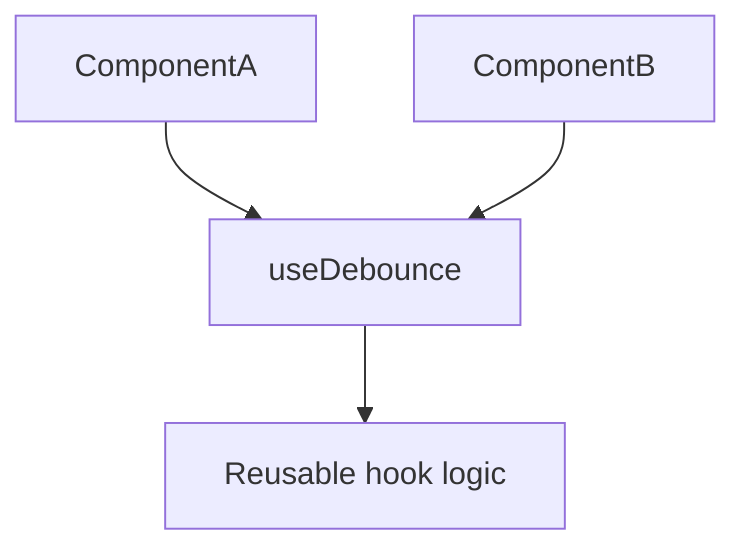

# Custom Hooks

## Detailed explanation
Custom hooks are functions that use React hooks to package reusable stateful logic. They let components share behavior without render props, higher-order components, or duplicated hook code.

A custom hook must follow the Rules of Hooks and usually starts with `use`, such as `useDebounce`, `useOnlineStatus`, or `useLocalStorage`. It should expose a clear API and hide implementation details.

## 1. One-line mental model
A custom hook extracts reusable React logic into a function.

## 2. Problem it solves
Components often repeat state, subscriptions, timers, data handling, or browser API logic.

## 3. Core idea
- Custom hooks are JavaScript functions.
- They can call built-in hooks.
- Names should start with `use`.
- Each call gets its own state.
- They share logic, not state by default.

## 4. Visual / analogy
A custom hook is like a reusable recipe: each kitchen follows the same steps but gets its own meal.



## 5. Minimal example

```tsx
function useBoolean(initial = false) {
  const [value, setValue] = React.useState(initial);
  return {
    value,
    toggle: () => setValue((current) => !current),
  };
}
```

## 6. Real-world example

```tsx
function useDebounce<T>(value: T, delay: number) {
  const [debounced, setDebounced] = React.useState(value);

  React.useEffect(() => {
    const id = window.setTimeout(() => setDebounced(value), delay);
    return () => window.clearTimeout(id);
  }, [value, delay]);

  return debounced;
}
```

## 7. Common interview questions
- What is a custom hook?
- Why must hook names start with `use`?
- Do custom hooks share state?
- How do custom hooks replace render props?
- How do you test custom hooks?
- What should a custom hook return?
- How do custom hooks compose?

## 8. Active recall test
1. What makes a function a custom hook?
2. Does state inside a custom hook get shared automatically?
3. Why use the `use` prefix?
4. What is one custom hook you can build?
5. What should custom hooks hide?

## 9. Mistakes / traps
- Calling hooks conditionally inside custom hooks.
- Assuming hook state is global.
- Returning unstable APIs unnecessarily.
- Making custom hooks too broad.
- Hiding too many unrelated responsibilities in one hook.

## 10. Compare with related concepts
- **Custom hook vs utility function:** custom hook can call React hooks; utility cannot.
- **Custom hook vs component:** hook returns logic/data; component returns UI.
- **Custom hook vs context:** hook can read context, but context provides shared values.

## 11. Summary from memory
Explain how `useDebounce` extracts timer logic from a search component.

## 12. Spaced revision prompts
- After 1 day: Define custom hook.
- After 3 days: Build `useBoolean`.
- After 7 days: Explain custom hook state isolation.
- After 14 days: Test a custom hook.

