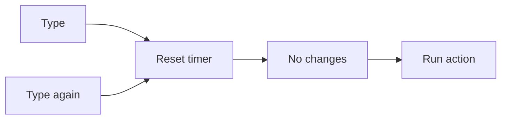

# Debouncing With Hooks

## Detailed explanation
Debouncing delays an action until input has stopped changing for a specified time. In React hooks, this is commonly implemented with `useEffect`, `setTimeout`, and cleanup.

Debouncing is useful for search inputs, validation, autosave, resize handling, and expensive calculations. The cleanup cancels the previous timer whenever the value changes again.

## 1. One-line mental model
Debouncing waits for quiet time before running an action.

## 2. Problem it solves
Without debouncing, expensive work can run on every keystroke or rapid event.

## 3. Core idea
- Start a timer when value changes.
- Clear the old timer in cleanup.
- Run action only after delay.
- Return debounced value or callback.
- Keep dependencies correct.

## 4. Visual / analogy
Debouncing is like waiting until someone stops typing before responding.



## 5. Minimal example

```tsx
function useDebounce<T>(value: T, delay: number) {
  const [debounced, setDebounced] = React.useState(value);
  React.useEffect(() => {
    const id = window.setTimeout(() => setDebounced(value), delay);
    return () => window.clearTimeout(id);
  }, [value, delay]);
  return debounced;
}
```

## 6. Real-world example

```tsx
const debouncedQuery = useDebounce(query, 300);
const results = useSearchQuery(debouncedQuery);
```

## 7. Common interview questions
- What is debouncing?
- How do you build `useDebounce`?
- Why is cleanup needed?
- Debounce vs throttle?
- Where is debounce useful?
- How do dependencies work?
- How do you test debounce?

## 8. Active recall test
1. What resets the timer?
2. What does cleanup clear?
3. Why debounce search?
4. What is returned from `useDebounce`?
5. How is throttle different?

## 9. Mistakes / traps
- Forgetting cleanup.
- Debouncing controlled input value itself and making typing lag.
- Missing delay dependency.
- Creating timers during render.
- Not testing with fake timers.

## 10. Compare with related concepts
- **Debounce vs throttle:** debounce waits for quiet; throttle limits frequency.
- **Debounced value vs debounced callback:** value delays state output; callback delays function execution.
- **Debounce vs deferred value:** debounce uses time; deferred value uses React scheduling.

## 11. Summary from memory
Explain how a debounced search avoids API calls on every keystroke.

## 12. Spaced revision prompts
- After 1 day: Define debounce.
- After 3 days: Build `useDebounce`.
- After 7 days: Compare debounce and throttle.
- After 14 days: Test debounce with fake timers.

