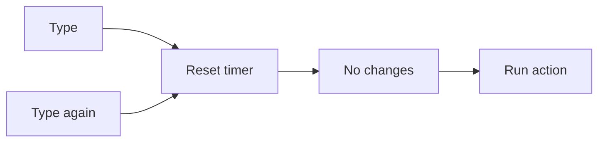

# Debouncing With Hooks

## Detailed explanation
Debouncing delays an action until input has stopped changing for a specified time. In React hooks, this is commonly implemented with `useEffect`, `setTimeout`, and cleanup.

Debouncing is useful for search inputs, validation, autosave, resize handling, and expensive calculations. The cleanup cancels the previous timer whenever the value changes again.

## 1. One-line mental model
Debouncing waits for quiet time before running an action.

## 2. Problem it solves
Without debouncing, expensive work can run on every keystroke or rapid event.

## 3. Core idea
- Start a timer when value changes.
- Clear the old timer in cleanup.
- Run action only after delay.
- Return debounced value or callback.
- Keep dependencies correct.

## 4. Visual / analogy
Debouncing is like waiting until someone stops typing before responding.



## 5. Minimal example

```tsx
function useDebounce<T>(value: T, delay: number) {
  const [debounced, setDebounced] = React.useState(value);
  React.useEffect(() => {
    const id = window.setTimeout(() => setDebounced(value), delay);
    return () => window.clearTimeout(id);
  }, [value, delay]);
  return debounced;
}
```

## 6. Real-world example

```tsx
const debouncedQuery = useDebounce(query, 300);
const results = useSearchQuery(debouncedQuery);
```

## 7. Common interview questions
#### What is debouncing?
- **The Engine Mechanism (Why it behaves this way):** Debouncing is a timing pattern that delays execution of a function until a specified period of inactivity has passed. Each new event resets the timer. In React, this is implemented with `setTimeout` inside `useEffect` and `clearTimeout` in the cleanup. The browser's timer API manages the delay, and React's effect lifecycle ensures the timer is cancelled and restarted when the debounced value changes.
- **The Unforgettable Mental Model:** The **Patient Listener**. A debouncer is like a friend who waits until you finish your entire sentence before responding. If you keep talking, they keep waiting. Only when you stop do they finally reply.
- **The Trap:** Confusing debounce with throttle. Debounce waits for quiet; throttle fires at regular intervals during activity. They solve different problems.
- **Senior Interview Playbook (Verbal Script):** "When asked this in an interview, say: Debouncing delays an action until input has stopped changing for a specified duration. Each new event resets the timer, so the action only fires after a period of inactivity. In React, I implement it with `useEffect`, `setTimeout`, and cleanup — the effect starts a timer when the value changes, and cleanup clears the previous timer, ensuring only the last value triggers the action."

#### How do you build `useDebounce`?
- **The Engine Mechanism (Why it behaves this way):** The hook accepts a value and a delay. It stores a `debounced` state initialized to the input value. A `useEffect` watches the input value and delay — when either changes, it starts a `setTimeout` that updates `debounced` after the delay. The cleanup function calls `clearTimeout` to cancel the previous timer. The hook returns the `debounced` state, which lags behind the input by the delay duration.
- **The Unforgettable Mental Model:** The **Delayed Mirror**. A normal mirror reflects instantly. A debounced mirror waits a moment before showing your reflection — if you keep moving, it keeps waiting. Only when you still does it finally show you.
- **The Trap:** Not including `delay` in the dependency array. If the delay prop changes, the effect must restart with the new delay. Missing this dependency causes the old delay to persist.
- **Senior Interview Playbook (Verbal Script):** "When asked this in an interview, say: `useDebounce` takes a value and delay, stores a debounced state, and uses `useEffect` to start a `setTimeout` that updates the debounced value after the delay. The cleanup clears the previous timer. Dependencies are the input value and delay. The hook returns the debounced state, which consumers can use to trigger expensive operations only after the user stops changing the input."

#### Why is cleanup needed?
- **The Engine Mechanism (Why it behaves this way):** Without cleanup, each value change would start a new `setTimeout` without cancelling the previous one. This means multiple timers would be running concurrently, and each would eventually fire, updating the debounced state multiple times — defeating the purpose of debouncing. The cleanup's `clearTimeout` ensures only the most recent timer survives, which is the core mechanism of debouncing.
- **The Unforgettable Mental Model:** The **Single-Track Railway**. Only one train (timer) should be on the track at a time. When a new train departs (new value), the previous one must be pulled off the track (cleared), or you'll have multiple trains arriving at the destination.
- **The Trap:** Forgetting cleanup causes the exact opposite of debouncing — every keystroke eventually triggers an action after the delay, just staggered. This is worse than no debounce because it creates a flood of delayed actions.
- **Senior Interview Playbook (Verbal Script):** "When asked this in an interview, say: Cleanup is the core mechanism of debouncing. Without `clearTimeout` in cleanup, each value change starts a new timer without cancelling the previous one, so every input eventually triggers an action — just delayed. The cleanup ensures only the latest timer survives, which is what makes debouncing work: only the final value after a pause triggers the action."

#### Debounce vs throttle?
- **The Engine Mechanism (Why it behaves this way):** Debounce delays execution until there's a gap of inactivity — it fires once after the last event. Throttle limits execution to at most once per time window — it fires repeatedly during activity but at a controlled rate. Debounce is ideal for search inputs (wait until user stops typing). Throttle is ideal for scroll handlers (update continuously but not on every pixel).
- **The Unforgettable Mental Model:** The **Elevator vs. the Escalator**. Debounce is an elevator — it waits until everyone stops pressing the button, then goes. Throttle is an escalator — it keeps moving at a steady pace as long as people are on it.
- **The Trap:** Using debounce for scroll tracking. Debounce won't fire until the user stops scrolling, which means no updates during the scroll — defeating the purpose of tracking scroll position.
- **Senior Interview Playbook (Verbal Script):** "When asked this in an interview, say: Debounce waits for a period of inactivity before firing — it's for 'do this after the user stops.' Throttle fires at most once per time window — it's for 'do this regularly during activity.' I use debounce for search inputs, form validation, and autosave. I use throttle for scroll tracking, resize handling, and pointer move events."

#### Where is debounce useful?
- **The Engine Mechanism (Why it behaves this way):** Debounce is useful anywhere rapid, repeated events should trigger a single delayed action. Search inputs: avoid API calls on every keystroke. Form validation: validate after the user finishes typing, not during. Autosave: save after the user pauses, not on every character. Window resize: recalculate layout after resize stops. These patterns reduce network requests, computation, and jank.
- **The Unforgettable Mental Model:** The **Pause Button**. Debounce hits pause on every event and only presses play when there's been silence. It turns a rapid-fire machine gun into a single, well-aimed shot.
- **The Trap:** Debouncing the controlled input value itself instead of a derived debounced value. If you debounce the input's `value` prop, the input becomes laggy and unresponsive to typing.
- **Senior Interview Playbook (Verbal Script):** "When asked this in an interview, say: Debounce is useful for search inputs to avoid excessive API calls, form validation to check after the user finishes typing, autosave to batch saves during pauses, and resize handlers to recalculate after the window settles. The key pattern is: keep the immediate UI responsive (input value updates instantly) but delay the expensive downstream action (API call, validation, save) until the user pauses."

#### How do dependencies work?
- **The Engine Mechanism (Why it behaves this way):** The `useEffect` inside `useDebounce` depends on the input value and the delay. When the value changes, the effect re-runs: cleanup clears the previous timer, and setup starts a new one. When the delay changes, the same happens — the old timer is cleared and a new one starts with the new delay. If either dependency is missing, the debounce behavior breaks: missing value means the timer never restarts; missing delay means the old delay persists.
- **The Unforgettable Mental Model:** The **Two Dials**. The value dial controls what gets delayed; the delay dial controls how long to wait. Turn either dial, and the machine resets its countdown.
- **The Trap:** Adding unnecessary dependencies like the setter function. `setDebounced` is stable across renders, so including it is harmless but misleading. Only include values that actually affect the timer logic.
- **Senior Interview Playbook (Verbal Script):** "When asked this in an interview, say: The effect in `useDebounce` depends on the input value and the delay. When the value changes, cleanup clears the old timer and setup starts a new one. When the delay changes, the same reset happens. Both dependencies are required — without the value, the timer never restarts on new input; without the delay, changes to the delay prop are ignored."

#### How do you test debounce?
- **The Engine Mechanism (Why it behaves this way):** Testing debounce requires controlling time. Real `setTimeout` would make tests slow and flaky. Test frameworks provide fake timers (`vi.useFakeTimers()` in Vitest, `jest.useFakeTimers()` in Jest) that replace the browser's timer APIs with mock implementations. You advance time manually with `vi.advanceTimersByTime(delay)` to trigger the debounced action instantly. This makes tests deterministic and fast.
- **The Unforgettable Mental Model:** The **Time Machine**. Fake timers let you fast-forward through the debounce delay without actually waiting. You type, then jump 300ms into the future to see if the action fired.
- **The Trap:** Forgetting to restore real timers after the test (`vi.useRealTimers()` or `afterEach` cleanup). Fake timers leak into other tests and cause mysterious timeout failures.
- **Senior Interview Playbook (Verbal Script):** "When asked this in an interview, say: I test debounce with fake timers. I enable them with `vi.useFakeTimers()`, trigger the input, then advance time by the delay with `vi.advanceTimersByTime(300)`. This instantly fires the debounced action without waiting. I assert the expected result after advancing time. I always restore real timers in an `afterEach` hook to prevent fake timers from affecting other tests."

## 8. Active recall test
1. **What resets the timer?**
   - **Explanation:** Each new value change triggers the effect to re-run. The cleanup clears the previous `setTimeout`, and the setup starts a fresh timer. This means the countdown restarts from zero every time the input changes, ensuring the action only fires after a period of no changes.
2. **What does cleanup clear?**
   - **Explanation:** The previous `setTimeout` timer ID via `clearTimeout(id)`. This cancels the pending debounced action, ensuring that only the most recent timer — the one started after the latest value change — is allowed to complete and update state.
3. **Why debounce search?**
   - **Explanation:** Search inputs fire an event on every keystroke. Without debouncing, each keystroke triggers an API call, causing excessive network traffic, server load, and potential race conditions. Debouncing waits for the user to pause, then fires a single request with the final query.
4. **What is returned from `useDebounce`?**
   - **Explanation:** The debounced state value — a lagging copy of the input that only updates after the delay period of inactivity. Consumers use this debounced value (not the raw input) to trigger expensive operations like API calls or heavy computations.
5. **How is throttle different?**
   - **Explanation:** Throttle fires at most once per time window during continuous activity, while debounce fires only once after activity stops. Throttle is for "keep updating during action" (scroll tracking); debounce is for "wait until action stops" (search input).

## 9. Mistakes / traps
- Forgetting cleanup.
- Debouncing controlled input value itself and making typing lag.
- Missing delay dependency.
- Creating timers during render.
- Not testing with fake timers.

## 10. Compare with related concepts
- **Debounce vs throttle:** debounce waits for quiet; throttle limits frequency.
- **Debounced value vs debounced callback:** value delays state output; callback delays function execution.
- **Debounce vs deferred value:** debounce uses time; deferred value uses React scheduling.

## 11. Summary from memory
Explain how a debounced search avoids API calls on every keystroke.

## 12. Spaced revision prompts
- After 1 day: Define debounce.
- After 3 days: Build `useDebounce`.
- After 7 days: Compare debounce and throttle.
- After 14 days: Test debounce with fake timers.

