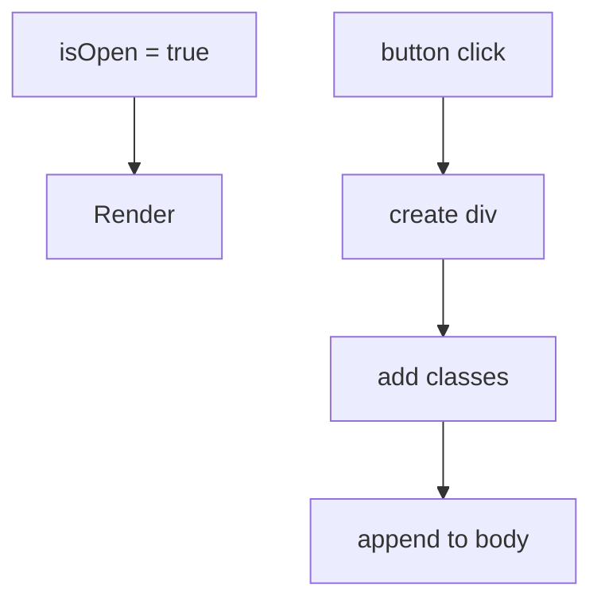

# Declarative vs Imperative UI

## Detailed explanation
Imperative UI code tells the browser each exact step to perform: find this DOM node, change this class, insert this element, remove that text. Declarative UI describes the final UI for the current state, and the framework decides the update steps. React is declarative because components return the UI that should exist for the current props and state.

This matters because frontend apps have many UI states: loading, error, empty, success, disabled, selected, expanded, and hidden. Declarative rendering makes those states visible in the component output instead of scattering DOM mutations across event handlers.

## 1. One-line mental model
Declarative UI describes the final screen for a state, while imperative UI describes the step-by-step DOM operations to get there.

## 2. Problem it solves
Imperative DOM code spreads UI update logic across event handlers and makes it easy for the DOM to drift away from application state. Declarative UI centralizes the relationship between state and screen.

## 3. Core idea
- Imperative code says "how to change the UI."
- Declarative code says "what the UI should be."
- React components re-run when state changes and return the next UI description.
- Declarative UI reduces manual DOM bookkeeping.
- It makes complex conditional screens easier to reason about.

## 4. Visual / analogy
Imperative is giving turn-by-turn driving instructions. Declarative is giving the destination to a navigation system.



## 5. Minimal example

```tsx
function Message({ isError }: { isError: boolean }) {
  return isError ? <p role="alert">Something failed</p> : <p>All good</p>;
}
```

## 6. Real-world example

```tsx
function SaveButton({ status }: { status: "idle" | "saving" | "saved" }) {
  return (
    <button disabled={status === "saving"}>
      {status === "saving" ? "Saving..." : status === "saved" ? "Saved" : "Save"}
    </button>
  );
}
```

The button is derived from `status`; no code manually edits the button text.

## 7. Common interview questions
#### What does declarative UI mean?
- **The Engine Mechanism (Why it behaves this way):** Declarative UI means describing the desired end-state of the interface rather than scripting step-by-step DOM mutations. In React, when you write JSX, you're producing a tree of React element objects that describe what the DOM *should* look like for the current state. React's reconciliation engine then compares this new element tree with the previous one during the render phase, computes the minimal set of mutations, and applies them in the commit phase. You never call `document.createElement`, `element.appendChild`, or `element.classList.add` directly.
- **The Unforgettable Mental Model:** The **Restaurant Order vs. Kitchen Instructions**. Declarative UI is like ordering a dish — you describe what you want on the plate. Imperative UI is like walking into the kitchen and telling the chef exactly which pan to heat, how long to sear each ingredient, and in what order to plate everything.
- **The Trap:** Thinking declarative means "no logic." Declarative UI still contains conditionals, loops, and computations — they're expressed as part of the output description, not as DOM mutations.
- **Senior Interview Playbook (Verbal Script):** "When asked this in an interview, say: Declarative UI means describing what the interface should look like for a given state, rather than writing step-by-step instructions to manipulate the DOM. In React, we declare the UI structure using JSX with conditional rendering and data binding. React's reconciliation engine then figures out the most efficient way to transform the current DOM into the desired state. This makes code more predictable, easier to debug, and less prone to synchronization bugs."

#### How is declarative UI different from imperative UI?
- **The Engine Mechanism (Why it behaves this way):** In imperative UI, the developer writes explicit DOM API calls (`document.querySelector`, `element.style.display`, `parent.removeChild`) that execute immediately and mutate the browser's DOM tree directly. In declarative UI with React, the component function returns a description (React elements), and React's Fiber scheduler decides when and how to apply changes. The key difference is *who* computes the diff: in imperative code, the developer manually tracks what changed; in declarative code, React's diffing algorithm does it automatically during reconciliation.
- **The Unforgettable Mental Model:** The **GPS vs. Turn-by-Turn Directions**. Imperative UI is like giving someone turn-by-turn walking directions — "go straight 200 meters, turn left, then right." Declarative UI is like typing a destination into GPS — you say where you want to end up, and the system figures out the route.
- **The Trap:** Believing declarative is always better. Imperative code is still necessary for animations, canvas drawing, and integrating third-party libraries that directly manipulate the DOM (like D3.js or map libraries).
- **Senior Interview Playbook (Verbal Script):** "When asked this in an interview, say: Imperative UI describes the exact steps to change the DOM — find an element, modify its class, append a child. Declarative UI describes the final state you want, and the framework figures out the steps. In React, I write JSX that says 'if isLoading, show a spinner; if data exists, show a table.' React handles the diffing and DOM updates. Declarative code is easier to reason about because the UI at any moment is a direct function of state, not the result of a sequence of mutations."

#### Why is React called declarative?
- **The Engine Mechanism (Why it behaves this way):** React is called declarative because components return a description of UI (React element trees) rather than performing DOM operations. When state changes, React doesn't tell you to update specific DOM nodes — you simply return a new UI description from your component function. React's reconciliation algorithm then compares the new tree with the previous one, identifies what changed, and updates only the affected DOM nodes. The developer declares "what," React figures out "how."
- **The Unforgettable Mental Model:** The **Architect's Blueprint**. You don't tell the construction crew which bricks to lay one by one — you hand them a blueprint of the finished building. When requirements change, you hand them a revised blueprint, and they figure out which walls to move.
- **The Trap:** Confusing "declarative" with "magic." React's declarative model is built on a very concrete engine: the Virtual DOM, Fiber architecture, and the reconciliation algorithm. It's not magic — it's a sophisticated diffing and scheduling system.
- **Senior Interview Playbook (Verbal Script):** "When asked this in an interview, say: React is declarative because components describe what the UI should look like for a given state, rather than specifying how to build it. I write JSX that expresses the desired output, and React's reconciliation engine determines the minimal DOM operations needed to achieve it. This separation of concerns — I declare the intent, React executes the implementation — makes code more predictable and easier to maintain."

#### Is JSX declarative?
- **The Engine Mechanism (Why it behaves this way):** JSX itself is a syntax extension that compiles to `React.createElement` or `jsx()` function calls, which produce React element objects. The declarative nature comes from *how* JSX is used — embedding JavaScript expressions inside a tag-like structure to describe UI output. When JSX is evaluated during the render phase, it produces a tree of plain JavaScript objects that describe the desired DOM structure. React then uses these objects during reconciliation to determine what the actual DOM should look like.
- **The Unforgettable Mental Model:** The **Recipe Card**. JSX is like a recipe card — it lists ingredients (props) and instructions (expressions) for what the final dish should contain. It's not the cooking process itself; it's the description of the desired result.
- **The Trap:** Thinking JSX is a template language like Handlebars or EJS. JSX is JavaScript — it has full access to the language's expressions, operators, and control flow. Template languages typically have their own limited syntax for loops and conditionals.
- **Senior Interview Playbook (Verbal Script):** "When asked this in an interview, say: Yes, JSX is declarative. It lets me describe the UI structure using a tag-like syntax where JavaScript expressions are embedded with curly braces. Instead of imperatively creating elements and setting their properties, I write what the output should look like, and JSX compiles it into React element objects. React then handles the actual DOM construction and updates."

#### Can React code still be imperative?
- **The Engine Mechanism (Why it behaves this way):** Yes. React provides escape hatches like `useRef` and `useEffect` that let you directly interact with DOM nodes or third-party imperative APIs. When you use `ref.current.focus()`, `ref.current.scrollIntoView()`, or integrate a library like a chart or map that manipulates the DOM directly, you're writing imperative code inside React. React's commit phase fires `useLayoutEffect` synchronously after DOM mutations and `useEffect` asynchronously, giving you controlled access to imperative operations after React has finished its declarative rendering.
- **The Unforgettable Mental Model:** The **Automatic Car with Manual Override**. React is like an automatic transmission — it handles most shifts for you. But `useRef` and `useEffect` are the paddle shifters — you can take manual control when the automatic mode isn't enough.
- **The Trap:** Overusing refs and effects for things that could be declarative. If you're using `useRef` to track state that should trigger re-renders, or using `useEffect` to derive values from props, you're fighting React's model.
- **Senior Interview Playbook (Verbal Script):** "When asked this in an interview, say: Absolutely. React is primarily declarative, but it provides imperative escape hatches through refs and effects. I use `useRef` to access DOM nodes directly for operations like focusing an input, measuring dimensions, or integrating third-party libraries that require direct DOM manipulation. The key principle is to use imperative code only when declarative approaches can't solve the problem — like when working with non-React libraries or browser APIs that don't have declarative wrappers."

#### Why is direct DOM manipulation discouraged in React?
- **The Engine Mechanism (Why it behaves this way):** React maintains its own in-memory representation of the UI (the Virtual DOM / React element tree). During reconciliation, React compares the new element tree with the previous one and applies calculated mutations to the real DOM. If you manually manipulate DOM nodes that React owns (e.g., `document.getElementById('myDiv').style.color = 'red'`), React's next render cycle may overwrite your changes because it doesn't know about them. This creates a "source of truth" conflict — the DOM and React's Virtual DOM diverge, leading to unpredictable UI behavior.
- **The Unforgettable Mental Model:** The **Two Editors Problem**. Imagine two people editing the same Google Doc simultaneously without seeing each other's changes. One person (React) thinks the document says one thing, the other (your manual DOM code) changed it to something else. The result is chaos.
- **The Trap:** Thinking "it works fine" because you tested it once. Direct DOM manipulation might appear to work until React re-renders and overwrites your changes, creating intermittent bugs that are notoriously hard to debug.
- **Senior Interview Playbook (Verbal Script):** "When asked this in an interview, say: Direct DOM manipulation is discouraged because React maintains its own representation of the UI and expects to be the sole manager of the DOM nodes it creates. When you manually change a DOM node that React owns, React's next render cycle doesn't know about that change and may overwrite it, causing the UI to drift out of sync with the application state. If I need direct DOM access, I use refs within React's lifecycle to ensure changes happen at the right time and don't conflict with React's rendering."

#### How does declarative UI improve maintainability?
- **The Engine Mechanism (Why it behaves this way):** Declarative UI centralizes the relationship between state and output in a single location — the component's render function. In imperative code, UI update logic is scattered across event handlers, lifecycle methods, and callback functions, making it difficult to trace how a particular state change affects the screen. With declarative UI, you can read a component function and immediately see every possible UI outcome for every possible state value. This reduces cognitive load, simplifies debugging, and makes it easier to add new UI states without breaking existing ones.
- **The Unforgettable Mental Model:** The **Single Dashboard vs. Scattered Sticky Notes**. Declarative UI is like having one dashboard that shows all possible states at a glance. Imperative UI is like having sticky notes scattered across ten different monitors, each describing one piece of a UI update.
- **The Trap:** Assuming declarative automatically means maintainable. Poorly structured declarative code (deeply nested ternaries, giant components with dozens of state variables) can be just as hard to maintain as imperative code.
- **Senior Interview Playbook (Verbal Script):** "When asked this in an interview, say: Declarative UI improves maintainability by centralizing the relationship between state and screen in one place. Instead of tracking DOM mutations across multiple event handlers and lifecycle methods, I can read a component function and see exactly what the UI looks like for any given state. This makes it easier to add new states, debug issues, and onboard new developers. The UI becomes a predictable function of data rather than a sequence of side effects."

## 8. Active recall test
1. **Define declarative UI.**
   - **Explanation:** Declarative UI describes the desired end-state of the interface for a given set of data, rather than scripting the step-by-step DOM operations to achieve it. In React, components return JSX that declares what the screen should look like, and React's reconciliation engine computes the minimal DOM updates.
2. **Define imperative UI.**
   - **Explanation:** Imperative UI explicitly instructs the browser how to change the DOM — selecting elements, modifying attributes, adding or removing nodes. Examples include `document.querySelector`, `element.classList.add()`, and `parent.appendChild()`.
3. **Why does React prefer declarative rendering?**
   - **Explanation:** Declarative rendering ensures the UI is always a consistent reflection of application state. React can batch updates, optimize DOM mutations through diffing, and pause/interrupt rendering with Concurrent Mode — all of which are impossible when developers manually mutate the DOM.
4. **Give one example of imperative DOM code.**
   - **Explanation:** `document.getElementById('modal').classList.add('visible')` — this directly finds a DOM node and mutates its class, requiring the developer to also write the reverse operation to hide it.
5. **When might imperative code still be needed in React?**
   - **Explanation:** Imperative code is needed when integrating third-party libraries that directly manipulate the DOM (e.g., D3.js, map libraries, chart libraries), when focusing/scrolling elements via refs, or when measuring DOM dimensions. React provides `useRef` and `useEffect` as controlled escape hatches for these scenarios.

## 9. Mistakes / traps
- Saying declarative means "less code." It means state describes output.
- Thinking React forbids all imperative code. Refs and effects can still interact with imperative APIs.
- Directly manipulating DOM nodes that React owns.
- Duplicating derived UI state instead of deriving it during render.

## 10. Compare with related concepts
- **Declarative vs imperative:** final desired UI vs step-by-step commands.
- **Declarative vs reactive:** declarative describes output; reactive systems update when dependencies change.
- **Declarative vs functional:** functional programming is broader; React uses functions to express declarative UI.

## 11. Summary from memory
Explain how you would show a loading spinner declaratively without manually inserting or removing DOM nodes.

## 12. Spaced revision prompts
- After 1 day: Give one declarative and one imperative UI example.
- After 3 days: Explain why direct DOM manipulation conflicts with React.
- After 7 days: Convert an imperative modal open flow into declarative state.
- After 14 days: Explain when refs are acceptable.
