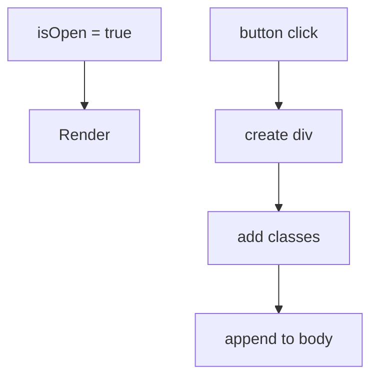

# Declarative vs Imperative UI

## Detailed explanation
Imperative UI code tells the browser each exact step to perform: find this DOM node, change this class, insert this element, remove that text. Declarative UI describes the final UI for the current state, and the framework decides the update steps. React is declarative because components return the UI that should exist for the current props and state.

This matters because frontend apps have many UI states: loading, error, empty, success, disabled, selected, expanded, and hidden. Declarative rendering makes those states visible in the component output instead of scattering DOM mutations across event handlers.

## 1. One-line mental model
Declarative UI describes the final screen for a state, while imperative UI describes the step-by-step DOM operations to get there.

## 2. Problem it solves
Imperative DOM code spreads UI update logic across event handlers and makes it easy for the DOM to drift away from application state. Declarative UI centralizes the relationship between state and screen.

## 3. Core idea
- Imperative code says "how to change the UI."
- Declarative code says "what the UI should be."
- React components re-run when state changes and return the next UI description.
- Declarative UI reduces manual DOM bookkeeping.
- It makes complex conditional screens easier to reason about.

## 4. Visual / analogy
Imperative is giving turn-by-turn driving instructions. Declarative is giving the destination to a navigation system.



## 5. Minimal example

```tsx
function Message({ isError }: { isError: boolean }) {
  return isError ? <p role="alert">Something failed</p> : <p>All good</p>;
}
```

## 6. Real-world example

```tsx
function SaveButton({ status }: { status: "idle" | "saving" | "saved" }) {
  return (
    <button disabled={status === "saving"}>
      {status === "saving" ? "Saving..." : status === "saved" ? "Saved" : "Save"}
    </button>
  );
}
```

The button is derived from `status`; no code manually edits the button text.

## 7. Common interview questions
- What does declarative UI mean?
- How is declarative UI different from imperative UI?
- Why is React called declarative?
- Is JSX declarative?
- Can React code still be imperative?
- Why is direct DOM manipulation discouraged in React?
- How does declarative UI improve maintainability?

## 8. Active recall test
1. Define declarative UI.
2. Define imperative UI.
3. Why does React prefer declarative rendering?
4. Give one example of imperative DOM code.
5. When might imperative code still be needed in React?

## 9. Mistakes / traps
- Saying declarative means "less code." It means state describes output.
- Thinking React forbids all imperative code. Refs and effects can still interact with imperative APIs.
- Directly manipulating DOM nodes that React owns.
- Duplicating derived UI state instead of deriving it during render.

## 10. Compare with related concepts
- **Declarative vs imperative:** final desired UI vs step-by-step commands.
- **Declarative vs reactive:** declarative describes output; reactive systems update when dependencies change.
- **Declarative vs functional:** functional programming is broader; React uses functions to express declarative UI.

## 11. Summary from memory
Explain how you would show a loading spinner declaratively without manually inserting or removing DOM nodes.

## 12. Spaced revision prompts
- After 1 day: Give one declarative and one imperative UI example.
- After 3 days: Explain why direct DOM manipulation conflicts with React.
- After 7 days: Convert an imperative modal open flow into declarative state.
- After 14 days: Explain when refs are acceptable.
