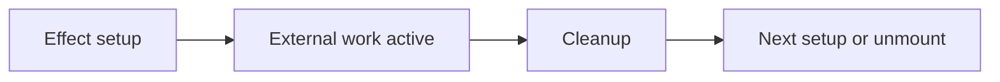

# Cleanup Functions in useEffect

## Detailed explanation
An effect cleanup function is the function returned from `useEffect`. React runs it before re-running the effect and when the component unmounts. Cleanup is required for subscriptions, timers, event listeners, observers, and in-flight async work.

Without cleanup, components can leak memory, update stale state, duplicate listeners, or keep background work running after the UI that needed it is gone.

## 1. One-line mental model
Cleanup undoes the external work an effect started.

## 2. Problem it solves
External resources must be released when dependencies change or the component unmounts.

## 3. Core idea
- Return a function from `useEffect`.
- Cleanup runs before the next effect run.
- Cleanup runs on unmount.
- Cleanup should reverse setup.
- StrictMode helps reveal missing cleanup.

## 4. Visual / analogy
Cleanup is like turning off lights and locking the room before leaving.



## 5. Minimal example

```tsx
React.useEffect(() => {
  const id = window.setInterval(tick, 1000);
  return () => window.clearInterval(id);
}, []);
```

## 6. Real-world example

```tsx
React.useEffect(() => {
  const controller = new AbortController();
  fetch(`/api/users/${userId}`, { signal: controller.signal });
  return () => controller.abort();
}, [userId]);
```

## 7. Common interview questions
#### What is effect cleanup?
- **The Engine Mechanism (Why it behaves this way):** When you return a function from `useEffect`, React stores it as the cleanup handler for that effect instance. During the commit phase, before React runs a new instance of the effect (because dependencies changed), it first calls the previous cleanup function. On unmount, React calls the cleanup during the "unmount commit" step. This is managed by the Fiber node's `updateQueue` where each effect is tracked with its cleanup reference.
- **The Unforgettable Mental Model:** The **Janitor's Checklist**. Before a new tenant moves into an apartment (new effect run), the janitor (cleanup) must clean out what the previous tenant left behind. When the building closes (unmount), the janitor does a final walkthrough.
- **The Trap:** Thinking cleanup is only for unmount. It runs before every re-run of the effect, which is critical when dependencies change frequently.
- **Senior Interview Playbook (Verbal Script):** "When asked this in an interview, say: Effect cleanup is the function returned from `useEffect`. React runs it before re-executing the effect when dependencies change, and again when the component unmounts. It's essential for releasing external resources like subscriptions, timers, event listeners, and aborting in-flight requests — preventing memory leaks and stale state updates."

#### When does cleanup run?
- **The Engine Mechanism (Why it behaves this way):** React's commit phase has a specific ordering: first, it performs DOM mutations, then it fires `useLayoutEffect` synchronously, then `useEffect` asynchronously. Before running a new effect (due to dependency change), React calls the previous cleanup synchronously during the same commit. On unmount, cleanup runs during the deletion phase of the Fiber tree. In StrictMode development, React mounts, unmounts, and remounts components, causing cleanup to run twice — simulating what could happen in Concurrent Mode with interrupted renders.
- **The Unforgettable Mental Model:** The **Two-Door Rule**. Cleanup runs through two doors: the "dependency changed" door (before new setup) and the "component left" door (on unmount). In development, StrictMode opens both doors twice to test your locks.
- **The Trap:** Assuming cleanup only fires once on unmount. It fires every time before the effect re-runs, which means your cleanup must handle partial setups correctly.
- **Senior Interview Playbook (Verbal Script):** "When asked this in an interview, say: Cleanup runs at two points: first, before the effect re-runs when its dependencies change, and second, when the component unmounts. In React 18's StrictMode development, effects are mounted, cleaned up, and mounted again to surface cleanup bugs early. This mirrors how Concurrent Mode might interrupt and restart rendering work."

#### Why is cleanup needed?
- **The Engine Mechanism (Why it behaves this way):** JavaScript's event loop keeps timers, listeners, and pending promises alive even after a React component is removed from the Fiber tree. Without cleanup, these external references hold the component's closure in memory (preventing garbage collection), and callbacks may fire and call `setState` on an unmounted component, causing memory leaks or the "can't perform a React state update on an unmounted component" warning.
- **The Unforgettable Mental Model:** The **Open Tap**. If you leave a tap running after leaving the kitchen, water keeps flowing and eventually floods the house. Cleanup turns off the tap.
- **The Trap:** Believing React automatically cleans up everything. React only manages its own internal state and DOM — external browser APIs, network requests, and third-party libraries are your responsibility.
- **Senior Interview Playbook (Verbal Script):** "When asked this in an interview, say: Cleanup is needed because React doesn't automatically manage external resources. Timers, event listeners, subscriptions, and network requests exist outside React's Fiber tree. Without cleanup, these keep running after the component is gone, causing memory leaks, stale state updates on unmounted components, and duplicate listeners that compound with each re-render."

#### How do you clean up timers?
- **The Engine Mechanism (Why it behaves this way):** `setInterval` and `setTimeout` return numeric IDs that the browser's timer subsystem uses to track scheduled callbacks. When you call `clearInterval(id)` or `clearTimeout(id)`, the browser removes that callback from its timer queue. In React, you capture the ID in the effect's closure and return a cleanup function that calls the clear method. The Fiber node holds the effect with its closure, so the ID remains accessible when cleanup runs.
- **The Unforgettable Mental Model:** The **Parking Ticket**. When you start a timer, you get a ticket number (ID). To stop it, you hand that exact ticket back to the attendant (clearInterval). Lose the ticket, and you can't stop the meter.
- **The Trap:** Calling `clearInterval` without the correct ID, or creating a new interval on every render without cleaning up the previous one — leading to exponentially growing timers.
- **Senior Interview Playbook (Verbal Script):** "When asked this in an interview, say: I capture the timer ID returned by `setInterval` or `setTimeout` inside the effect, then return a cleanup function that calls `clearInterval` or `clearTimeout` with that ID. This ensures that when dependencies change or the component unmounts, the previous timer is cancelled before a new one starts, preventing multiple concurrent timers."

#### How do you clean up event listeners?
- **The Engine Mechanism (Why it behaves this way):** `addEventListener` registers a callback in the browser's event dispatch system for a specific target and event type. `removeEventListener` must receive the exact same function reference to unregister it. If you pass a different function reference (even with identical code), the browser cannot find and remove the listener. In React, this means you must either define the listener outside the effect or use `useCallback`/a ref to maintain referential equality between add and remove calls.
- **The Unforgettable Mental Model:** The **Bouncer's Guest List**. The bouncer (browser) only removes someone from the club if they show the exact same ID card (function reference) they used to enter. A photocopy won't work.
- **The Trap:** Defining the listener inline in both `addEventListener` and `removeEventListener` — these are different function objects, so the listener is never actually removed, causing memory leaks and duplicate handler invocations.
- **Senior Interview Playbook (Verbal Script):** "When asked this in an interview, say: I define the event handler as a stable reference — either outside the effect, memoized with `useCallback`, or stored in a ref — and use that same reference for both `addEventListener` in the setup and `removeEventListener` in the cleanup. This ensures the browser can correctly match and remove the listener, preventing memory leaks and duplicate event handling."

#### How does StrictMode expose cleanup bugs?
- **The Engine Mechanism (Why it behaves this way):** In React 18+ StrictMode development, the commit phase intentionally double-invokes effects: it mounts the component, runs the effect, immediately runs the cleanup, unmounts, then remounts and runs the effect again. This simulates the behavior of Concurrent Mode, where React may pause, abort, and restart rendering work. If your cleanup is missing or incorrect, the second mount will reveal duplicated resources, stale closures, or state corruption.
- **The Unforgettable Mental Model:** The **Fire Drill**. StrictMode is like a surprise fire drill — it forces your building to evacuate and re-enter to prove the emergency procedures actually work. If your cleanup (evacuation plan) is broken, you'll find out before the real fire (production).
- **The Trap:** Disabling StrictMode in development because "it causes bugs." The bugs it reveals are real — they just haven't manifested in production yet due to timing luck.
- **Senior Interview Playbook (Verbal Script):** "When asked this in an interview, say: StrictMode in development double-invokes effects — mounting, cleaning up, and remounting — to simulate how Concurrent Mode might interrupt and restart rendering. This surfaces missing cleanup functions, duplicated subscriptions, and stale closures that would otherwise only appear intermittently in production. It's a proactive stress test for your effect lifecycle."

#### How does cleanup help async requests?
- **The Engine Mechanism (Why it behaves this way):** When an effect starts an async request and dependencies change before it completes, the old request's promise still resolves and may call `setState` on a component that's now rendering different data. Cleanup with `AbortController` cancels the in-flight request at the network level, preventing the response from ever arriving. Alternatively, a boolean flag (`let active = true`) set to `false` in cleanup lets the promise resolve but prevents the state update. Both approaches prevent race conditions where stale data overwrites fresh data.
- **The Unforgettable Mental Model:** The **Recalled Letter**. You sent a letter (request), but your address changed (dependency updated). Cleanup either recalls the letter from the post office (AbortController) or tells the postman "nobody home" (active flag) when it arrives.
- **The Trap:** Treating abort errors as real failures. An aborted request throws a `DOMException` with name "AbortError" — this is expected behavior, not a bug to report to the user.
- **Senior Interview Playbook (Verbal Script):** "When asked this in an interview, say: Cleanup prevents race conditions in async effects by either aborting in-flight requests with `AbortController` or using a flag to ignore stale responses. When dependencies change, the cleanup runs before the new effect starts, cancelling the old request so its response can't overwrite newer data. I always filter out `AbortError` exceptions since they're expected cancellation, not real failures."

## 8. Active recall test
1. **What does `useEffect` return for cleanup?**
   - **Explanation:** A cleanup function that React stores and calls before the next effect run and on component unmount. It should reverse whatever the effect set up — clearing timers, removing listeners, aborting requests, or unsubscribing.
2. **Does cleanup run only on unmount?**
   - **Explanation:** No. Cleanup runs before every re-execution of the effect (when dependencies change) AND on unmount. This dual timing is critical for preventing resource accumulation during the component's lifecycle.
3. **Why clean up event listeners?**
   - **Explanation:** Without cleanup, listeners accumulate with each re-render, causing the handler to fire multiple times per event. The component's closure also stays in memory, preventing garbage collection and causing memory leaks.
4. **How do you abort a fetch request in cleanup?**
   - **Explanation:** Create an `AbortController` inside the effect, pass `controller.signal` to the fetch call, and call `controller.abort()` in the cleanup function. This cancels the network request and prevents stale responses from updating state.
5. **What happens in StrictMode development for effects?**
   - **Explanation:** React mounts the component, runs the effect, immediately runs cleanup, unmounts, then remounts and runs the effect again. This double-invocation surfaces missing cleanup bugs that would otherwise appear intermittently in Concurrent Mode production builds.

## 9. Mistakes / traps
- Forgetting cleanup for intervals.
- Adding listener with one function and removing another.
- Thinking cleanup only runs on unmount.
- Ignoring AbortController for changing requests.
- Doing state updates inside cleanup unnecessarily.

## 10. Compare with related concepts
- **Cleanup vs effect setup:** setup starts work; cleanup stops it.
- **Cleanup vs error handling:** cleanup releases resources; error handling handles failures.
- **Cleanup vs unmount:** unmount is one time cleanup runs, not the only time.

## 11. Summary from memory
Explain cleanup for a window resize listener and a fetch request.

## 12. Spaced revision prompts
- After 1 day: Define cleanup.
- After 3 days: Clean up an interval.
- After 7 days: Explain cleanup before re-run.
- After 14 days: Abort fetch in an effect.

