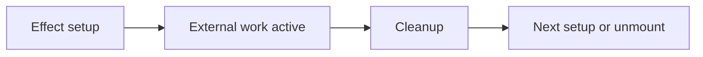

# Cleanup Functions in useEffect

## Detailed explanation
An effect cleanup function is the function returned from `useEffect`. React runs it before re-running the effect and when the component unmounts. Cleanup is required for subscriptions, timers, event listeners, observers, and in-flight async work.

Without cleanup, components can leak memory, update stale state, duplicate listeners, or keep background work running after the UI that needed it is gone.

## 1. One-line mental model
Cleanup undoes the external work an effect started.

## 2. Problem it solves
External resources must be released when dependencies change or the component unmounts.

## 3. Core idea
- Return a function from `useEffect`.
- Cleanup runs before the next effect run.
- Cleanup runs on unmount.
- Cleanup should reverse setup.
- StrictMode helps reveal missing cleanup.

## 4. Visual / analogy
Cleanup is like turning off lights and locking the room before leaving.



## 5. Minimal example

```tsx
React.useEffect(() => {
  const id = window.setInterval(tick, 1000);
  return () => window.clearInterval(id);
}, []);
```

## 6. Real-world example

```tsx
React.useEffect(() => {
  const controller = new AbortController();
  fetch(`/api/users/${userId}`, { signal: controller.signal });
  return () => controller.abort();
}, [userId]);
```

## 7. Common interview questions
- What is effect cleanup?
- When does cleanup run?
- Why is cleanup needed?
- How do you clean up timers?
- How do you clean up event listeners?
- How does StrictMode expose cleanup bugs?
- How does cleanup help async requests?

## 8. Active recall test
1. What does `useEffect` return for cleanup?
2. Does cleanup run only on unmount?
3. Why clean up event listeners?
4. How do you abort fetch?
5. What happens in StrictMode development?

## 9. Mistakes / traps
- Forgetting cleanup for intervals.
- Adding listener with one function and removing another.
- Thinking cleanup only runs on unmount.
- Ignoring AbortController for changing requests.
- Doing state updates inside cleanup unnecessarily.

## 10. Compare with related concepts
- **Cleanup vs effect setup:** setup starts work; cleanup stops it.
- **Cleanup vs error handling:** cleanup releases resources; error handling handles failures.
- **Cleanup vs unmount:** unmount is one time cleanup runs, not the only time.

## 11. Summary from memory
Explain cleanup for a window resize listener and a fetch request.

## 12. Spaced revision prompts
- After 1 day: Define cleanup.
- After 3 days: Clean up an interval.
- After 7 days: Explain cleanup before re-run.
- After 14 days: Abort fetch in an effect.

