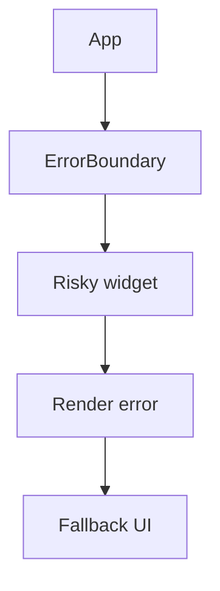

# Error Boundaries

## Detailed explanation
Error boundaries are React components that catch rendering errors in their child tree and show fallback UI instead of crashing the entire app. In React core, error boundaries are implemented with class components using `getDerivedStateFromError` and `componentDidCatch`.

They catch errors during rendering, lifecycle methods, and constructors below them. They do not catch event handler errors, async errors, or server-side rendering errors in the same way.

## 1. One-line mental model
An error boundary catches render-time crashes below it and shows fallback UI.

## 2. Problem it solves
One broken widget should not necessarily blank the entire application.

## 3. Core idea
- Wrap risky UI sections in boundaries.
- Show user-safe fallback UI.
- Log errors for debugging.
- Boundaries catch render-phase errors below them.
- They do not replace normal API error states.

## 4. Visual / analogy
An error boundary is a circuit breaker: one failed area is isolated so the rest can keep working.



## 5. Minimal example

```tsx
class ErrorBoundary extends React.Component<
  { children: React.ReactNode },
  { hasError: boolean }
> {
  state = { hasError: false };

  static getDerivedStateFromError() {
    return { hasError: true };
  }

  render() {
    return this.state.hasError ? <p>Something went wrong.</p> : this.props.children;
  }
}
```

## 6. Real-world example

```tsx
<ErrorBoundary fallback={<ChartFallback />}>
  <RevenueChart />
</ErrorBoundary>
```

A chart crash can show a fallback while the rest of the dashboard remains usable.

## 7. Common interview questions
#### What is an error boundary?
- **The Engine Mechanism (Why it behaves this way):** An error boundary is a React component that catches JavaScript errors in its child component tree during rendering, lifecycle methods, and constructors. It is implemented using two class component lifecycle methods: `static getDerivedStateFromError(error)` which updates state to show fallback UI, and `componentDidCatch(error, errorInfo)` which logs error details. When an error is thrown during the render phase of a child, React walks up the component tree looking for the nearest error boundary. If found, React triggers the boundary's error handling methods and renders the fallback UI instead of the crashed subtree. If no boundary is found, React unmounts the entire component tree.
- **The Unforgettable Mental Model:** The **Circuit Breaker**. In a house, a circuit breaker detects when a circuit overloads and cuts power to just that circuit, keeping the rest of the house running. An error boundary detects when a component crashes and shows fallback UI for just that section, keeping the rest of the app functional.
- **The Trap:** Thinking error boundaries are try/catch for React. They only catch errors during rendering, lifecycle methods, and constructors — not event handlers, async code, or server-side rendering.
- **Senior Interview Playbook (Verbal Script):** "When asked this in an interview, say: An error boundary is a React component that catches errors in its child tree during rendering and shows fallback UI instead of crashing the entire app. It's implemented with class component lifecycle methods — `getDerivedStateFromError` for updating state and `componentDidCatch` for logging. When a child throws during render, React walks up the tree to find the nearest error boundary and renders its fallback. Error boundaries are like try/catch for the component tree, but they only catch render-phase errors, not event handler or async errors."

#### What errors do error boundaries catch?
- **The Engine Mechanism (Why it behaves this way):** Error boundaries catch errors that occur during the render phase of the React lifecycle. This includes: errors in component render methods (function component bodies and class `render` methods), errors in lifecycle methods (`componentDidMount`, `componentDidUpdate`, etc.), errors in constructors, and errors in `getDerivedStateFromProps`. These are all synchronous operations that happen during React's render or commit phases. When such an error occurs, React captures it and propagates it up the tree to the nearest error boundary, which then renders its fallback UI.
- **The Unforgettable Mental Model:** The **Quality Control Inspector**. The inspector checks products on the assembly line (render phase) and catches defects before they ship. But the inspector doesn't check what happens after the product leaves the factory (event handlers, async callbacks).
- **The Trap:** Assuming error boundaries catch all JavaScript errors in a React app. They only catch errors during React's rendering lifecycle — errors in event handlers, `setTimeout`, `Promise` callbacks, and SSR are not caught.
- **Senior Interview Playbook (Verbal Script):** "When asked this in an interview, say: Error boundaries catch errors that occur during React's render phase — errors in component render functions, lifecycle methods, and constructors. They catch synchronous errors that happen while React is building or committing the component tree. This includes errors in `render`, `componentDidMount`, `componentDidUpdate`, and the component constructor. The key limitation: they only catch errors during React's lifecycle, not in event handlers, async callbacks, or server-side rendering."

#### What do error boundaries not catch?
- **The Engine Mechanism (Why it behaves this way):** Error boundaries do not catch errors in event handlers because event handlers run outside of React's render phase — they are triggered by user interactions, not by React's rendering pipeline. They don't catch async errors (setTimeout, Promise callbacks, async/await) because these execute after the render phase has completed and React has moved on. They don't catch errors in server-side rendering because the error boundary mechanism relies on the client-side Fiber tree. They also don't catch errors thrown within the error boundary itself — a boundary can only catch errors in its children, not in its own code.
- **The Unforgettable Mental Model:** The **Safety Net Under the Trapeze**. The safety net catches performers who fall during their act (render phase). But it doesn't catch them when they're walking to the tent (event handlers), practicing backstage (async code), or performing in a different circus (SSR).
- **The Trap:** Wrapping an entire app in a single error boundary and assuming all errors are handled. Event handler errors will still crash the app, and async errors will go uncaught.
- **Senior Interview Playbook (Verbal Script):** "When asked this in an interview, say: Error boundaries do not catch errors in event handlers, async code like setTimeout or Promise callbacks, server-side rendering, or errors thrown within the boundary itself. Event handlers run outside React's render phase, so errors there bypass the boundary mechanism. Async errors execute after rendering completes. For these cases, you need traditional try/catch blocks, Promise error handlers, or global error handlers like `window.onerror`."

#### Why are error boundaries class components?
- **The Engine Mechanism (Why it behaves this way):** Error boundaries require `getDerivedStateFromError` and `componentDidCatch`, which are class component lifecycle methods. These methods were specifically designed for error handling and have no functional component equivalent. `getDerivedStateFromError` is a static method that receives the error and returns a state update — it runs during the render phase, allowing React to switch to fallback UI. `componentDidCatch` runs after commit, allowing error logging. React has not yet released a `useErrorBoundary` hook, though the React team has discussed it. Until then, class components are the only way to implement error boundaries.
- **The Unforgettable Mental Model:** The **Specialized Tool**. Some jobs require a specific tool that hasn't been adapted for the new system yet. Error boundaries are like a wrench that only fits class component bolts — the functional equivalent hasn't been manufactured yet.
- **The Trap:** Trying to implement error boundaries with `try/catch` in function components. This doesn't work because errors during JSX evaluation propagate up the tree before your try/catch can catch them.
- **Senior Interview Playbook (Verbal Script):** "When asked this in an interview, say: Error boundaries must be class components because they rely on `getDerivedStateFromError` and `componentDidCatch`, which are class-specific lifecycle methods. These methods were designed for error handling and have no functional component equivalent yet. `getDerivedStateFromError` runs during render to switch to fallback UI, while `componentDidCatch` runs after commit for logging. The React team has discussed a `useErrorBoundary` hook, but it hasn't been released. In the meantime, you can use third-party libraries that wrap the class component implementation in a functional API."

#### Where should error boundaries be placed?
- **The Engine Mechanism (Why it behaves this way):** Error boundaries should be placed strategically around sections of the UI that can fail independently. Placing a single boundary at the app root catches all errors but shows a blank fallback for the entire app when any component fails. Placing boundaries around individual widgets (dashboard cards, sidebar, chart panels) isolates failures — if one widget crashes, the others remain functional. The ideal placement depends on the app's architecture: route-level boundaries for page-level isolation, widget-level boundaries for component-level isolation, and a root-level boundary as a last-resort catch-all.
- **The Unforgettable Mental Model:** The **Fire Doors in a Building**. A building with fire doors between each room contains a fire to one room. A building with no fire doors lets the fire spread everywhere. Error boundaries are fire doors for component failures — place them between independent sections to contain the damage.
- **The Trap:** Placing only one boundary at the app root. This defeats the purpose of error boundaries — if any component crashes, the entire app shows the fallback, which is the same as having no boundary at all.
- **Senior Interview Playbook (Verbal Script):** "When asked this in an interview, say: Error boundaries should be placed around independent sections of the UI, not just at the app root. In a dashboard, you'd place boundaries around each widget — if the chart crashes, the sidebar and data table remain usable. Route-level boundaries are good for page-level isolation. A root-level boundary should exist as a last-resort catch-all, but the real value comes from granular boundaries that isolate failures. The principle: place boundaries where a failure in one section shouldn't break the entire experience."

#### How do you reset an error boundary?
- **The Engine Mechanism (Why it behaves this way):** Once an error boundary catches an error and sets `hasError: true` in state, it stays in the error state until the state is reset. To reset, you need to trigger a re-render with `hasError: false`. Common patterns include: (1) adding a "Try Again" button in the fallback UI that calls `this.setState({ hasError: false })`, (2) using a `key` prop on the error boundary — changing the key forces React to unmount and remount the boundary, resetting its state, and (3) listening to route changes and resetting the boundary when the user navigates to a different page. The key prop approach is particularly useful because it automatically resets the boundary when the content it wraps changes.
- **The Unforgettable Mental Model:** The **Reset Button on a Router**. When your internet goes down, you don't just wait — you press the reset button. The router clears its error state and tries again. An error boundary needs the same: a way to clear the error state and re-render the children.
- **The Trap:** Forgetting to reset the boundary after fixing the underlying issue. If the error was transient (network timeout), the boundary will stay in error state forever without a reset mechanism.
- **Senior Interview Playbook (Verbal Script):** "When asked this in an interview, say: An error boundary stays in error state until explicitly reset. The most common approach is a 'Try Again' button in the fallback UI that calls `setState({ hasError: false })`. Another pattern is using a `key` prop on the boundary — changing the key forces React to remount the boundary, resetting its state. For route-based apps, you can reset the boundary on navigation. The key insight: error boundaries don't auto-recover; you need to provide a mechanism for the user or the app to trigger a retry."

#### Error boundary vs API error state?
- **The Engine Mechanism (Why it behaves this way):** Error boundaries and API error states handle fundamentally different types of errors. An error boundary catches unexpected JavaScript errors during rendering — bugs in component code, null reference exceptions, or invalid prop types. An API error state handles expected failure conditions from data fetching — a 404 response, a 500 server error, or a network timeout. API errors are part of the normal application flow and should be handled with state (`isLoading`, `isError`, `data`), not error boundaries. Error boundaries are for crashes; API error states are for expected failures.
- **The Unforgettable Mental Model:** The **Car Dashboard Warning vs. Engine Fire**. A low fuel light (API error state) is an expected condition — you know what to do (refuel). An engine fire (error boundary) is an unexpected crash — you need to pull over and call for help. They require completely different responses.
- **The Trap:** Using error boundaries to handle API errors. This conflates expected failures with unexpected crashes, making debugging harder and showing inappropriate fallback UI to users.
- **Senior Interview Playbook (Verbal Script):** "When asked this in an interview, say: Error boundaries and API error states handle different error types. Error boundaries catch unexpected JavaScript crashes during rendering — bugs, null references, type errors. API error states handle expected failures from data fetching — 404s, 500s, network timeouts. API errors are part of the normal flow and should be handled with loading/error state in your data layer. Error boundaries are the last line of defense for bugs that slip through. Never use error boundaries as a substitute for proper API error handling."

## 8. Active recall test
1. **What phase do error boundaries catch errors from?**
   - **Explanation:** Error boundaries catch errors during React's render phase — errors in component render functions, lifecycle methods (`componentDidMount`, etc.), and constructors. They catch synchronous errors that occur while React is building or committing the component tree.
2. **Do error boundaries catch event handler errors?**
   - **Explanation:** No. Event handlers run outside React's render phase, triggered by user interactions. Errors in event handlers bypass the error boundary mechanism and require traditional try/catch or global error handlers.
3. **Which lifecycle method logs errors?**
   - **Explanation:** `componentDidCatch(error, errorInfo)` logs errors after the commit phase. It receives the error object and an `errorInfo` object with the component stack trace. `getDerivedStateFromError` is for updating state to show fallback UI.
4. **Why place boundaries around individual widgets?**
   - **Explanation:** Granular placement isolates failures. If one widget crashes, only that widget shows fallback UI while the rest of the app remains functional. A single root-level boundary would blank the entire app for any error.
5. **What should fallback UI include?**
   - **Explanation:** Fallback UI should show a user-friendly message (not stack traces), provide a recovery action (like a "Try Again" button), and optionally log the error to a monitoring service. It should never expose technical details to the user.

## 9. Mistakes / traps
- Expecting boundaries to catch async promise rejections.
- Using one boundary only at the app root.
- Showing technical stack traces to users.
- Treating API 500 states as boundary errors.
- Forgetting error logging.

## 10. Compare with related concepts
- **Error boundary vs try/catch:** boundary catches render tree errors; try/catch catches synchronous code in scope.
- **Error boundary vs route error UI:** route frameworks may provide route-level error handling.
- **Error boundary vs loading/error state:** API errors are expected states, not render crashes.

## 11. Summary from memory
Explain where you would place error boundaries in a dashboard and what they catch.

## 12. Spaced revision prompts
- After 1 day: Define error boundary.
- After 3 days: List what boundaries do not catch.
- After 7 days: Design dashboard boundary placement.
- After 14 days: Compare boundary errors and API errors.

