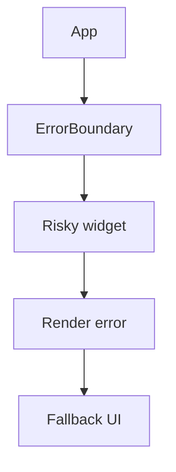

# Error Boundaries

## Detailed explanation
Error boundaries are React components that catch rendering errors in their child tree and show fallback UI instead of crashing the entire app. In React core, error boundaries are implemented with class components using `getDerivedStateFromError` and `componentDidCatch`.

They catch errors during rendering, lifecycle methods, and constructors below them. They do not catch event handler errors, async errors, or server-side rendering errors in the same way.

## 1. One-line mental model
An error boundary catches render-time crashes below it and shows fallback UI.

## 2. Problem it solves
One broken widget should not necessarily blank the entire application.

## 3. Core idea
- Wrap risky UI sections in boundaries.
- Show user-safe fallback UI.
- Log errors for debugging.
- Boundaries catch render-phase errors below them.
- They do not replace normal API error states.

## 4. Visual / analogy
An error boundary is a circuit breaker: one failed area is isolated so the rest can keep working.



## 5. Minimal example

```tsx
class ErrorBoundary extends React.Component<
  { children: React.ReactNode },
  { hasError: boolean }
> {
  state = { hasError: false };

  static getDerivedStateFromError() {
    return { hasError: true };
  }

  render() {
    return this.state.hasError ? <p>Something went wrong.</p> : this.props.children;
  }
}
```

## 6. Real-world example

```tsx
<ErrorBoundary fallback={<ChartFallback />}>
  <RevenueChart />
</ErrorBoundary>
```

A chart crash can show a fallback while the rest of the dashboard remains usable.

## 7. Common interview questions
- What is an error boundary?
- What errors do error boundaries catch?
- What do they not catch?
- Why are error boundaries class components?
- Where should boundaries be placed?
- How do you reset an error boundary?
- Error boundary vs API error state?

## 8. Active recall test
1. What phase do boundaries catch errors from?
2. Do they catch event handler errors?
3. Which lifecycle logs errors?
4. Why place boundaries around widgets?
5. What should fallback UI include?

## 9. Mistakes / traps
- Expecting boundaries to catch async promise rejections.
- Using one boundary only at the app root.
- Showing technical stack traces to users.
- Treating API 500 states as boundary errors.
- Forgetting error logging.

## 10. Compare with related concepts
- **Error boundary vs try/catch:** boundary catches render tree errors; try/catch catches synchronous code in scope.
- **Error boundary vs route error UI:** route frameworks may provide route-level error handling.
- **Error boundary vs loading/error state:** API errors are expected states, not render crashes.

## 11. Summary from memory
Explain where you would place error boundaries in a dashboard and what they catch.

## 12. Spaced revision prompts
- After 1 day: Define error boundary.
- After 3 days: List what boundaries do not catch.
- After 7 days: Design dashboard boundary placement.
- After 14 days: Compare boundary errors and API errors.

