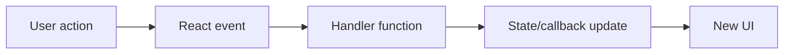

# Event Handling in React

## Detailed explanation
Event handling in React is how components respond to user actions such as clicks, typing, submitting forms, keyboard shortcuts, focus changes, drag events, and pointer movement. React event handlers are passed as props using camelCase names like `onClick`, `onChange`, and `onSubmit`.

React handlers receive Synthetic Event objects that normalize browser differences. In modern React, events are no longer pooled the way older React versions did, so event values can generally be read asynchronously, but it is still best to extract needed values early for clear code.

## 1. One-line mental model
React event handling connects user actions to state updates and callbacks.

## 2. Problem it solves
Interactive UI needs predictable ways to react to user input without manually attaching and cleaning up DOM listeners for common component events.

## 3. Core idea
- Use camelCase event props such as `onClick` and `onSubmit`.
- Pass a function reference, not the result of calling a function.
- Use event handlers to update state or call parent callbacks.
- Use `event.preventDefault()` for form submit behavior when needed.
- Prefer semantic elements so keyboard and accessibility behavior come for free.

## 4. Visual / analogy
Events are doorbells: the user presses the button, the handler decides what should happen.



## 5. Minimal example

```tsx
function Counter() {
  const [count, setCount] = React.useState(0);
  return <button onClick={() => setCount((value) => value + 1)}>{count}</button>;
}
```

## 6. Real-world example

```tsx
function SearchForm({ onSearch }: { onSearch: (query: string) => void }) {
  const [query, setQuery] = React.useState("");

  function handleSubmit(event: React.FormEvent<HTMLFormElement>) {
    event.preventDefault();
    onSearch(query.trim());
  }

  return (
    <form onSubmit={handleSubmit}>
      <input value={query} onChange={(event) => setQuery(event.currentTarget.value)} />
      <button type="submit">Search</button>
    </form>
  );
}
```

## 7. Common interview questions
#### How are events handled in React?
- **The Engine Mechanism (Why it behaves this way):** React uses a synthetic event system that wraps native browser events in a cross-browser compatible layer. Event handlers are passed as camelCase props (e.g., `onClick`, `onChange`, `onSubmit`) to React elements. In React 17+, events are attached directly to the DOM nodes that listen for them (event delegation to the root was used in React 16 and earlier). When a user action occurs, the native event fires, React wraps it in a SyntheticEvent object, and dispatches it through the React tree using its internal event system. The handler function receives this SyntheticEvent, which normalizes browser differences and provides a consistent API.
- **The Unforgettable Mental Model:** The **Universal Translator**. React's event system is like a universal translator at the UN — regardless of which language (browser) speaks, the translator (SyntheticEvent) converts it to a common language that everyone understands.
- **The Trap:** Thinking React events are native browser events. They're SyntheticEvent wrappers with a normalized API. Also, React events are not attached directly to elements in older versions — they use event delegation.
- **Senior Interview Playbook (Verbal Script):** "When asked this in an interview, say: React handles events through a synthetic event system that wraps native browser events in a cross-browser compatible layer. I pass handlers as camelCase props like onClick or onChange. React creates a SyntheticEvent object that normalizes browser differences and dispatches it through the component tree. In React 17+, events are attached directly to the DOM nodes rather than delegated to the root, which improves compatibility with micro-frontends."

#### Why do React events use camelCase?
- **The Engine Mechanism (Why it behaves this way):** React uses camelCase for event prop names (`onClick`, `onChange`, `onSubmit`) because JSX is JavaScript, not HTML. In HTML, event attributes are lowercase (`onclick`, `onchange`), but in JavaScript, the convention is camelCase. Since JSX compiles to JavaScript function calls, React follows JavaScript naming conventions. This also distinguishes React event props from HTML event attributes — React's `onClick` is a prop that receives a function, while HTML's `onclick` is an attribute that receives a string of JavaScript code.
- **The Unforgettable Mental Model:** The **JavaScript Convention**. React events follow JavaScript naming rules, not HTML rules. It's like the difference between `backgroundColor` (JS/CSSOM) and `background-color` (CSS) — same concept, different context.
- **The Trap:** Using lowercase `onclick` in JSX, which React will treat as a custom attribute rather than an event handler. It won't work as expected.
- **Senior Interview Playbook (Verbal Script):** "When asked this in an interview, say: React uses camelCase for event names because JSX is JavaScript, not HTML. JavaScript conventions use camelCase for properties and methods, so React follows that pattern. This also distinguishes React's event props — which receive function references — from HTML's event attributes, which receive strings of inline JavaScript code."

#### What is a Synthetic Event?
- **The Engine Mechanism (Why it behaves this way):** A SyntheticEvent is React's cross-browser wrapper around native browser events. It provides a consistent API across all browsers by normalizing event properties like `event.target`, `event.currentTarget`, `event.preventDefault()`, and `event.stopPropagation()`. In React 16 and earlier, SyntheticEvents were pooled — reused across events for performance — which meant event properties were nullified after the callback. React 17+ removed event pooling, so events can now be accessed asynchronously. The SyntheticEvent still provides the same normalized interface but without the pooling restriction.
- **The Unforgettable Mental Model:** The **Universal Remote**. A SyntheticEvent is like a universal remote control — it works the same way regardless of which brand of TV (browser) you're controlling, because it translates all the different signals into a common format.
- **The Trap:** Assuming event pooling still exists in React 17+. If you're reading old tutorials that say you need `event.persist()` to access events asynchronously, that's no longer necessary.
- **Senior Interview Playbook (Verbal Script):** "When asked this in an interview, say: A SyntheticEvent is React's cross-browser wrapper around native browser events. It normalizes event properties so they behave consistently across all browsers — things like event.target, preventDefault, and stopPropagation work the same everywhere. In React 16 and earlier, SyntheticEvents were pooled for performance, meaning they were reused and nullified after the callback. React 17+ removed pooling, so events can be accessed asynchronously without needing event.persist()."

#### Why should handlers be function references?
- **The Engine Mechanism (Why it behaves this way):** React event handlers expect a function reference, not the result of calling a function. When you write `onClick={handleClick}`, you're passing the function itself to React, which stores it and calls it when the event fires. When you write `onClick={handleClick()}`, you're calling the function immediately during render and passing its return value (usually `undefined`) as the handler. This causes the handler to execute during every render instead of on the event, which can cause infinite loops if the handler updates state.
- **The Unforgettable Mental Model:** The **Doorbell vs. the Ringing**. `onClick={handleClick}` is like giving someone the doorbell — they can ring it when they want. `onClick={handleClick()}` is like ringing the doorbell yourself right now — it happens immediately, not when the visitor arrives.
- **The Trap:** Accidentally calling the handler during render with `onClick={handleClick()}`. This executes on every render, potentially causing infinite loops if the handler updates state.
- **Senior Interview Playbook (Verbal Script):** "When asked this in an interview, say: Handlers should be function references because React needs to store the function and call it when the event fires. Writing `onClick={handleClick}` passes the function itself. Writing `onClick={handleClick()}` calls the function immediately during render and passes its return value, which is usually undefined. This causes the handler to run on every render instead of on the event, which can trigger infinite re-render loops if the handler updates state."

#### How do you prevent default form submission?
- **The Engine Mechanism (Why it behaves this way):** Form submission in HTML triggers a full page reload by default. In React, you prevent this by calling `event.preventDefault()` in the `onSubmit` handler. The SyntheticEvent's `preventDefault()` method calls the native event's `preventDefault()` internally, which cancels the default browser behavior. This allows you to handle the form data with JavaScript — validate inputs, make API calls, update state — without a page refresh. The form element's `onSubmit` event fires when the user presses Enter in an input field or clicks a submit button.
- **The Unforgettable Mental Model:** The **Pause Button**. `event.preventDefault()` is like pressing pause on the browser's default action — it stops the page reload so you can handle the form submission your way.
- **The Trap:** Forgetting `preventDefault()` and wondering why the page refreshes and state is lost. Also, using `onClick` on the submit button instead of `onSubmit` on the form — `onClick` won't catch Enter key submissions.
- **Senior Interview Playbook (Verbal Script):** "When asked this in an interview, say: I prevent default form submission by calling `event.preventDefault()` in the `onSubmit` handler. This stops the browser's default page reload behavior. I attach the handler to the form element, not the submit button, so it catches both button clicks and Enter key submissions. After preventing default, I can validate the form data, make API calls, and update state without a page refresh."

#### What is event bubbling?
- **The Engine Mechanism (Why it behaves this way):** Event bubbling is the DOM event propagation mechanism where an event fired on a child element bubbles up through its parent elements to the root. In React, SyntheticEvents follow the same bubbling behavior as native events. When you click a button inside a div inside a section, the click event fires on the button, then bubbles to the div, then to the section. React provides `event.stopPropagation()` to prevent bubbling and `event.currentTarget` to identify which element's handler is currently executing. Event delegation in React leverages bubbling to handle events efficiently.
- **The Unforgettable Mental Model:** The **Ripple in a Pond**. An event is like a stone dropped in water — the ripple starts at the point of impact (the clicked element) and spreads outward through concentric circles (parent elements).
- **The Trap:** Not accounting for bubbling when nesting clickable elements. A click on a child button will also trigger the parent's click handler unless you call `stopPropagation()`.
- **Senior Interview Playbook (Verbal Script):** "When asked this in an interview, say: Event bubbling is how DOM events propagate — an event fired on a child element bubbles up through its parents to the root. In React, this means a click on a nested element will trigger handlers on all ancestor elements with click handlers. I use `event.stopPropagation()` to prevent bubbling when needed, and `event.currentTarget` to identify which element's handler is executing. I'm careful when nesting clickable elements to avoid unintended handler triggers."

#### How do you pass arguments to event handlers?
- **The Engine Mechanism (Why it behaves this way):** To pass arguments to event handlers, you wrap the handler call in an arrow function or use `Function.prototype.bind()`. The arrow function approach `onClick={() => handleClick(id)}` creates a new function that captures the argument in its closure and calls the handler when the event fires. React stores this wrapper function and invokes it when the event occurs. The SyntheticEvent is available as the first argument to the arrow function if needed: `onClick={(e) => handleClick(id, e)`. Using `bind` — `onClick={handleClick.bind(this, id)}` — achieves the same result by creating a bound function with pre-filled arguments.
- **The Unforgettable Mental Model:** The **Pre-addressed Envelope**. The arrow function is like putting a letter in an envelope with the address already written — when the event fires (mail is sent), it goes to the right place with the right information.
- **The Trap:** Creating new arrow functions in render for memoized children, which breaks `React.memo` because the function reference changes every render. Use `useCallback` or extract the handler to avoid this.
- **Senior Interview Playbook (Verbal Script):** "When asked this in an interview, say: I pass arguments to event handlers by wrapping them in an arrow function: `onClick={() => handleClick(id)`. This creates a closure that captures the argument and calls the handler when the event fires. If I need the event object too, I pass it explicitly: `onClick={(e) => handleClick(id, e)`. For memoized children, I'm careful to avoid creating new functions on every render — I use useCallback or restructure the component to pass the data as a prop instead."

## 8. Active recall test
1. **What is wrong with `onClick={handleClick()}`?**
   - **Explanation:** This calls `handleClick()` immediately during render and passes its return value (usually `undefined`) as the handler. The function executes on every render instead of on the click event. If the handler updates state, this causes an infinite re-render loop. The correct form is `onClick={handleClick}` (function reference) or `onClick={() => handleClick()}` (arrow function wrapper).
2. **Why use `currentTarget` in typed event handlers?**
   - **Explanation:** `event.currentTarget` refers to the element that the event handler is attached to, while `event.target` refers to the element that actually triggered the event (which could be a child element due to bubbling). In TypeScript, `currentTarget` has a more specific type based on the element the handler is attached to, making it safer for type-safe access to element properties.
3. **How do you stop a form reload?**
   - **Explanation:** Call `event.preventDefault()` in the form's `onSubmit` handler. This prevents the browser's default form submission behavior (page reload). The handler should be attached to the `<form>` element, not the submit button, so it catches both button clicks and Enter key submissions from input fields.
4. **What should a click handler usually update?**
   - **Explanation:** A click handler should typically update component state via a setter function (from `useState`), call a callback prop to notify the parent, or trigger a side effect (like navigation or API calls). It should not directly manipulate the DOM — React's declarative model handles DOM updates based on state changes.
5. **Why is a real button better than a clickable div?**
   - **Explanation:** A real `<button>` element comes with built-in accessibility features: keyboard focus, Enter/Space key activation, screen reader semantics, and proper ARIA roles. A `<div onClick={...>` requires manual implementation of all these features (tabIndex, onKeyDown handlers, role attributes). Using semantic elements ensures accessibility "for free" and follows web standards.

## 9. Mistakes / traps
- Calling a handler during render instead of passing it.
- Using non-semantic elements for buttons.
- Forgetting `preventDefault()` in forms.
- Creating stale handler logic that reads old state.
- Stopping propagation without understanding parent handlers.

## 10. Compare with related concepts
- **React events vs DOM events:** React wraps native events in a cross-browser layer.
- **Handler vs callback prop:** a handler responds locally; a callback prop lets parent logic run.
- **Event handling vs effects:** events respond to user actions; effects synchronize with external systems.

## 11. Summary from memory
Explain how a form submit event becomes a state-safe search action.

## 12. Spaced revision prompts
- After 1 day: Write a click handler from memory.
- After 3 days: Explain Synthetic Event.
- After 7 days: Compare event handler and effect.
- After 14 days: Debug a handler that runs during render.

