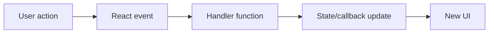

# Event Handling in React

## Detailed explanation
Event handling in React is how components respond to user actions such as clicks, typing, submitting forms, keyboard shortcuts, focus changes, drag events, and pointer movement. React event handlers are passed as props using camelCase names like `onClick`, `onChange`, and `onSubmit`.

React handlers receive Synthetic Event objects that normalize browser differences. In modern React, events are no longer pooled the way older React versions did, so event values can generally be read asynchronously, but it is still best to extract needed values early for clear code.

## 1. One-line mental model
React event handling connects user actions to state updates and callbacks.

## 2. Problem it solves
Interactive UI needs predictable ways to react to user input without manually attaching and cleaning up DOM listeners for common component events.

## 3. Core idea
- Use camelCase event props such as `onClick` and `onSubmit`.
- Pass a function reference, not the result of calling a function.
- Use event handlers to update state or call parent callbacks.
- Use `event.preventDefault()` for form submit behavior when needed.
- Prefer semantic elements so keyboard and accessibility behavior come for free.

## 4. Visual / analogy
Events are doorbells: the user presses the button, the handler decides what should happen.



## 5. Minimal example

```tsx
function Counter() {
  const [count, setCount] = React.useState(0);
  return <button onClick={() => setCount((value) => value + 1)}>{count}</button>;
}
```

## 6. Real-world example

```tsx
function SearchForm({ onSearch }: { onSearch: (query: string) => void }) {
  const [query, setQuery] = React.useState("");

  function handleSubmit(event: React.FormEvent<HTMLFormElement>) {
    event.preventDefault();
    onSearch(query.trim());
  }

  return (
    <form onSubmit={handleSubmit}>
      <input value={query} onChange={(event) => setQuery(event.currentTarget.value)} />
      <button type="submit">Search</button>
    </form>
  );
}
```

## 7. Common interview questions
- How are events handled in React?
- Why do React events use camelCase?
- What is a Synthetic Event?
- Why should handlers be function references?
- How do you prevent default form submission?
- What is event bubbling?
- How do you pass arguments to event handlers?

## 8. Active recall test
1. What is wrong with `onClick={handleClick()}`?
2. Why use `currentTarget` in typed event handlers?
3. How do you stop a form reload?
4. What should a click handler usually update?
5. Why is a real button better than a clickable div?

## 9. Mistakes / traps
- Calling a handler during render instead of passing it.
- Using non-semantic elements for buttons.
- Forgetting `preventDefault()` in forms.
- Creating stale handler logic that reads old state.
- Stopping propagation without understanding parent handlers.

## 10. Compare with related concepts
- **React events vs DOM events:** React wraps native events in a cross-browser layer.
- **Handler vs callback prop:** a handler responds locally; a callback prop lets parent logic run.
- **Event handling vs effects:** events respond to user actions; effects synchronize with external systems.

## 11. Summary from memory
Explain how a form submit event becomes a state-safe search action.

## 12. Spaced revision prompts
- After 1 day: Write a click handler from memory.
- After 3 days: Explain Synthetic Event.
- After 7 days: Compare event handler and effect.
- After 14 days: Debug a handler that runs during render.

